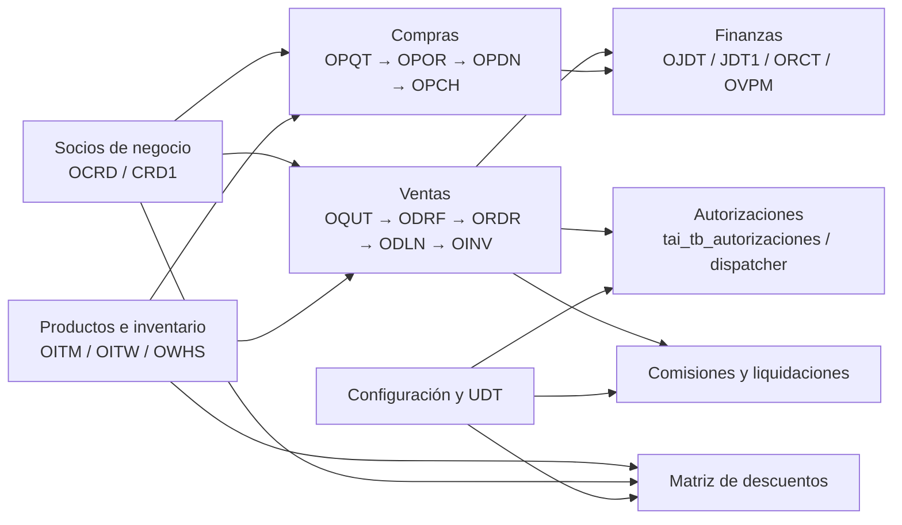
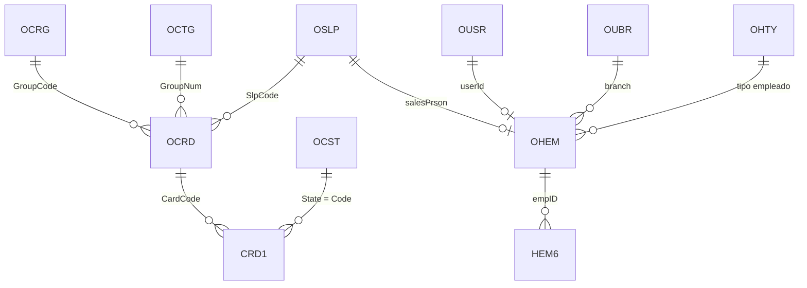
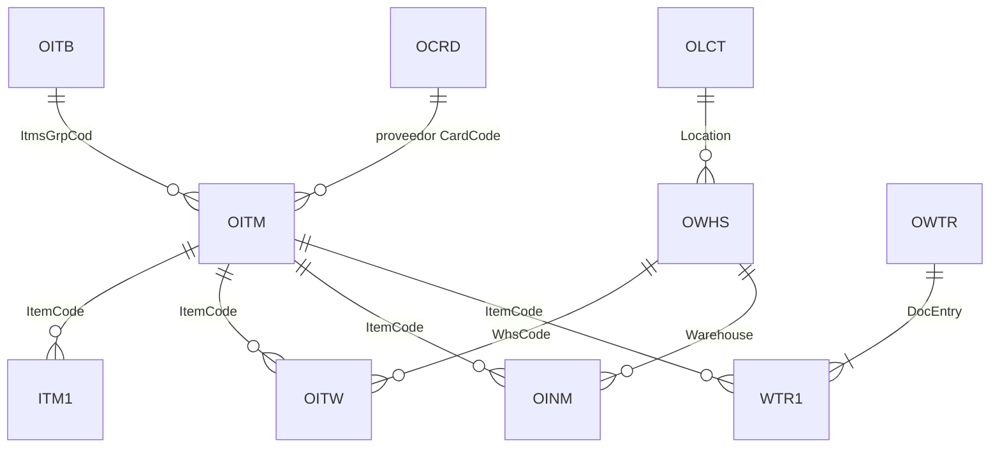
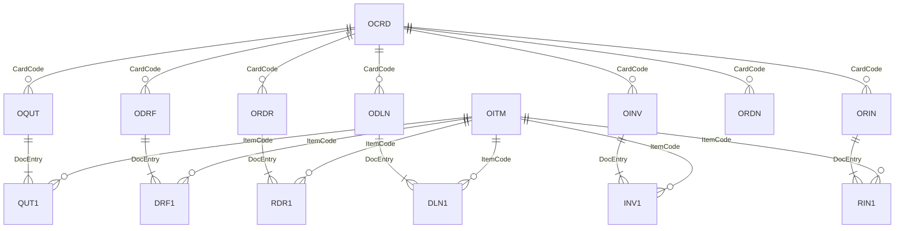
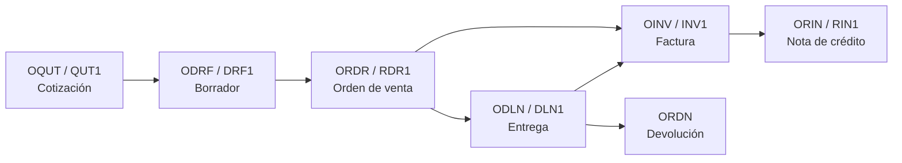
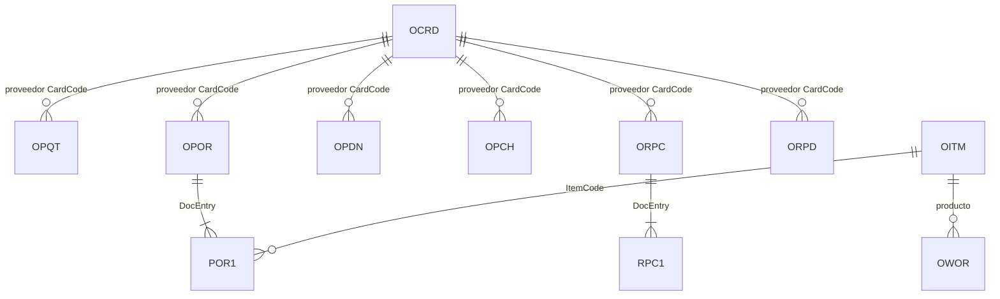
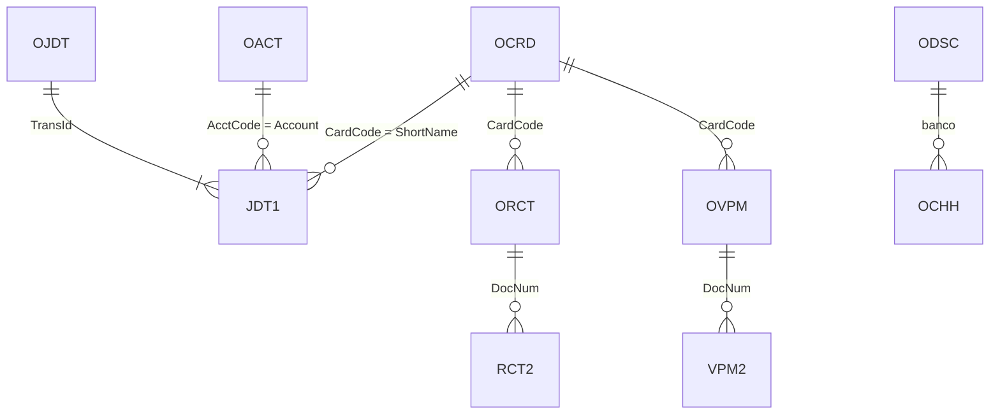
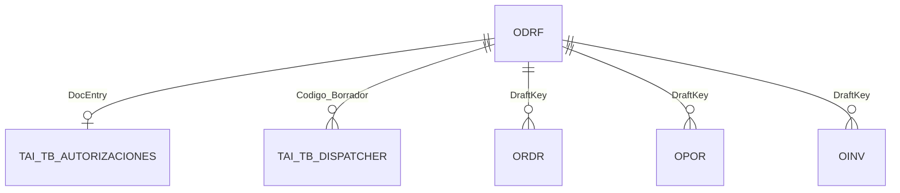
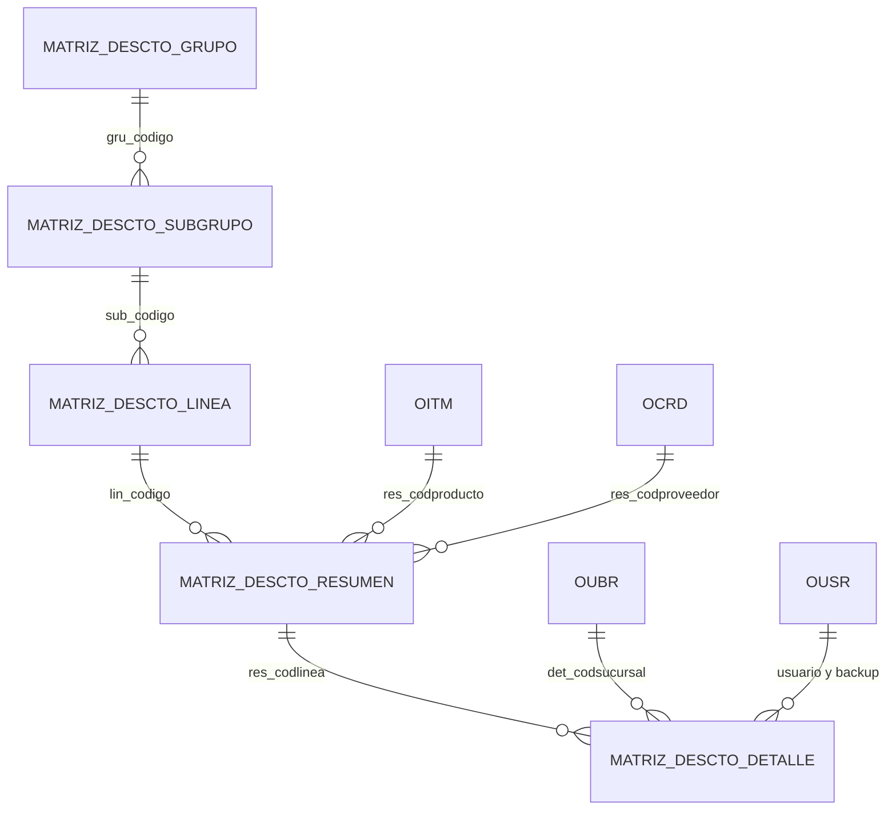
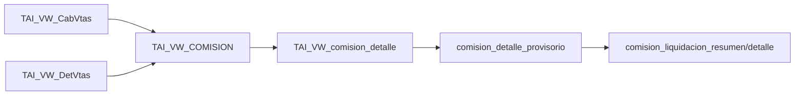

# Modelo entidad-relación del Sistema de Ventas integrado con SAP Business One

## 1. Alcance y fuentes

Este documento consolida el modelo de datos detectado en:

- el código VB.NET de `ventas/SistemaVentasWeb`;
- el servicio de integración `wssap/WebServices`;
- `busqueda_en_codigo.md`;
- las definiciones de procedimientos de `sps.sql`;
- las vistas y funciones de `sqls2.sql`, `sqls3.sql` y `sqls4.sql`.

El alcance documental considera exclusivamente los 56 procedimientos almacenados llamados directamente por la versión revisada del portal y del web service.

### Convenciones

- **PK:** clave primaria conocida o esperada en SAP Business One.
- **FK lógica:** relación confirmada por `JOIN`, por campos base de documentos o por uso funcional. SAP Business One no siempre implementa estas relaciones como restricciones físicas.
- **SAP:** tabla estándar de SAP Business One.
- **UDT:** tabla definida por el usuario de SAP, identificada físicamente con prefijo `@`.
- **Propia:** tabla creada fuera del esquema estándar de SAP.
- **Vista/función:** objeto SQL derivado; no almacena necesariamente información propia.

## 2. Vista general del modelo



## 3. Socios de negocio, vendedores y empleados



| Tabla | Tipo | Entidad o propósito | Claves/relaciones principales |
|---|---|---|---|
| `OCRD` | SAP | Clientes y proveedores | PK `CardCode`; relaciona documentos, direcciones, vendedor, grupo y condición de pago |
| `CRD1` | SAP | Direcciones de facturación y despacho | `CardCode` → `OCRD`; `State` → `OCST.Code` |
| `OCRG` | SAP | Grupos de socios de negocio | PK `GroupCode`; `OCRD.GroupCode` |
| `OCTG` | SAP | Condiciones de pago | PK `GroupNum`; documentos y `OCRD.GroupNum` |
| `OCST` | SAP | Regiones/estados | PK lógica `Code`; usada por `CRD1.State` |
| `OSLP` | SAP | Vendedores | PK `SlpCode`; documentos y `OCRD.SlpCode` |
| `OHEM` | SAP | Empleados | PK `empID`; `salesPrson` → `OSLP`; `userId` → `OUSR` |
| `HEM6` | SAP | Datos complementarios del empleado | Relacionada mediante `empID` |
| `OHTY` | SAP | Tipos de empleado | Clasificación de empleados |
| `OUSR` | SAP | Usuarios SAP | PK `USERID`; código funcional `USER_CODE` |
| `OUBR` | SAP | Sucursales | PK `Code`; relaciona usuarios y empleados |

## 4. Productos, precios e inventario



| Tabla | Tipo | Entidad o propósito | Claves/relaciones principales |
|---|---|---|---|
| `OITM` | SAP | Maestro de artículos | PK `ItemCode`; grupo, proveedor y campos comerciales TAI |
| `OITB` | SAP | Grupos/líneas de artículos | PK `ItmsGrpCod`; `OITM.ItmsGrpCod` |
| `ITM1` | SAP | Precio del artículo por lista | PK lógica `ItemCode + PriceList` |
| `OITW` | SAP | Stock, costo y precio por artículo/bodega | PK lógica `ItemCode + WhsCode` |
| `OWHS` | SAP | Bodegas | PK `WhsCode`; `Location` → `OLCT.Code` |
| `OLCT` | SAP | Localidades de inventario | PK `Code` |
| `OINM` | SAP | Historial/movimientos de inventario | Relaciona artículo, bodega y documento origen |
| `OWTR` | SAP | Transferencia de inventario, encabezado | PK `DocEntry` |
| `WTR1` | SAP | Líneas de transferencia | `DocEntry` → `OWTR`; `ItemCode` → `OITM` |
| `OWTQ` | SAP | Solicitud de transferencia | Documento detectado en la vista consolidada documental |
| `OIGN` | SAP | Entrada de mercancías | Documento de inventario |
| `OIGE` | SAP | Salida de mercancías | Documento de inventario |
| `OIDC` | SAP | Objeto/documento de inventario referenciado | Presente en `VK_VW_ODOC`; uso exacto sujeto a la versión SAP instalada |

## 5. Documentos de venta



| Tabla | Tipo | Documento | Claves/relaciones principales |
|---|---|---|---|
| `OQUT` | SAP | Cotización de venta, encabezado | PK `DocEntry`; líneas `QUT1` |
| `QUT1` | SAP | Líneas de cotización | `DocEntry`, `LineNum`, `ItemCode`, `WhsCode` |
| `ODRF` | SAP | Borradores de documentos | PK `DocEntry`; `ObjType` determina el documento |
| `DRF1` | SAP | Líneas de borrador | `DocEntry`, `LineNum`, producto y bodega |
| `ORDR` | SAP | Orden de venta, encabezado | PK `DocEntry`; `DraftKey` vincula el borrador |
| `RDR1` | SAP | Líneas de orden de venta | `DocEntry`, `LineNum`, `ItemCode`, `WhsCode` |
| `ODLN` | SAP | Entrega/guía de despacho, encabezado | PK `DocEntry` |
| `DLN1` | SAP | Líneas de entrega | `DocEntry`, `LineNum` y campos base |
| `OINV` | SAP | Factura/boleta de cliente | PK `DocEntry`; `DraftKey`, serie y folio |
| `INV1` | SAP | Líneas de factura | `DocEntry`, `LineNum`; `BaseType/BaseEntry/BaseLine` |
| `ORIN` | SAP | Nota de crédito de cliente | PK `DocEntry` |
| `RIN1` | SAP | Líneas de nota de crédito | `DocEntry`, `LineNum`; referencias al documento base |
| `ORDN` | SAP | Devolución de cliente | Documento detectado en `VK_VW_ODOC` |
| `ODPI` | SAP | Factura de anticipo de cliente | Documento detectado en `VK_VW_ODOC` |

### Flujo documental de venta



Los enlaces entre documentos se almacenan principalmente en las líneas:

```text
BaseType   = tipo de objeto del documento origen
BaseEntry  = DocEntry del documento origen
BaseLine   = LineNum de la línea origen
TargetType = tipo de objeto del documento destino
TrgetEntry = DocEntry del documento destino
```

## 6. Documentos de compra y producción



| Tabla | Tipo | Documento | Claves/relaciones principales |
|---|---|---|---|
| `OPQT` | SAP | Cotización de compra | Encabezado detectado en `VK_VW_ODOC` |
| `OPOR` | SAP | Orden de compra | PK `DocEntry`; líneas `POR1` |
| `POR1` | SAP | Líneas de orden de compra | `DocEntry`, `LineNum`, producto, bodega y documento base |
| `OPDN` | SAP | Entrada de mercancías de proveedor | Documento posterior a la orden de compra |
| `OPCH` | SAP | Factura de proveedor | Documento financiero de compra |
| `ORPC` | SAP | Nota de crédito de proveedor | Encabezado; líneas `RPC1` |
| `RPC1` | SAP | Líneas de nota de crédito de proveedor | `DocEntry`, `LineNum` y documento base |
| `ORPD` | SAP | Devolución de mercancías a proveedor | Documento detectado por los SP/vistas |
| `ODPO` | SAP | Factura de anticipo de proveedor | Documento detectado en `VK_VW_ODOC` |
| `OWOR` | SAP | Orden de producción | Documento detectado en `VK_VW_ODOC` |

El sistema fuerza la relación de una línea de compra con la orden de venta mediante:

```text
POR1.BaseType  = 17                -- orden de venta
POR1.BaseEntry = ORDR.DocEntry
POR1.BaseLine  = RDR1.LineNum
```

## 7. Finanzas, pagos y cuenta corriente



| Tabla/vista | Tipo | Entidad o propósito |
|---|---|---|
| `OJDT` | SAP | Encabezado de asiento contable |
| `JDT1` | SAP | Líneas del asiento y saldos del socio de negocio |
| `OACT` | SAP | Plan de cuentas |
| `ORCT` | SAP | Pagos recibidos |
| `RCT2` | SAP | Documentos aplicados al pago recibido |
| `OVPM` | SAP | Pagos efectuados |
| `VPM2` | SAP | Documentos aplicados al pago efectuado |
| `OCHH` | SAP | Registro de cheques |
| `ODSC` | SAP | Bancos |
| `TAI_VW_CtaCte_Cliente` | Vista | Cuenta corriente consolidada del cliente |
| `VK_VW_ODOC` | Vista | Encabezados documentales SAP consolidados |

La vista de cuenta corriente reconoce al menos:

| `TransType` | Entidad |
|---:|---|
| `13` | Factura de cliente |
| `14` | Nota de crédito de cliente |
| `24` | Pago recibido |
| `30` | Asiento contable |

## 8. Series, periodos, proyectos y autorizaciones SAP

| Tabla | Tipo | Entidad o propósito |
|---|---|---|
| `NNM1` | SAP | Series de numeración documental |
| `NNM2` | SAP | Información adicional de numeración/series |
| `ORTT` | SAP | Tipos de cambio por moneda y fecha |
| `OPRJ` | SAP | Proyectos |
| `HLD1` | SAP | Detalle de calendario/feriados |
| `UFD1` | SAP | Valores válidos de campos definidos por usuario |
| `OWTM` | SAP | Plantillas/procesos de autorización |
| `WTM1` | SAP | Etapas relacionadas con autorización |
| `WTM2` | SAP | Autorizadores/usuarios relacionados |
| `WTM3` | SAP | Documentos/condiciones relacionadas |
| `WST1` | SAP | Etapas de autorización |
| `OWST` | SAP | Definición de etapas de autorización |

## 9. Autorizaciones propias y dispatcher



| Tabla | Tipo | Entidad o propósito | Relación principal |
|---|---|---|---|
| `tai_tb_autorizaciones` | Propia | Contadores, estados y mensajes de autorizaciones comerciales | `DocEntry` → borrador/documento |
| `tai_tb_dispatcher` | Propia | Solicitudes individuales enviadas a autorizadores y backups | `Codigo_Borrador` → `ODRF.DocEntry` |

Las autorizaciones cubren crédito, protestos, deuda vencida, margen, costo, tasa y niveles comerciales `BM1`, `BM2`, `BM3`, `BC1`, `BC2` y `BC3`.

## 10. Matriz de descuentos



| Tabla | Tipo | Entidad o propósito |
|---|---|---|
| `matriz_descto_grupo` | Propia | Nivel superior de agrupación comercial |
| `matriz_descto_subgrupo` | Propia | Subgrupo comercial |
| `matriz_descto_linea` | Propia | Línea comercial vinculada a grupos SAP |
| `matriz_descto_resumen` | Propia | Niveles de descuento por línea, proveedor y producto |
| `matriz_descto_detalle` | Propia | Autorizadores por línea, sucursal, cargo y zona |
| `matriz_descto_resumen_carga` | Propia | Tabla de carga masiva del resumen |

## 11. Comisiones y liquidaciones



| Tabla/vista | Tipo | Entidad o propósito |
|---|---|---|
| `TAI_VW_CabVtas` | Vista | Encabezados de facturas y notas de crédito |
| `TAI_VW_DetVtas` | Vista | Líneas, costos, márgenes, artículos y bodegas |
| `TAI_VW_COMISION` | Vista | Cálculo base de comisión por venta |
| `TAI_VW_comision_detalle` | Vista | Detalle final usado por cargas y liquidaciones |
| `comision_general` | Propia | Reglas generales por vendedor |
| `comision_especifica` | Propia | Reglas específicas por línea/bodega |
| `comision_especial` | Propia | Casos especiales de comisión |
| `comision_excluyente` | Propia | Reglas que reemplazan o excluyen el cálculo normal |
| `comision_nuevo` | Propia | Configuración para vendedores bajo esquema nuevo |
| `comision_detalle` | Propia | Detalle persistido de comisiones |
| `comision_detalle_provisorio` | Propia | Carga provisoria del periodo |
| `comision_liquidacion_resumen` | Propia | Cabecera/resumen de liquidación |
| `comision_liquidacion_detalle` | Propia | Detalle de liquidación |
| `comision_liquidacion_especial` | Propia | Resumen de liquidaciones especiales |
| `comision_liquidacion_detalle_especial` | Propia | Detalle de liquidaciones especiales |
| `presupuesto_agrupacion` | Propia | Agrupaciones presupuestarias |
| `presupuesto_grupo` | Propia | Grupos presupuestarios |

## 12. Tablas de carga y apoyo

| Tabla | Tipo | Propósito |
|---|---|---|
| `costo_producto_carga` | Propia | Carga de costos, moneda, flete, seguro y margen hacia `OITW` |
| `costos_productos_carga` | Propia | Variante/estructura de carga de costos |
| `TEST` | Propia/temporal | Tabla usada por un SP de prueba; no pertenece al modelo funcional confirmado |
| `menu_sistema_modulo` | Propia | Módulos del menú web |
| `menu_sistema_opcion` | Propia | Opciones y permisos del menú web |
| `TAI_VW_Parametros` | Propia | Catálogo transversal de parámetros del sistema |

`@MonitorCab` aparece en el SQL como variable de tabla interna, no como tabla persistente, y por eso no forma parte del modelo físico.

### Uso de `TAI_VW_Parametros` en el modelo ER

`TAI_VW_Parametros` participa como tabla catálogo en el modelo de socios y se relaciona lógicamente con `OCRD` para describir `U_TAI_Categoria`.

```text
OCRD.U_TAI_Categoria     → TAI_VW_Parametros.par_enlace
```

## 13. Tablas de usuario SAP (UDT)

| Tabla física | Propósito inferido desde el SQL |
|---|---|
| `@TAI_AUT_BM_BC` | Umbrales de autorización comercial por línea |
| `@TAI_AUT_BM_BC1` | Autorizadores, backups, zona, sucursal y cargo |
| `@TAI_CIERRE_MESD` | Detalle de cierre mensual |
| `@TAI_CUENTASAPXSUC` | Cuentas SAP por sucursal/bodega |
| `@TAI_FE_IMPRESORA` | Configuración de impresoras de facturación electrónica |
| `@TAI_FLETE_ESPECIAL` | Reglas especiales de flete |
| `@TAI_INGACTIVO` | Ingredientes activos |
| `@TAI_OCPCC` | Cabecera de asignación comercial cliente/vendedor |
| `@TAI_OCPCD` | Detalle de asignación comercial cliente/vendedor |
| `@TAI_P_MES` | Parámetros mensuales |
| `@TAI_PPLIN` | Política comercial, flete y comisión por línea |
| `@TAI_PPLINSUC` | Política por línea, sucursal y vendedor |
| `@TAI_PROV_PREM` | Proveedores/productos con tratamiento de premio |
| `@TAI_SEMILLASD` | Datos o atributos de semillas |
| `@VK_OCCL` | Configuración comercial personalizada VK |
| `@VK_OPAR` | Parámetros personalizados VK |
| `@VK_WHUD` | Relación personalizada de usuarios y bodegas |

## 14. Vistas y funciones personalizadas

| Objeto | Tipo | Estado | Dependencias principales |
|---|---|---|---|
| `TAI_VW_CtaCte_Cliente` | Vista | Analizada | Contabilidad, facturas, NC, pagos y `VK_VW_ODOC` |
| `TAI_VW_ValorDespacho` | Vista | Analizada | `UFD1` |
| `TAI_VW_CabVtas` | Vista | Analizada | `OINV`, `ORIN`, `NNM1`, `OSLP`, `OHEM` |
| `TAI_VW_DetVtas` | Vista | Analizada | `OINV/INV1`, `ORIN/RIN1`, artículos, costos y bodegas |
| `TAI_VW_COMISION` | Vista | Analizada | Cabecera/detalle de ventas y reglas de comisión |
| `TAI_VW_comision_detalle` | Vista | Analizada | `TAI_VW_COMISION`, políticas por sucursal |
| `VK_VW_ODOC` | Vista | Analizada | Documentos comerciales, inventario, producción y compras |
| `TAI_FN_ItemPolPre` | Función | Analizada | Artículo, precios, bodega, localidad, tipo de cambio y políticas |
| `TAI_FN_MONITOR_OV` | Función tabular | Analizada | Borradores, órdenes y facturas de venta |
| `TAI_FN_agrupacion` | Función escalar | Analizada | Mapeo fijo de línea a agrupación; no consulta tablas |

## 15. Campos de usuario relevantes

### Encabezados documentales

Los siguientes campos `U_*` se utilizan en `ODRF`, `ORDR`, `OPOR`, `OINV` y otros encabezados según el documento:

```text
U_Estado_Aut
U_TAI_BloqueaGD
U_TAI_ComentarioOC
U_TAI_CondicionPagOC
U_TAI_Despacho
U_TAI_DocExitoso
U_TAI_Emision
U_TAI_FactElec
U_TAI_GlosaEspecial
U_TAI_GuiaDespacho
U_TAI_Imprimir
U_TAI_MonedaProducto
U_TAI_Motivo
U_TAI_NotaPedidoC
U_TAI_TipoVenta
U_TAI_cuartacopia
U_VK_CertOrigen
```

### Líneas documentales

```text
U_TAI_CardCode
U_TAI_CondicionProducto
U_TAI_CostoComercial
U_TAI_CostoReposicio
U_TAI_DescripcionAd
U_TAI_Descuento
U_TAI_DiasCompra
U_TAI_FechaEntrega
U_TAI_Flete
U_TAI_ImpteComis
U_TAI_Interes
U_TAI_MonedaCosto
U_TAI_MonedaPF
U_TAI_MotivoProducto
U_TAI_PUFinal
U_TAI_PorcVenta
U_TAI_PrcDsctoMax
U_TAI_PreCompraPF
U_TAI_PrecioCompraO
U_TAI_TasaInteres
```

### Maestro de clientes y productos

```text
OCRD.U_TAI_Acuerdo
OCRD.U_TAI_Categoria
OCRD.U_TAI_LinCredCom
OITM.U_TAI_Capacidad
OITM.U_TAI_DiasPago
OITM.U_TAI_Envase
OITM.U_TAI_IngrActivo
OITM.U_TAI_UndMed
OITW.U_TAI_CostoComercial
OITW.U_TAI_CostoRep
OITW.U_TAI_Moneda
OITW.U_TAI_PrecioVenta
OITW.U_TAI_StockReal
```

## 16. Inventario consolidado

| Categoría | Cantidad aproximada detectada |
|---|---:|
| Tablas estándar SAP | 68 |
| Tablas UDT `@...` | 17 |
| Tablas propias persistentes o de carga | 30 |
| Vistas personalizadas | 8 analizadas |
| Funciones personalizadas | 3 |
| Procedimientos almacenados utilizados | 56 |

Las cantidades pueden variar al clasificar objetos SAP auxiliares según la versión instalada. El inventario se basa en referencias efectivas presentes en el código SQL entregado, no en todas las tablas existentes en la base SAP.

## 17. Pendientes para cerrar el modelo

1. Si se requiere un modelo físico con tipos de datos, PK, índices y nulabilidad, exportar `sys.tables`, `sys.columns`, `sys.indexes` y `sys.foreign_keys` para las tablas propias.
2. Exportar metadatos de las UDT y UDF de SAP (`OUTB`, `CUFD`, `UFD1`) para documentar nombres funcionales y valores válidos.
3. Validar si `TEST` y `costos_productos_carga` siguen vigentes o corresponden a código de prueba/legado.
