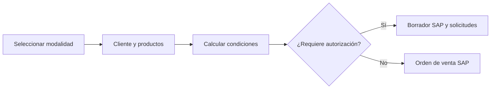

# Flujos funcionales principales

## FUN-001/FUN-002 — Acceso y menú según perfil

### Objetivo

Identificar al usuario y mostrar solamente la navegación asociada a su perfil operativo.

### Flujo

1. El usuario ingresa nombre y contraseña.
2. El sistema consulta si las credenciales corresponden a un usuario activo.
3. Recupera empleado, usuario SAP, operador, oficina, rol, nivel, perfil y condición de cotizador.
4. Obtiene módulos, opciones y páginas para el perfil.
5. Muestra el menú y conserva el contexto para las páginas posteriores.

### Reglas identificadas

- Un usuario existente pero inactivo no puede continuar.
- Menú y permisos visibles dependen del perfil almacenado en base de datos.
- El ambiente productivo/testing se informa en la pantalla de acceso.

### Resultado

Usuario identificado con navegación contextual.

### Evidencia técnica

- `ventas/SistemaVentasWeb/SistemaVentasWeb/Pages/pagLoginSistema.aspx`
- `ventas/SistemaVentasWeb/SistemaVentasWeb/Classes/clsUsuarioSistemaListado.vb`
- `ventas/SistemaVentasWeb/SistemaVentasWeb/Classes/clsMenuSistemaListado.vb`

## FUN-003 a FUN-016 — Preparar y registrar una venta

### Objetivo

Registrar una operación comercial según su modalidad y decidir si puede convertirse en orden o debe pasar por aprobación.

### Flujo

1. El operador selecciona la modalidad de venta.
2. Busca cliente; el sistema recupera direcciones, vendedor y situación crediticia.
3. Agrega productos, bodega, cantidades, precios, monedas, fechas y, según modalidad, proveedor y condiciones de compra.
4. El sistema consulta inventario y calcula descuento, interés, flete, margen, costo y total.
5. El usuario completa despacho, plazo de pago, orden de compra del cliente y comentarios.
6. El navegador decide, según las excepciones detectadas, si solicita crear un borrador SAP o una orden SAP directa.
7. Cuando requiere autorización, primero se crea el borrador en SAP Business One y luego se registran las solicitudes y notificaciones.

### Reglas identificadas

- Existen modalidades diferenciadas: bodega propia, consignada, puesto fundo, calzada proveedor, costo especial y liquidación; calzada propia requiere validación de vigencia.
- El borrador legado es un documento SAP creado después de completar la preparación; el código no confirma guardado o reanudación de una venta local incompleta.
- Se consideran línea de crédito, deuda/facturas impagas y cheques protestados.
- Se comparan descuento máximo, tasa, margen y costo; el significado exacto de todas las bandas `BM`/`BC` está pendiente.
- Cada línea puede conservar bodega, fecha de entrega, descuento, interés, flete y costo de reposición.
- Las modalidades con abastecimiento externo incorporan moneda, precio, plazo, condición, motivo y proveedor de compra.

### Resultado

Borrador sujeto a autorización u orden de venta registrada en SAP.

### Evidencia técnica

- `ventas/SistemaVentasWeb/SistemaVentasWeb/Pages/pagVentaBodegaPropia.aspx`
- `ventas/SistemaVentasWeb/SistemaVentasWeb/Pages/pagVentaCalzadaProveedor.aspx`
- `ventas/SistemaVentasWeb/SistemaVentasWeb/Pages/pagVentaCostoEspecial.aspx`
- `ventas/SistemaVentasWeb/SistemaVentasWeb/Classes/clsAutorizacionListado.vb`
- `wssap/WebServices/WebServices/Classes/clsOrdenVenta.vb`
## FUN-016 a FUN-020 — Autorizar una venta excepcional

### Objetivo

Obtener decisiones trazables de responsables antes de convertir un borrador observado en orden de venta.

### Flujo

1. El sistema determina los conceptos que necesitan autorización.
2. Registra autorizador oficial y respaldo para cada concepto.
3. Envía correo con datos del cliente, operación, productos y enlace de respuesta.
4. El autorizador revisa y aprueba o rechaza, dejando comentario.
5. El sistema consolida todas las respuestas y refleja el resultado en el monitor.
6. Si el conjunto queda aprobado, la operación aparece como autorizada no creada; un usuario la procesa desde el monitor para convertir el borrador SAP en orden. Si existe rechazo, finaliza como rechazado.

### Reglas identificadas

- La decisión se registra por concepto y por autorizador.
- Se mantienen fechas de creación y respuesta, comentario, responsable oficial y respaldo.
- La aprobación puede incluir una instrucción de bloqueo de guía de despacho.
- La conversión a orden sólo se habilita cuando la validación agregada resulta aprobada y requiere una acción visible desde el monitor.

### Resultado

Orden de venta SAP o borrador rechazado con trazabilidad de decisiones.

### Evidencia técnica

- `ventas/SistemaVentasWeb/SistemaVentasWeb/Pages/pagAprobarBorrador.aspx.vb`
- `ventas/SistemaVentasWeb/SistemaVentasWeb/Pages/pagRechazarBorrador.aspx.vb`
- `ventas/SistemaVentasWeb/SistemaVentasWeb/Classes/clsDispatcherListado.vb`
- `ventas/SistemaVentasWeb/SistemaVentasWeb/Classes/clsAutorizacionesListado.vb`
- `wssap/WebServices/WebServices/Classes/clsOrdenVenta.vb`

## FUN-021/FUN-022 — Seguimiento de operaciones

### Objetivo

Dar visibilidad al estado de autorizaciones y documentos durante el ciclo comercial.

### Flujo

1. El usuario ingresa al monitor correspondiente.
2. Selecciona estado, operador o tipo de consulta.
3. El sistema obtiene resúmenes desde procedimientos almacenados.
4. Según el estado, el usuario abre el detalle, procesa un borrador autorizado, abre una orden facturable o solicita su cancelación manual.
5. Antes de abrir una orden para facturación, el sistema vuelve a consultar el crédito; si no es suficiente bajo las condiciones visibles, deriva a una autorización específica.
6. El sistema presenta cabecera, cliente, condiciones, comentarios, líneas y totales.

### Reglas identificadas

- Autorizaciones y documentos usan monitores separados.
- La visualización cambia campos según la modalidad de venta.
- Se exponen estados de borrador y referencias SAP.
- La cancelación manual desde el monitor es distinta del aviso/cancelación automática por antigüedad.

### Resultado

Trazabilidad consultable de la operación.

### Evidencia técnica

- `ventas/SistemaVentasWeb/SistemaVentasWeb/Pages/pagMonitorAutorizacion.aspx`
- `ventas/SistemaVentasWeb/SistemaVentasWeb/Pages/pagMonitorDocumento.aspx`
- `ventas/SistemaVentasWeb/SistemaVentasWeb/Pages/pagVisualizarBorradorVenta.aspx.vb`
- `ventas/SistemaVentasWeb/SistemaVentasWeb/Pages/pagVisualizarOrdenVenta.aspx.vb`

## FUN-023/FUN-024 — Facturar y visualizar documento tributario

### Objetivo

Convertir una orden en documento de venta y permitir su consulta en PDF.

### Flujo

1. El usuario selecciona una orden no facturada.
2. El sistema revalida el crédito disponible y, si corresponde, exige una nueva autorización antes de abrir la facturación.
3. El usuario elige crear factura o boleta y el sistema solicita a la integración SAP crearla desde la orden.
4. SAP genera el documento usando las líneas base de la orden.
5. Para ciertas modalidades el sistema espera y consulta el folio tributario.
6. Cuando se solicita ver el documento, envía tipo, folio y resolución al servicio PDFE.
7. El navegador abre la URL del PDF retornada.

### Reglas identificadas

- El tipo de emisión distingue boleta de factura.
- El documento se crea como factura de reserva; para boleta se configura el subtipo correspondiente.
- La opción de impresión se transmite al registro SAP.
- La espera de folio depende de parámetros configurables.

### Resultado

Factura/boleta registrada y PDF tributario disponible cuando la integración responde.

### Evidencia técnica

- `ventas/SistemaVentasWeb/SistemaVentasWeb/Pages/pagVisualizarOrdenVenta.aspx.vb`
- `wssap/WebServices/WebServices/Classes/clsOrdenVenta.vb`
- `ventas/SistemaVentasWeb/SistemaVentasWeb/Web References/PDFE/Reference.vb`

## FUN-025/FUN-026 — Compra asociada a una venta

### Objetivo

Abastecer operaciones que requieren comprar productos a un proveedor y comunicarle las condiciones.

### Flujo

1. El sistema obtiene proveedor y líneas comprables desde la orden de venta.
2. Crea una orden de compra en SAP con proveedor, fechas, moneda, precios y referencias a la venta.
3. Actualiza en SQL la relación entre orden de compra y orden de venta.
4. Genera un correo HTML con datos del proveedor, negocio y productos.
5. Envía el correo al proveedor y copia a destinatarios configurados.

### Reglas identificadas

- Sólo se incluyen líneas que corresponden al proveedor y condición consultados.
- La orden comunica que, sin objeción en 24 horas, se asumen aceptadas las condiciones.
- Las cuentas y series se obtienen mediante reglas externas almacenadas en SQL.

### Resultado

Orden de compra SAP vinculada y proveedor notificado.

### Evidencia técnica

- `ventas/SistemaVentasWeb/SistemaVentasWeb/Pages/pagGenerarOrdenCompra.aspx.vb`
- `ventas/SistemaVentasWeb/SistemaVentasWeb/Pages/pagVisualizarOrdenVenta.aspx.vb`
- `wssap/WebServices/WebServices/Classes/clsOrdenCompra.vb`

## FUN-033/FUN-034 — Cancelación de documentos pendientes

### Objetivo

Cerrar borradores u órdenes que permanecen sin completar más allá del plazo admitido.

### Flujo

1. Una invocación automática consulta los documentos candidatos.
2. Para órdenes, el modo aviso envía al operador un correo preventivo.
3. Una ejecución posterior solicita a SAP cancelar la orden.
4. Para borradores, un procedimiento almacenado realiza la actualización directamente.

### Reglas identificadas

- El correo indica que la orden será cancelada al día siguiente por superar el tiempo máximo pendiente de facturación.
- El criterio temporal exacto no está en el repositorio.
- La ejecución depende de un mecanismo programado externo no incluido.

### Resultado

Aviso preventivo o documento cancelado.

### Evidencia técnica

- `ventas/SistemaVentasWeb/SistemaVentasWeb/Pages/pagCancelarOrdenVenta.aspx.vb`
- `ventas/SistemaVentasWeb/SistemaVentasWeb/Pages/pagCancelarBorradorVenta.aspx.vb`
- `wssap/WebServices/WebServices/Classes/clsOrdenVenta.vb`
