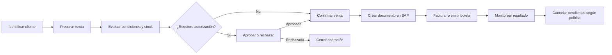

# Matriz de migración funcional — Sistema legado → Nuevo POS

## 1. Objetivo

Esta matriz convierte el levantamiento del sistema legado en decisiones iniciales de alcance para el nuevo POS de Agroinsumos. Permite distinguir las capacidades que deben preservarse, las que requieren un nuevo diseño y aquellas que todavía dependen de validación de negocio.

La clasificación orienta la priorización del producto; no constituye por sí sola una aprobación definitiva. Las decisiones marcadas `VALIDAR` y los bloqueos críticos deben resolverse antes de comprometer alcance o fecha productiva.

## 2. Criterios de clasificación

- **MANTENER:** la capacidad debe existir conceptualmente en el nuevo POS.
- **REDISEÑAR:** la necesidad continúa, pero el flujo o solución legado no debe trasladarse literalmente.
- **DESCARTAR:** la capacidad queda fuera del POS por evidencia suficiente de responsabilidad externa o falta de vigencia.
- **VALIDAR:** falta evidencia para decidir sin asumir comportamiento.
- **Prioridad:** `P0` habilita el flujo inicial de venta; `P1` completa la operación de Agroinsumos; `P2` admite implementación posterior; `P3` es secundaria o administrativa.
- **MVP Agroinsumos:** `SI` integra el candidato inicial, `NO` se posterga y `POR VALIDAR` depende de una decisión pendiente.

## 3. Matriz funcional

| ID | Módulo | Funcionalidad | Decisión | Prioridad | MVP Agroinsumos | Motivo | Dependencia/Bloqueo |
|---|---|---|---|---|---|---|---|
| FUN-001 | Acceso | Iniciar sesión | REDISEÑAR | P0 | SI | Acceso indispensable, alineado a identidad corporativa. | Identidad, usuarios y transición de perfiles. |
| FUN-002 | Acceso | Construir menú por perfil | REDISEÑAR | P0 | SI | El acceso por responsabilidad debe mantenerse con un modelo explícito. | Matriz real de roles y permisos. |
| FUN-003 | Ventas | Registrar venta de bodega propia | MANTENER | P0 | SI | Proceso central de venta con stock propio. | Reglas comerciales y contrato SAP. |
| FUN-004 | Ventas | Registrar venta consignada | VALIDAR | P1 | POR VALIDAR | Modalidad confirmada, pero su vigencia y diferencia operativa no. | Definición de modalidades comerciales. |
| FUN-005 | Ventas | Registrar venta puesto fundo | VALIDAR | P1 | POR VALIDAR | Necesita confirmar alcance logístico y de compra. | Ventas, Abastecimiento y Logística. |
| FUN-006 | Ventas | Registrar venta calzada proveedor | VALIDAR | P1 | POR VALIDAR | Necesita confirmar abastecimiento directo y responsabilidad de entrega. | Proveedores, compras y despacho. |
| FUN-007 | Ventas | Registrar venta calzada propia | VALIDAR | P2 | POR VALIDAR | La vigencia de la modalidad no está demostrada. | Uso productivo y definición de negocio. |
| FUN-008 | Ventas | Registrar venta a costo especial | VALIDAR | P1 | POR VALIDAR | La excepción puede seguir vigente, pero requiere reglas aprobadas. | Política de precios y autorizaciones. |
| FUN-009 | Ventas | Registrar venta de liquidación | VALIDAR | P2 | POR VALIDAR | Requiere confirmar vigencia, responsables y condiciones. | Política de liquidación. |
| FUN-010 | Ventas | Calcular condiciones del producto | REDISEÑAR | P0 | SI | Evaluación comercial central; las fórmulas deben quedar gobernadas. | Fórmulas, redondeos, impuestos y monedas. |
| FUN-011 | Ventas | Consultar cliente y riesgo comercial | MANTENER | P0 | SI | Es necesario decidir una venta con información del cliente y su riesgo. | Fuente maestra y política de crédito. |
| FUN-012 | Ventas | Consultar producto e inventario | MANTENER | P0 | SI | Productos y disponibilidad habilitan la preparación de venta. | Maestro de productos y stock confiable. |
| FUN-013 | Ventas | Emitir voucher de venta | REDISEÑAR | P2 | NO | El comprobante puede ser útil, pero formato y canal deben modernizarse. | Definición documental y experiencia de usuario. |
| FUN-014 | SAP ventas | Crear borrador de venta | REDISEÑAR | P0 | SI | Se requiere un estado previo, desacoplado del mecanismo SAP legado. | Estrategia de estados y contrato de integración. |
| FUN-015 | SAP ventas | Crear orden de venta | REDISEÑAR | P0 | SI | Confirmar la venta en SAP es parte del flujo operativo. | API SAP RISE, series, impuestos y campos requeridos. |
| FUN-016 | Autorizaciones | Determinar autorizaciones requeridas | REDISEÑAR | P0 | SI | Control comercial indispensable con reglas trazables. | Umbrales, jerarquías y dueños de reglas. |
| FUN-017 | Autorizaciones | Notificar solicitud de autorización | REDISEÑAR | P0 | SI | Las aprobaciones necesitan aviso confiable y seguimiento. | Canal corporativo, plantillas y escalamiento. |
| FUN-018 | Autorizaciones | Aprobar borrador | MANTENER | P0 | SI | Decisión humana necesaria para excepciones comerciales. | Identidad, permisos y reglas aprobadas. |
| FUN-019 | Autorizaciones | Rechazar borrador | MANTENER | P0 | SI | Cierre negativo trazable del proceso de excepción. | Identidad, permisos y trazabilidad. |
| FUN-020 | Autorizaciones | Consolidar decisión de autorización | REDISEÑAR | P0 | SI | Debe resolver múltiples decisiones sin replicar el dispatcher legado. | Estados, concurrencia y política de aprobación. |
| FUN-021 | Monitoreo | Monitorear autorizaciones | REDISEÑAR | P0 | SI | Visibilidad necesaria para evitar ventas detenidas. | Modelo de estados, responsables y alertas. |
| FUN-022 | Monitoreo | Monitorear documentos comerciales | REDISEÑAR | P0 | SI | Trazabilidad punta a punta necesaria para operar y soportar. | Correlación POS–SAP y estados sincronizados. |
| FUN-023 | Facturación | Crear factura o boleta desde orden | REDISEÑAR | P0 | SI | Completa el eje transaccional, pero depende del diseño SAP/DTE futuro. | Tipo documental, SAP RISE, SII e impresión. |
| FUN-024 | Facturación | Visualizar documento tributario | REDISEÑAR | P1 | SI | El usuario debe acceder al documento, sin depender del SOAP legado. | Proveedor DTE, folio, resolución y seguridad. |
| FUN-025 | Compras | Generar orden de compra asociada | VALIDAR | P1 | POR VALIDAR | Puede ser crítica para modalidades con abastecimiento externo. | Límite POS–Compras y responsabilidad de Abastecimiento. |
| FUN-026 | Compras | Notificar orden de compra | VALIDAR | P2 | POR VALIDAR | Canal y cláusula de aceptación requieren validación. | Proceso de compras, Legal y comunicaciones. |
| FUN-027 | Cotizaciones | Consultar cotizaciones | VALIDAR | P2 | POR VALIDAR | No está confirmado si cotizar es parte del nuevo POS. | Alcance comercial y uso actual. |
| FUN-028 | Informes | Consultar cuenta corriente | MANTENER | P1 | NO | Información relevante, pero puede entregarse fuera del MVP. | Fuente financiera y permisos de consulta. |
| FUN-029 | Informes | Consultar ventas mensuales | MANTENER | P2 | NO | Capacidad de gestión útil, no bloquea la venta inicial. | Plataforma corporativa de reportes. |
| FUN-030 | Comisiones | Consultar comisión provisoria | VALIDAR | P3 | NO | No hay evidencia suficiente para incluirla en el POS. | Dueño del proceso y sistema objetivo. |
| FUN-031 | Comisiones | Consultar liquidación de comisión | VALIDAR | P3 | NO | Proceso administrativo posiblemente externo al POS. | Finanzas, RR. HH. y sistema objetivo. |
| FUN-032 | Documentos | Registrar recepción de cuarta copia | VALIDAR | P3 | NO | Debe aclararse su vigencia legal y ubicación futura. | Administración, Cobranza y gestión documental. |
| FUN-033 | Cancelaciones | Cancelar borradores pendientes | REDISEÑAR | P1 | SI | Se necesita depuración controlada, observable y recuperable. | Criterio temporal, estados y automatización. |
| FUN-034 | Cancelaciones | Avisar/cancelar órdenes sin facturar | REDISEÑAR | P0 | SI | Evita documentos abiertos fuera de política comercial. | Plazo, aviso, autorización y cancelación SAP. |
| FUN-035 | Maestros | Consultar parámetros comerciales | REDISEÑAR | P0 | SI | Datos maestros son transversales y deben tener fuente y gobierno claros. | Dueños de datos, sincronización y SAP RISE. |

## 4. Flujo MVP candidato

## 5. Funcionalidades P0

- `FUN-001` — Iniciar sesión.
- `FUN-002` — Construir menú por perfil.
- `FUN-003` — Registrar venta de bodega propia.
- `FUN-010` — Calcular condiciones del producto.
- `FUN-011` — Consultar cliente y riesgo comercial.
- `FUN-012` — Consultar producto e inventario.
- `FUN-014` — Crear borrador de venta.
- `FUN-015` — Crear orden de venta.
- `FUN-016` — Determinar autorizaciones requeridas.
- `FUN-017` — Notificar solicitud de autorización.
- `FUN-018` — Aprobar borrador.
- `FUN-019` — Rechazar borrador.
- `FUN-020` — Consolidar decisión de autorización.
- `FUN-021` — Monitorear autorizaciones.
- `FUN-022` — Monitorear documentos comerciales.
- `FUN-023` — Crear factura o boleta desde orden.
- `FUN-034` — Avisar/cancelar órdenes sin facturar.
- `FUN-035` — Consultar parámetros comerciales.

## 6. Decisiones bloqueantes

| ID/Área | Decisión requerida | Impacto |
|---|---|---|
| PEN-001 / Autorizaciones | Aprobar conceptos, umbrales, jerarquías y responsables de autorización. | ALTO |
| PEN-002 y PEN-010 / SAP | Definir contrato de integración con SAP RISE, campos, series, impuestos, responsabilidades y transición. | ALTO |
| PEN-003 y PEN-006 / Modalidades | Confirmar modalidades vigentes y cuándo una venta va directa, a borrador o a compra. | ALTO |
| PEN-007 / Cálculo comercial | Formalizar fórmulas de precios, descuentos, interés, flete, margen, impuestos, moneda y redondeo. | ALTO |
| PEN-005 / Acceso | Aprobar roles, permisos y alcance de identidad corporativa. | ALTO |
| PEN-016 y PEN-017 / Facturación | Definir factura, factura de reserva, boleta, DTE, visualización, contingencia y proveedor vigente. | ALTO |
| PEN-022 / Pagos | Decidir si el POS incluirá medios de pago, caja y cierre, ausentes del levantamiento legado. | ALTO |
| PEN-023 / Despacho | Definir alcance de preparación, guía, bloqueo, entrega y responsabilidades logísticas. | ALTO |
| PEN-012 y PEN-013 / Cancelación | Aprobar plazos, avisos, excepciones y mecanismo operativo de cancelación automática. | MEDIO |
| PEN-024 / Postventa | Decidir alcance de devoluciones y notas de crédito. | ALTO |

## 7. Resumen ejecutivo

| Indicador | Cantidad |
|---|---:|
| Total funcionalidades | 35 |
| Mantener | 7 |
| Rediseñar | 16 |
| Descartar | 0 |
| Validar | 12 |
| P0 | 18 |
| P1 | 8 |
| P2 | 6 |
| P3 | 3 |
| Candidatas MVP | 20 |
| Bloqueos críticos | 10 |

- El MVP candidato cubre el ciclo desde acceso y preparación de venta hasta facturación, monitoreo y cancelación.
- El mayor esfuerzo no consiste en copiar pantallas, sino en desacoplar reglas y estados de SQL, servicios heredados y SAP Business One.
- Doce capacidades permanecen en validación; principalmente modalidades especiales, compras, cotizaciones, comisiones y gestión documental.
- No existe evidencia suficiente para descartar capacidades de forma definitiva.
- Las decisiones sobre SAP, cálculo comercial, autorizaciones, pagos y documentos tributarios condicionan arquitectura y salida productiva.
