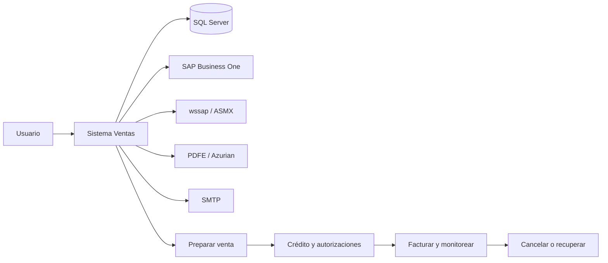
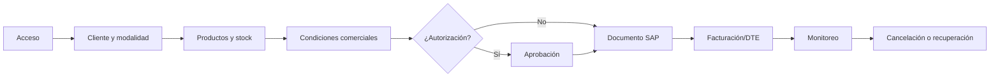

# Manual funcional — Sistema de Ventas Actual

## 1. Propósito del documento

Este manual consolida el comportamiento funcional documentado del sistema legado de ventas. Está dirigido a gerencia, usuarios de negocio, analistas y desarrolladores que necesitan comprender la operación sin depender de una persona específica.

Su objetivo es facilitar la continuidad operacional, ubicar rápidamente el detalle de cada proceso y servir como referencia para mantenimiento y futura evolución. Describe el sistema actual; no define el nuevo POS.

## 2. Alcance del sistema

El sistema cubre acceso y perfiles, preparación y modalidades de venta, clientes y crédito, autorizaciones, productos y stock, compras y abastecimiento, despacho, documentos SAP, facturación/DTE, monitoreo y cancelaciones, cotizaciones, informes, comisiones, maestros y configuración operativa.

La operación se apoya principalmente en SQL Server, SAP Business One, servicios `wssap`/ASMX, PDFE/Azurian, SMTP e impresión. Varias reglas se encuentran encapsuladas en stored procedures y parámetros cuya administración requiere conocimiento especializado.

## 3. Mapa general del sistema

## 4. Flujo principal de una venta

1. El operador se autentica y recibe empresa, oficina, rol, nivel y perfil.
2. Selecciona cliente y consulta direcciones, vendedor, crédito, deuda y protestos.
3. Selecciona modalidad, bodega, productos, stock, precios, moneda y condiciones.
4. El sistema calcula condiciones comerciales y determina si debe solicitar autorización.
5. Si corresponde, un aprobador revisa la excepción; al facturar se puede revalidar crédito/riesgo.
6. Se crea o consulta el documento SAP correspondiente.
7. Se factura o emite boleta, se obtiene folio/DTE y se genera visualización o impresión.
8. Monitores permiten seguir estados, cancelar operaciones permitidas y tratar errores.

Detalle: [01-flujo-venta-completo.md](funcionalidades/01-flujo-venta-completo.md).

## 5. Modalidades de venta

**Revalidación dirigida:** calzada propia permanece no confirmada. Sólo se encontró una pantalla cuyo code-behind y scripts propios no implementan un flujo transaccional verificable.

| Modalidad | Descripción breve | Abastecimiento | Observaciones |
|---|---|---|---|
| Bodega propia | Venta desde stock de una bodega propia | Stock propio | La bodega y disponibilidad condicionan la operación |
| Consignada | Venta asociada a inventario consignado | Stock consignado | Se identifica por atributos de bodega |
| Puesto fundo | Venta con abastecimiento/entrega asociada a fundo | Proveedor o ubicación definida por modalidad | Reglas de compra y entrega requieren revisar detalle |
| Calzada proveedor | Venta donde participa directamente un proveedor | Compra/abastecimiento de proveedor | Relacionada con bodegas marcadas para esta modalidad |
| Costo especial | Venta con costo o condición especial | Según operación | Puede activar reglas comerciales/autorización |
| Liquidación | Venta de productos en liquidación | Bodega/stock de liquidación | Se identifica por códigos y reglas de modalidad |
| Calzada propia | No confirmada suficientemente | PENDIENTE DE VALIDACIÓN FUNCIONAL | No tratar como modalidad confirmada |

## 6. Crédito, riesgo y autorizaciones

El sistema consulta acuerdo, autorizado, utilizado y disponible del cliente, además de facturas impagas y cheques protestados. Las condiciones de pago, margen, descuento, precio, interés, flete y costo pueden generar autorizaciones. Se documentan niveles BM y BC, aprobadores, estados de autorización y una revalidación previa a facturar.

Una aprobación no debe interpretarse como una garantía permanente: cambios posteriores y la vigencia exacta de las autorizaciones requieren validación funcional. Las matrices y umbrales están mayormente en SQL y parámetros.

Detalle: [04-credito-riesgo-autorizaciones.md](funcionalidades/04-credito-riesgo-autorizaciones.md).

## 7. Compras, abastecimiento y despacho

Una venta puede abastecerse desde stock propio o generar una necesidad de compra asociada. Las modalidades con proveedor determinan proveedor, cantidades, documentos de compra y relación con el despacho. Las órdenes de compra y su seguimiento se apoyan en SAP y SQL.

Está documentada la relación funcional venta→proveedor→orden/documento→abastecimiento→despacho. La recepción física, algunos estados logísticos y la confirmación exacta de entrega permanecen pendientes cuando no aparecen en el código.

Detalle: [02-compras-abastecimiento-despacho.md](funcionalidades/02-compras-abastecimiento-despacho.md).

## 8. SAP y wssap

SAP Business One concentra documentos y operaciones empresariales; el sistema de ventas prepara datos y puede acceder mediante DI API. `wssap` expone servicios ASMX para operaciones de orden de venta y actúa como capa intermedia en los casos documentados. SQL Server conserva consultas, parámetros y referencias utilizadas para correlacionar la operación.

| Proceso | Documento/operación SAP |
|---|---|
| Preparación/autorización | Borrador |
| Venta | Orden de venta |
| Abastecimiento | Orden de compra |
| Facturación | Factura o boleta |
| Corrección operativa | Cancelación de documentos permitidos |

La implementación del legado no debe confundirse con una decisión tecnológica futura. La correlación SQL/SAP, series, UDF, errores DI API y liberación COM requieren conocimiento especializado.

Detalle: [06-sap-wssap-integracion.md](funcionalidades/06-sap-wssap-integracion.md).

## 9. Facturación y DTE

Antes de facturar se revisan estado de venta, cliente, condiciones y, cuando corresponde, crédito/riesgo. SAP crea o consulta el documento y devuelve identificadores/folio. PDFE/Azurian participa en la visualización del DTE; el sistema también genera comprobantes PDF locales e impresión.

La documentación confirma visualización, impresión y cuarta copia como conceptos operativos, pero algunos detalles de copias, impresoras, reintentos y estados tributarios requieren validación.

Detalle: [03-facturacion-dte-impresion.md](funcionalidades/03-facturacion-dte-impresion.md).

## 10. Monitoreo y recuperación operativa

Los monitores permiten consultar operaciones, documentos y autorizaciones, revisar estados y abrir detalles. Existen cancelaciones manuales para operaciones permitidas y procesos automáticos asociados a borradores u órdenes sin facturar, incluyendo avisos y posterior cancelación cuando el código lo confirma.

Ante errores SAP, SQL o de servicios se registran mensajes y puede requerirse intervención manual. No se confirmó una reconciliación automática coordinada entre SQL y SAP; los casos de actualización parcial deben tratarse como riesgo operativo.

Detalle: [05-monitoreo-cancelaciones-recuperacion.md](funcionalidades/05-monitoreo-cancelaciones-recuperacion.md).

## 11. Maestros y parámetros

Los maestros principales son clientes, productos, proveedores, bodegas, plazos, tasas, descuentos, fletes, series, usuarios, perfiles y menú.

- **SQL Server:** consultas de clientes, productos, proveedores, bodegas, usuarios, perfiles, menú, parámetros comerciales y series.
- **SAP Business One:** socios de negocio, documentos y ciertos UDF/configuración de documentos.
- **Aplicación:** selecciona ambiente, consume servicios y presenta los datos; no se confirmó un CRUD completo para todos los maestros.

Detalle: [07-maestros-parametros-acceso.md](funcionalidades/07-maestros-parametros-acceso.md).

## 12. Acceso y permisos

El acceso actual usa usuario y contraseña propios validados contra SQL Server. La cuenta debe existir y estar activa. Después del login se recuperan empresa, operador, oficina, rol, nivel y perfil; el perfil determina el menú dinámico de módulos y páginas.

No se debe asumir autenticación Windows, Microsoft Identity ni el modelo del nuevo POS: este manual describe exclusivamente el sistema legado.

## 13. Cotizaciones, informes y comisiones

Las cotizaciones se consultan por estado y operador; las pendientes pueden abrir la modalidad de venta con su identificador. Los informes confirmados incluyen cuenta corriente, venta mensual y liquidaciones de comisión.

La cuenta corriente muestra deuda vencida, por vencer y cheques; la venta mensual muestra folios, fechas, netos y detalle, ajustando notas de crédito; las comisiones muestran neto, costo, margen, porcentajes y componentes individuales/grupales/finales. Las fórmulas están encapsuladas en SQL.

Detalle: [08-cotizaciones-informes-comisiones.md](funcionalidades/08-cotizaciones-informes-comisiones.md).

## 14. Integraciones externas

| Integración | Propósito |
|---|---|
| SQL Server | Datos operativos, maestros, parámetros, estados y reportes |
| SAP Business One DI API | Socios de negocio y documentos comerciales |
| wssap/ASMX | Servicios de integración y consultas del sistema web |
| PDFE/Azurian | Visualización/obtención de DTE |
| SMTP | Notificaciones de autorización u otros avisos confirmados |
| iTextSharp | Generación de comprobantes PDF locales |
| Impresión | Salida de documentos y copias |
| Scheduler/dispatcher | Procesos automáticos; frecuencia exacta no siempre identificada |

No se incluyen credenciales ni valores de configuración sensibles.

## 15. Procesos automáticos

Se documentan cancelación automática de borradores, aviso y posterior cancelación de órdenes sin facturar, y componentes dispatcher/timer asociados a monitoreo. En varios casos el código permite la ejecución automática, pero el scheduler productivo y su frecuencia no están confirmados.

No presentar como hecho una tarea programada cuya instalación operativa no esté evidenciada.

## 16. Riesgos operativos actuales

| Riesgo | Impacto | Situación actual |
|---|---|---|
| Desalineación SQL/SAP | Operación parcialmente registrada | No se confirmó reconciliación automática |
| Reglas en stored procedures | Dificulta modificar o explicar reglas | Fórmulas, perfiles y autorizaciones dependen de SQL |
| Configuración SAP | Puede impedir documentos, series o conexiones | Requiere `CompanyDB`, series, UDF y DI API correctos |
| Servicios externos | Puede impedir DTE, integración o avisos | Dependencia de wssap, PDFE/Azurian y SMTP |
| Procesos automáticos no identificados completamente | Pendientes pueden no cancelarse o avisarse | Scheduler/frecuencia requieren validación |
| Conocimiento DI API/COM | Riesgo de errores de conexión y objetos abiertos | Mantenimiento requiere experiencia especializada |

## 17. Pendientes de validación funcional

### Negocio

- Vigencia y conversión definitiva de cotizaciones.
- Modalidad calzada propia y alcance exacto de cada modalidad.
- Responsables de mantenimiento de maestros y parámetros.

### SAP

- Correspondencia definitiva entre empresas, `CompanyDB`, series, subtipos y UDF.
- Estados y recuperación cuando SAP y SQL quedan desalineados.

### Crédito

- Umbrales completos de cupo, deuda, margen y niveles BM/BC.
- Vigencia y efecto de cambios posteriores a una autorización.

### Facturación

- Reglas tributarias finales, cuarta copia, impresoras y reintentos DTE.

### Logística

- Recepción física, estados de entrega y confirmación de despacho.

### Configuración

- Responsables y procedimiento seguro para cambiar endpoints, parámetros y credenciales por ambiente.

### Reportes/comisiones

- Fórmulas completas, cierre y periodicidad de liquidaciones.
- Catálogo total de informes y exportaciones disponibles.

## 18. Guía de navegación de la documentación

| Necesito entender... | Documento recomendado |
|---|---|
| Venta completa | [01-flujo-venta-completo.md](funcionalidades/01-flujo-venta-completo.md) |
| Compras/abastecimiento | [02-compras-abastecimiento-despacho.md](funcionalidades/02-compras-abastecimiento-despacho.md) |
| Facturación/DTE | [03-facturacion-dte-impresion.md](funcionalidades/03-facturacion-dte-impresion.md) |
| Crédito/autorizaciones | [04-credito-riesgo-autorizaciones.md](funcionalidades/04-credito-riesgo-autorizaciones.md) |
| Monitoreo/recuperación | [05-monitoreo-cancelaciones-recuperacion.md](funcionalidades/05-monitoreo-cancelaciones-recuperacion.md) |
| SAP/wssap | [06-sap-wssap-integracion.md](funcionalidades/06-sap-wssap-integracion.md) |
| Maestros/acceso | [07-maestros-parametros-acceso.md](funcionalidades/07-maestros-parametros-acceso.md) |
| Cotizaciones/informes/comisiones | [08-cotizaciones-informes-comisiones.md](funcionalidades/08-cotizaciones-informes-comisiones.md) |

## 19. Guía rápida para mantenimiento

### Si falla el acceso

Revisar `clsUsuarioSistemaListado`, `pagLoginSistema`, `tai_vw_sp2_select_usuario_sistema`, conexión SQL y estado/perfil del usuario. Ver [07-maestros-parametros-acceso.md](funcionalidades/07-maestros-parametros-acceso.md).

### Si no aparecen productos o clientes

Revisar `clsProductoListado`, `clsClienteListado`, los procedimientos de selección, conexión SQL y parámetros de bodega/operador.

### Si falla una autorización

Revisar `clsAutorizacionListado`, `tai_vw_sp2_select_autorizacion`, parámetros de descuento/margen y determinación de aprobadores. Ver [04-credito-riesgo-autorizaciones.md](funcionalidades/04-credito-riesgo-autorizaciones.md).

### Si no se crea un documento SAP

Revisar `clsOrdenVenta`, `clsOrdenCompra`, `clsFactura`, configuración de `CompanyDB`, series, UDF, DI API y servicios wssap. Ver [06-sap-wssap-integracion.md](funcionalidades/06-sap-wssap-integracion.md).

### Si una factura no obtiene PDF

Revisar `pagVisualizarOrdenVenta`, referencia PDFE/Azurian, parámetros de ambiente y estado/folio del documento. Ver [03-facturacion-dte-impresion.md](funcionalidades/03-facturacion-dte-impresion.md).

### Si una orden no se cancela

Revisar monitor, precondiciones, permisos, procedimiento de cancelación, estado SAP y actualización SQL. Ver [05-monitoreo-cancelaciones-recuperacion.md](funcionalidades/05-monitoreo-cancelaciones-recuperacion.md).

### Si un reporte muestra datos incorrectos

Revisar filtros, procedimiento SQL asociado y parámetros de período/cliente/operador. Para comisiones, revisar `tai_vw_sp2_select_liquidacion_comision`.

## 20. Qué NO está confirmado

- No está confirmada la conversión integral de cotización a venta ni su vigencia.
- No está confirmada una reconciliación automática SQL/SAP.
- No están completamente confirmados schedulers, frecuencias, reintentos y compensaciones.
- No están cerradas todas las reglas de crédito, autorización, comisión y parámetros.
- No está confirmado el catálogo total de exportaciones, impresoras y copias.
- No debe confundirse este legado con SAP RISE, Microsoft Identity o la arquitectura del nuevo POS.

## 21. Resumen para gerencia

El sistema actual permite a empleados preparar ventas en distintas modalidades, consultar clientes y productos, evaluar crédito, solicitar autorizaciones, crear documentos en SAP, facturar, obtener DTE, imprimir y monitorear operaciones. También gestiona compras asociadas, abastecimiento, despacho, cotizaciones, cuenta corriente, informes y comisiones.

Su operación depende de SQL Server, SAP Business One, servicios web de integración, PDFE/Azurian, SMTP e impresión. Las áreas involucradas son ventas, crédito, autorizaciones, abastecimiento, logística, facturación, administración y soporte técnico.

El conocimiento funcional principal está documentado en este manual y sus ocho documentos de detalle. Los riesgos más relevantes son la dependencia de reglas SQL y configuración SAP, los errores parciales entre SQL y SAP, los servicios externos y los procesos automáticos cuyo despliegue/frecuencia no están completamente confirmados. La siguiente etapa debe validar con negocio y responsables técnicos los pendientes críticos antes de convertirlos en requisitos de migración.

## 22. Estado de documentación

| Área | Estado |
|---|---|
| Flujo y modalidades de venta | DOCUMENTADA CON PENDIENTES |
| Compras, abastecimiento y despacho | DOCUMENTADA CON PENDIENTES |
| Facturación, DTE e impresión | DOCUMENTADA CON PENDIENTES |
| Crédito, riesgo y autorizaciones | DOCUMENTADA CON PENDIENTES |
| Monitoreo, cancelaciones y recuperación | DOCUMENTADA CON PENDIENTES |
| SAP y wssap | DOCUMENTADA CON PENDIENTES |
| Maestros, parámetros y acceso | DOCUMENTADA CON PENDIENTES |
| Cotizaciones, informes y comisiones | DOCUMENTADA CON PENDIENTES |

Este manual describe exclusivamente el sistema legado actual.
