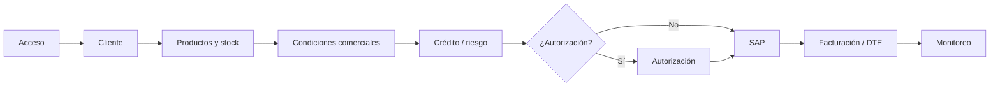

# Presentación gerencial — Sistema de Ventas Actual

## Lámina 1 — Qué sistema existe hoy

El sistema actual es una plataforma legado que soporta la operación diaria de ventas de Agroinsumos y sus procesos relacionados.

**Módulos principales**

- acceso, perfiles y menú;
- ventas y modalidades de abastecimiento;
- clientes, crédito, riesgo y autorizaciones;
- productos, stock, proveedores y bodegas;
- compras, despacho y seguimiento;
- SAP, facturación, DTE e impresión;
- monitoreo, cancelaciones y recuperación;
- cotizaciones, informes y comisiones.

**Áreas involucradas:** ventas, crédito, autorizaciones, abastecimiento, logística, facturación, administración y soporte técnico.

El sistema participa directamente en el ciclo comercial: desde la preparación de una operación hasta su registro documental, seguimiento y tratamiento de excepciones.

## Lámina 2 — Flujo principal de venta

En términos operativos, el usuario inicia sesión, selecciona cliente y modalidad, incorpora productos, revisa condiciones comerciales, supera controles de crédito o autorización, genera el documento SAP, factura y realiza seguimiento.

## Lámina 3 — Modalidades de venta

**Nota de validación:** calzada propia no está confirmada; existe un artefacto de pantalla sin flujo transaccional propio verificable.

| Modalidad | Característica ejecutiva |
|---|---|
| Bodega propia | Venta desde stock propio |
| Consignada | Venta asociada a inventario consignado |
| Puesto fundo | Venta con abastecimiento/entrega vinculada al fundo |
| Calzada proveedor | Venta con participación directa de un proveedor |
| Costo especial | Venta con costo o condición comercial especial |
| Liquidación | Venta de productos en liquidación |
| Calzada propia | No confirmada funcionalmente |

La bodega y sus parámetros pueden determinar la modalidad, el origen del producto, la necesidad de compra y el despacho posterior.

## Lámina 4 — Integraciones y dependencias

| Integración | Papel en la operación |
|---|---|
| SQL Server | Maestros, parámetros, estados, autorizaciones y reportes |
| SAP Business One DI API | Socios de negocio y documentos comerciales |
| wssap / ASMX | Servicios de integración y operaciones web |
| PDFE / Azurian | Visualización y obtención de documentos tributarios |
| SMTP | Avisos y notificaciones confirmadas |
| Impresión | Documentos, comprobantes y copias |
| Procesos automáticos | Cancelaciones, avisos, dispatcher y seguimiento |

La continuidad operacional depende de la disponibilidad y correcta configuración de estos componentes.

## Lámina 5 — Dónde está concentrada la lógica

- **Stored procedures:** concentran consultas, parámetros, crédito, autorizaciones, reportes y comisiones.
- **Crédito y riesgo:** cupo, deuda, protestos, condiciones de pago y revalidaciones.
- **Autorizaciones BM/BC:** reglas de excepción, aprobadores y estados.
- **SAP:** borradores, órdenes, compras, facturas, boletas y cancelaciones.
- **DTE:** folios, PDFE/Azurian, visualización, impresión y cuarta copia.
- **Configuración:** empresas, ambientes, series, bodegas, endpoints y parámetros.
- **Schedulers/dispatcher:** procesos automáticos cuya frecuencia productiva no siempre está identificada.

La lógica no está concentrada en un único módulo; se distribuye entre aplicación, SQL, SAP y servicios externos.

## Lámina 6 — Riesgos de conocimiento y operación

- Reglas críticas encapsuladas en SQL y parámetros difíciles de interpretar sin contexto.
- Posible desalineación entre SQL Server y SAP cuando una operación termina parcialmente.
- Recuperación manual ante determinados errores o documentos pendientes.
- Dependencia de conocimiento especializado de DI API y gestión COM.
- Configuración sensible de `CompanyDB`, series, endpoints, ambientes y servicios.
- Schedulers y procesos automáticos no completamente identificados en frecuencia o despliegue.

Estos riesgos afectan continuidad, soporte y capacidad de respuesta ante excepciones.

## Lámina 7 — Resultado del levantamiento

- Manual funcional consolidado creado y versionado.
- Ocho documentos funcionales detallados por proceso.
- Catálogo funcional y matriz de migración disponibles como índice.
- Integraciones SAP, wssap, DTE y dependencias externas documentadas.
- Pendientes funcionales explícitos, separados de los hechos confirmados.
- Guías rápidas para localizar código, procedimientos y configuración.
- Dependencia del conocimiento individual del desarrollador original reducida significativamente.

## Cierre ejecutivo

> **“El conocimiento crítico del sistema actual, antes disperso entre código y conocimiento individual, quedó documentado, estructurado y versionado.”**

La documentación permite a gerencia entender el alcance y los riesgos, y permite a nuevos mantenedores localizar el detalle necesario sin reconstruir todo el sistema desde cero.
