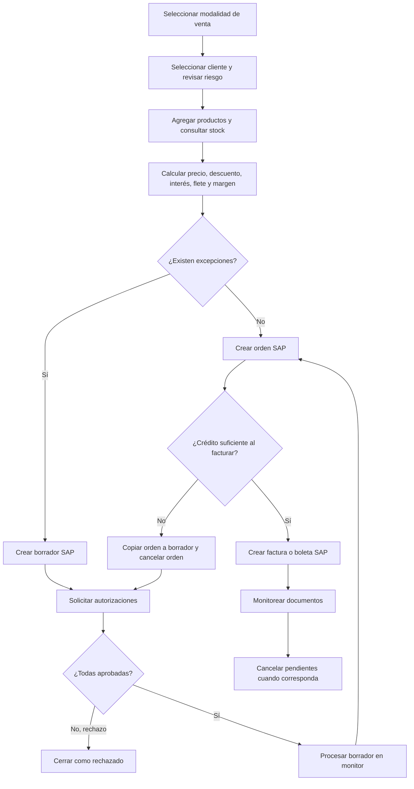

# Flujo funcional completo de venta — sistema original

## 1. Visión general

El sistema original permite que un operador comercial prepare una venta para un cliente, seleccione una modalidad de abastecimiento, agregue productos y defina fechas, despacho, pago y referencias. Durante la preparación consulta datos del cliente, crédito, documentos impagos, cheques protestados, productos, stock, precios, monedas y parámetros. Los importes y excepciones se calculan por línea antes de crear un documento.

Al confirmar, el sistema decide entre dos rutas. Si la operación no requiere aprobaciones, solicita a `wssap` crear directamente una orden de venta en SAP Business One. Si detecta excepciones de crédito, deuda, protestos, margen, costo, tasa u otras bandas comerciales, primero crea un borrador de orden en SAP y después registra y notifica las solicitudes de autorización. Por tanto, el borrador del legado no es una venta local incompleta: es un documento SAP generado después de preparar la operación.

Los autorizadores responden por concepto. Cuando todas las respuestas están completas, un rechazo cierra la autorización; una aprobación deja el borrador disponible para que se procese desde el monitor y se convierta en orden SAP. Antes de facturar, el sistema vuelve a revisar el crédito. Si el crédito ya no resulta suficiente, copia la orden a un nuevo borrador SAP, cancela la orden original y solicita una autorización de crédito.

Una orden elegible se convierte en factura de reserva o boleta en SAP. Los usuarios siguen borradores, autorizaciones, órdenes y facturas desde monitores. Las órdenes pendientes pueden cancelarse manualmente; además existen páginas destinadas a ejecuciones programadas que cancelan borradores y avisan o cancelan órdenes antiguas sin facturar.

`ventas/` contiene las pantallas, reglas de interacción, consultas, autorizaciones, monitoreo y decisión de qué operación ejecutar. `wssap/` contiene el servicio ASMX que recibe la venta y usa SAP Business One DI API para crear borradores, órdenes o cancelaciones. Otras operaciones SAP, como conversión y facturación, se invocan desde `ventas/` mediante un componente referenciado.

## 2. Diagrama general

## 3. Funcionalidades detalladas

Las clases examinadas ejecutan principalmente procedimientos almacenados y operaciones de objetos SAP. No se documentan nombres de tablas como hechos porque el repositorio no contiene las definiciones de los SP y no permite atribuir con seguridad cada dato a una tabla física.

### FUN-003 — Registrar venta de bodega propia

#### Propósito

Preparar una venta abastecida desde una bodega propia y crear una orden SAP directa o un borrador SAP sujeto a autorización. Es la modalidad base y concentra el flujo común de cliente, productos, stock, fechas, despacho y condiciones comerciales.

#### Usuario o área

Operador comercial o vendedor identificado en la sesión.

#### Cómo se inicia

Desde la opción de venta de bodega propia se abre `pagVentaBodegaPropia.aspx`. También puede iniciarse desde una cotización pendiente que precarga la pantalla. La acción final visible cambia entre **Crear Orden** y **Crear Borrador**.

#### Datos de entrada

- Cliente, dirección de facturación y dirección de despacho.
- Moneda de pago, vendedor asociado y operador.
- Fecha de orden, fecha de entrega y vencimiento.
- Serie, tipo de despacho, plazo de venta, orden de compra del cliente y nota de pedido.
- Productos, bodega, cantidad, precio unitario, moneda y fecha de entrega por línea.
- Emisión factura/boleta, guía de despacho y comentarios.

#### Flujo paso a paso

1. La pantalla carga datos del operador, parámetros, series, despachos, plazos y período contable.
2. El usuario busca al cliente; el sistema completa datos, direcciones, vendedor, moneda y antecedentes de riesgo.
3. El usuario selecciona bodega y producto; el sistema obtiene precio, moneda, costos, inventario y atributos.
4. Ingresa cantidad, precio y fecha de entrega.
5. El sistema valida stock, moneda y fechas, y calcula descuento, interés, flete, costo, margen y total de línea.
6. La línea confirmada se agrega a una tabla editable del pedido.
7. El usuario completa cabecera, despacho, vencimiento, referencias y comentarios.
8. El sistema revisa excepciones por producto, tasa, crédito, deuda y protestos.
9. Sin excepciones, el botón queda en **Crear Orden** y se solicita a `wssap` crearla en SAP.
10. Con excepciones, queda en **Crear Borrador**; primero se crea el borrador SAP y luego se registran y envían las autorizaciones.
11. Tras una creación exitosa se habilita el voucher; los errores retornados por la integración se muestran al usuario.

#### Reglas de negocio

- El cliente debe estar seleccionado y no bloqueado.
- Cliente categoría F genera aviso para contactar Crédito y Cobranzas.
- La fecha de orden no puede ser futura y debe pertenecer a período activo.
- La entrega de la orden no puede ser anterior a la fecha de orden; la entrega de línea no puede ser anterior al día vigente.
- Un producto en moneda extranjera no puede usar una moneda distinta de la moneda de pago del cliente.
- En bodega propia, la cantidad no puede superar el stock disponible.
- Para moneda extranjera, el vencimiento no puede ser inferior a 30 días.
- Total base de línea: `cantidad × precio unitario × tipo de cambio`, redondeado a entero.
- Descuento visible: `100 × (1 − total base / (precio de referencia × cantidad × tipo de cambio))`.
- Margen: `100 − (costo comercial × 100 / precio unitario)`.
- Precio final de línea: total base + interés + flete.

#### Validaciones

- Falta de cliente, fechas o tipo de despacho impide avanzar.
- Producto, cantidad, precio y entrega son obligatorios por línea.
- Precio inválido, stock cero o cantidad superior al stock impiden agregar la línea.
- Fecha con formato distinto de `dd/mm/aaaa` o fuera de rango genera mensaje y detiene el paso.
- No se genera voucher antes de guardar el documento.

#### Información consultada

Cliente, direcciones, vendedor, crédito, facturas impagas, cheques protestados, producto, inventario, costos, precios, tasa, descuento, interés, flete, moneda, tipo de cambio, bodega, serie, despacho y plazos.

#### Información generada o modificada

Tabla de líneas en la pantalla; borrador u orden SAP; registros de autorización cuando corresponda; voucher PDF opcional.

#### Integraciones

- ASMX internos de `ventas/`: consultas y reglas durante la preparación.
- SQL Server: maestros, riesgo, cálculos y autorizaciones.
- `wssap/srvOrdenVenta`: creación del borrador u orden.
- SAP Business One: documento comercial definitivo o sujeto a aprobación.
- SMTP: solicitudes de autorización.

#### Base de datos

SP principales: `tai_vw_sp2_select_cliente`, `tai_vw_sp2_select_producto`, `tai_vw_sp2_select_inventario`, `tai_vw_sp2_select_descuento_producto`, `tai_vw_sp2_select_interes_producto`, `tai_vw_sp2_select_flete_producto`, `tai_vw_sp2_select_autorizacion` y `tai_vw_sp2_select_periodo_contable`.

#### Resultado esperado

Orden SAP disponible para continuar el ciclo o borrador SAP pendiente de autorizaciones.

#### Errores y excepciones conocidas

Las llamadas AJAX muestran mensajes genéricos o el texto devuelto por el servicio. Las reglas completas almacenadas en SP no están versionadas. El endpoint `wssap_test` está escrito directamente en los scripts observados.

#### Dependencias

FUN-010, FUN-011, FUN-012, FUN-014 a FUN-017 y FUN-035. Después continúa con FUN-020, FUN-022 y FUN-023.

#### Evidencia técnica

- `ventas/SistemaVentasWeb/SistemaVentasWeb/Pages/pagVentaBodegaPropia.aspx`
- `ventas/SistemaVentasWeb/SistemaVentasWeb/Scripts/scrVentaBodegaPropia.js`
- `ventas/SistemaVentasWeb/SistemaVentasWeb/Scripts/scrVentaBodegaPropiaProducto.js`
- `wssap/WebServices/WebServices/Services/srvOrdenVenta.asmx.vb`

#### Pendientes

PENDIENTE DE VALIDACIÓN FUNCIONAL: significado operativo de cada tipo de despacho y de todas las bandas de autorización.

### FUN-004 — Registrar venta consignada

#### Propósito

Registrar una venta utilizando inventario consignado. Conserva el flujo general de bodega propia, pero la modalidad queda identificada separadamente en SAP y en el monitoreo.

#### Usuario o área

Operador comercial.

#### Cómo se inicia

Pantalla `pagVentaConsignada.aspx`, desde menú o cotización pendiente compatible.

#### Datos de entrada

Los mismos datos comerciales y logísticos de FUN-003: cliente, bodega, productos, stock, cantidades, precios, fechas, pago, despacho y referencias.

#### Flujo paso a paso

1. Selecciona cliente y se cargan riesgo y direcciones.
2. Selecciona producto disponible en la bodega aplicable.
3. El sistema calcula condiciones y valida la línea.
4. Se agregan una o más líneas.
5. Se evalúan excepciones comerciales y de riesgo.
6. Se crea orden directa o borrador SAP con tipo `ventaConsignada`.
7. Si es borrador, se envían autorizaciones.

#### Reglas de negocio

Comparte las validaciones de cliente, fechas, moneda, stock, precio y vencimiento de FUN-003. El margen total mostrado se calcula como `(total de venta − total costo comercial) / total de venta × 100`.

#### Validaciones

No permite cliente bloqueado, línea sin producto/cantidad/precio, stock insuficiente ni fechas inválidas.

#### Información consultada

Cliente/riesgo, producto, inventario consignado por bodega, costos, precios y parámetros comerciales.

#### Información generada o modificada

Borrador u orden SAP marcada con la modalidad consignada.

#### Integraciones

SQL Server, ASMX internos, `wssap`, SAP Business One y SMTP cuando requiere aprobación.

#### Base de datos

Utiliza los mismos grupos de SP de cliente, producto, inventario, cálculo y autorización de FUN-003.

#### Resultado esperado

Venta consignada creada en SAP, directa o pendiente de autorización.

#### Errores y excepciones conocidas

La diferencia contable y de propiedad exacta del stock consignado reside fuera del código disponible.

#### Dependencias

FUN-010 a FUN-012 y FUN-014 a FUN-020.

#### Evidencia técnica

- `ventas/SistemaVentasWeb/SistemaVentasWeb/Pages/pagVentaConsignada.aspx`
- `ventas/SistemaVentasWeb/SistemaVentasWeb/Scripts/scrVentaConsignada.js`
- `ventas/SistemaVentasWeb/SistemaVentasWeb/Scripts/scrVentaConsignadaProducto.js`

#### Pendientes

PENDIENTE DE VALIDACIÓN FUNCIONAL: responsabilidad y conciliación del inventario consignado.

### FUN-005 — Registrar venta puesto fundo

#### Propósito

Registrar una venta cuyo abastecimiento incorpora compra a proveedor y entrega puesta en el fundo. Además de vender, conserva por línea los antecedentes necesarios para una compra asociada posterior.

#### Usuario o área

Operador comercial; Abastecimiento participa posteriormente en la compra.

#### Cómo se inicia

Pantalla `pagVentaPuestoFundo.aspx` desde menú o cotización pendiente.

#### Datos de entrada

Datos comunes de venta más proveedor, plazo de compra, fecha de compra, moneda y precio de compra, tasa de interés de compra y condición/motivo cuando aplica.

#### Flujo paso a paso

1. Se completa cliente, riesgo, cabecera y despacho.
2. Se selecciona producto y se informan condiciones de compra y proveedor.
3. El sistema calcula el valor de venta y el margen contra el precio unitario de compra.
4. La línea conserva proveedor, días de compra, moneda y precios de compra.
5. Se evalúan riesgo, tasa, margen, costo y bandas comerciales.
6. Se crea orden o borrador SAP con tipo `ventaPuestoFundo`.
7. Una orden posterior puede originar la orden de compra asociada, fuera del primer alcance de este documento.

#### Reglas de negocio

- Margen de la línea: `100 − (precio unitario de compra × 100 / precio unitario de venta)`.
- El proveedor y las condiciones de compra forman parte de las líneas enviadas a SAP.
- Las validaciones comunes de cliente, moneda, fechas y vencimiento siguen vigentes.

#### Validaciones

Producto, cantidad, precio de venta, fecha de entrega, proveedor y datos de compra requeridos deben estar completos. Las reglas exactas entre plazo de compra y plazo de venta no se pueden confirmar: existe lógica comentada.

#### Información consultada

Cliente/riesgo, producto, proveedor, plazos, moneda/tipo de cambio, costos y reglas de autorización.

#### Información generada o modificada

Borrador u orden SAP con referencias de compra por línea.

#### Integraciones

ASMX internos, SQL Server, `wssap`, SAP Business One y SMTP.

#### Base de datos

Además de los SP comunes usa `tai_vw_sp2_select_proveedor` y `tai_vw_sp2_select_plazo_compra`.

#### Resultado esperado

Documento de venta SAP con datos suficientes para identificar la compra relacionada.

#### Errores y excepciones conocidas

La aplicación no explica en pantalla todo el proceso posterior de Abastecimiento.

#### Dependencias

FUN-010 a FUN-012, FUN-014 a FUN-020 y, después, FUN-025/FUN-026.

#### Evidencia técnica

- `ventas/SistemaVentasWeb/SistemaVentasWeb/Pages/pagVentaPuestoFundo.aspx`
- `ventas/SistemaVentasWeb/SistemaVentasWeb/Scripts/scrVentaPuestoFundo.js`
- `wssap/WebServices/WebServices/Classes/clsOrdenVenta.vb`

#### Pendientes

PENDIENTE DE VALIDACIÓN FUNCIONAL: momento y responsable exactos de confirmar la compra asociada.

### FUN-006 — Registrar venta calzada proveedor

#### Propósito

Registrar una venta abastecida desde instalaciones del proveedor, conservando condiciones de compra y entrega propias de esta modalidad.

#### Usuario o área

Operador comercial; proveedor y Abastecimiento participan en la ejecución posterior.

#### Cómo se inicia

Pantalla `pagVentaCalzadaProveedor.aspx`.

#### Datos de entrada

Cliente, producto, cantidad, precio de venta, fechas, despacho, proveedor, precio/moneda/plazo de compra y referencias.

#### Flujo paso a paso

1. Se identifica cliente y riesgo.
2. Se selecciona el producto y proveedor.
3. Se ingresan condiciones de venta y compra.
4. Se calculan margen, interés, descuento, flete y total.
5. Se evalúan excepciones.
6. Se crea borrador u orden SAP con tipo `ventaCalzadaProveedor`.
7. Los datos de proveedor quedan disponibles para compra asociada.

#### Reglas de negocio

La modalidad usa el precio de compra para evaluar margen y conserva proveedor/días de compra por línea. Aplican las validaciones comunes de cabecera, moneda, producto y fechas.

#### Validaciones

No permite continuar con proveedor o precio de compra faltante cuando la línea los exige.

#### Información consultada

Cliente, riesgo, productos, proveedores, condiciones comerciales, plazos y monedas.

#### Información generada o modificada

Documento SAP con modalidad y antecedentes de compra.

#### Integraciones

SQL Server, ASMX internos, `wssap`, SAP Business One y SMTP.

#### Base de datos

SP comunes de ventas más `tai_vw_sp2_select_proveedor` y `tai_vw_sp2_select_plazo_compra`.

#### Resultado esperado

Orden o borrador SAP listo para autorización y compra posterior cuando corresponda.

#### Errores y excepciones conocidas

El alcance físico de la entrega desde el proveedor no está implementado como flujo logístico completo.

#### Dependencias

FUN-010 a FUN-012, FUN-014 a FUN-020 y FUN-025/FUN-026.

#### Evidencia técnica

- `ventas/SistemaVentasWeb/SistemaVentasWeb/Pages/pagVentaCalzadaProveedor.aspx`
- `ventas/SistemaVentasWeb/SistemaVentasWeb/Scripts/scrVentaCalzadaProveedor.js`
- `wssap/WebServices/WebServices/Classes/clsOrdenVenta.vb`

#### Pendientes

PENDIENTE DE VALIDACIÓN FUNCIONAL: responsabilidad de despacho y recepción en esta modalidad.

### FUN-007 — Registrar venta calzada propia

#### Propósito

La solución contiene una pantalla destinada a preparar esta modalidad. No se confirmó un flujo completo que registre borrador u orden.

#### Usuario o área

PENDIENTE DE VALIDACIÓN FUNCIONAL

#### Cómo se inicia

Existe `pagVentaCalzadaPropia.aspx`; su disponibilidad efectiva depende del menú almacenado en base de datos.

#### Datos de entrada

La pantalla contiene datos comerciales, cliente y productos semejantes a otras modalidades.

#### Flujo paso a paso

1. La pantalla puede cargar componentes de cliente y producto.
2. No se encontró en sus scripts ni en servidor una ruta alcanzable equivalente a `RegistrarBorradorVenta` o `RegistrarOrdenVenta`.
3. No es posible documentar un resultado transaccional confirmado.

#### Reglas de negocio

PENDIENTE DE VALIDACIÓN FUNCIONAL

#### Validaciones

PENDIENTE DE VALIDACIÓN FUNCIONAL

#### Información consultada

Maestros y datos de preparación presentes en la pantalla.

#### Información generada o modificada

No confirmada.

#### Integraciones

No se confirmó invocación transaccional a `wssap`.

#### Base de datos

No se confirmó un SP exclusivo de registro.

#### Resultado esperado

PENDIENTE DE VALIDACIÓN FUNCIONAL

#### Errores y excepciones conocidas

Puede corresponder a funcionalidad incompleta, deshabilitada u obsoleta; el código no permite escoger una de estas alternativas.

#### Dependencias

Menú productivo y definición de modalidades.

#### Evidencia técnica

- `ventas/SistemaVentasWeb/SistemaVentasWeb/Pages/pagVentaCalzadaPropia.aspx`
- `ventas/SistemaVentasWeb/SistemaVentasWeb/Scripts/scrVentaCalzadaPropia.js`
- `ventas/SistemaVentasWeb/SistemaVentasWeb/Scripts/scrVentaCalzadaPropiaProducto.js`

#### Pendientes

PENDIENTE DE VALIDACIÓN FUNCIONAL: vigencia, usuarios y resultado real de la modalidad.

### FUN-008 — Registrar venta a costo especial

#### Propósito

Registrar una venta excepcional en la que el usuario informa un costo/precio de compra específico y una justificación por producto. La operación se somete a las mismas validaciones de riesgo y a controles particulares de costo y margen.

#### Usuario o área

Operador comercial; responsables comerciales autorizan excepciones.

#### Cómo se inicia

Pantalla `pagVentaCostoEspecial.aspx`.

#### Datos de entrada

Datos comunes de venta más proveedor, precio y moneda de compra, tasa, condición y motivo especial.

#### Flujo paso a paso

1. Se seleccionan cliente y producto.
2. Se ingresan precio de venta y antecedentes de compra especial.
3. El sistema calcula total, descuento, interés, flete y margen contra el precio de compra.
4. Se valida la línea y se incorpora al pedido.
5. El motivo y condición quedan incluidos en los datos enviados a SAP.
6. Las excepciones determinan borrador sujeto a aprobación u orden directa.

#### Reglas de negocio

- Margen: `100 − (precio de compra × 100 / precio de venta)`.
- Proveedor y precio de compra son obligatorios para una línea especial.
- La condición y el motivo se conservan en campos propios de la línea SAP.
- La decisión de autorización incluye controles de costo, margen, crédito, deuda, protestos, tasa y bandas configuradas.

#### Validaciones

Producto, cantidad, precio de venta, precio de compra, proveedor, fecha y tasa exigida deben estar completos. Moneda incompatible, cliente bloqueado o fecha inválida impiden continuar.

#### Información consultada

Cliente/riesgo, producto, proveedor, moneda, costos de referencia, tasas y autorizadores.

#### Información generada o modificada

Borrador u orden SAP con costo, condición, motivo y proveedor por línea.

#### Integraciones

ASMX internos, SQL Server, `wssap`, SAP Business One y SMTP.

#### Base de datos

SP de cliente, producto, proveedor, cálculo y autorización; los umbrales se obtienen desde SQL.

#### Resultado esperado

Venta especial registrada o enviada a aprobación con su justificación.

#### Errores y excepciones conocidas

El significado y catálogo vigente de motivos no puede reconstruirse completamente sin datos productivos.

#### Dependencias

FUN-010 a FUN-012 y FUN-014 a FUN-020.

#### Evidencia técnica

- `ventas/SistemaVentasWeb/SistemaVentasWeb/Pages/pagVentaCostoEspecial.aspx`
- `ventas/SistemaVentasWeb/SistemaVentasWeb/Scripts/scrVentaCostoEspecial.js`
- `wssap/WebServices/WebServices/Classes/clsOrdenVenta.vb`

#### Pendientes

PENDIENTE DE VALIDACIÓN FUNCIONAL: política vigente de costos especiales y responsables por nivel.

### FUN-009 — Registrar venta de liquidación

#### Propósito

Registrar productos bajo modalidad de liquidación, conservando antecedentes de compra y una tasa aplicada a la línea.

#### Usuario o área

Operador comercial; responsables de autorización cuando se exceden condiciones.

#### Cómo se inicia

Pantalla `pagVentaLiquidacion.aspx`.

#### Datos de entrada

Datos comunes más proveedor, plazo, precio y moneda de compra, tasa de interés y condición/motivo cuando corresponda.

#### Flujo paso a paso

1. Se identifica cliente y riesgo.
2. Se selecciona producto y se ingresan venta y compra.
3. El sistema calcula margen contra precio de compra, descuento, interés, flete y precio final.
4. Se valida y agrega cada línea.
5. Se determinan autorizaciones.
6. Se crea borrador u orden SAP con tipo `ventaLiquidacion`.

#### Reglas de negocio

- La tasa de interés de compra debe ingresarse y el código exige que no sea inferior a `1,8`.
- Proveedor y precio unitario de compra son obligatorios.
- Aplican reglas comunes de moneda, fechas, cliente, vencimiento y autorización.

#### Validaciones

Impide agregar línea sin plazo de compra, tasa, precio de compra o proveedor. Muestra explícitamente que la tasa no debe ser inferior a 1,8.

#### Información consultada

Cliente/riesgo, producto, proveedor, plazos, monedas, costos y reglas de aprobación.

#### Información generada o modificada

Borrador u orden SAP con datos comerciales y de compra de liquidación.

#### Integraciones

SQL Server, ASMX internos, `wssap`, SAP Business One y SMTP.

#### Base de datos

SP comunes de venta, proveedor, plazo de compra, tasa y autorización.

#### Resultado esperado

Venta de liquidación creada directamente o pendiente de autorización.

#### Errores y excepciones conocidas

No se encontró en el repositorio la fuente normativa del mínimo 1,8 ni su unidad.

#### Dependencias

FUN-010 a FUN-012 y FUN-014 a FUN-020.

#### Evidencia técnica

- `ventas/SistemaVentasWeb/SistemaVentasWeb/Pages/pagVentaLiquidacion.aspx`
- `ventas/SistemaVentasWeb/SistemaVentasWeb/Scripts/scrVentaLiquidacion.js`
- `wssap/WebServices/WebServices/Classes/clsOrdenVenta.vb`

#### Pendientes

PENDIENTE DE VALIDACIÓN FUNCIONAL: vigencia y fundamento del mínimo de tasa.

### FUN-010 — Calcular condiciones del producto

#### Propósito

Calcular los valores que muestran la rentabilidad y costo financiero de cada línea, y alimentar la decisión de autorización. La pantalla combina fórmulas visibles con resultados obtenidos desde procedimientos almacenados.

#### Usuario o área

El sistema durante la preparación; el operador revisa los resultados.

#### Cómo se inicia

Al seleccionar producto, cambiar cantidad, precio, fechas, plazo, bodega, proveedor o condiciones de compra.

#### Datos de entrada

Cantidad, precio real/de referencia, precio propuesto, moneda y tipo de cambio, bodega, fecha de venta y vencimiento, plazo, costo comercial/reposición, compra y proveedor según modalidad.

#### Flujo paso a paso

1. Calcula el total base de la línea.
2. Compara el precio propuesto con el precio real para mostrar descuento.
3. Consulta interés aplicable por cliente, producto, bodega, plazo, monto y fechas.
4. Consulta descuento comercial y flete.
5. Calcula margen con costo comercial o precio de compra según modalidad.
6. Suma total base, interés y flete como precio final.
7. Guarda valores calculados dentro de la línea que se enviará a SAP.
8. Compara los resultados con reglas de autorización por producto, tasa, margen y costo.

#### Reglas de negocio

- Total base: `cantidad × precio unitario × tipo de cambio`.
- Descuento porcentual: `100 × (1 − total base / total de referencia)`.
- Margen de stock propio: `100 − costo comercial × 100 / precio de venta`.
- Margen con compra asociada: `100 − precio de compra × 100 / precio de venta`.
- Precio final: total base + interés + flete.
- Las sumas monetarias se redondean a entero en el JavaScript observado.
- Descuento, interés, tasa máxima y flete dependen de SP; sus fórmulas internas no están en el repositorio.

#### Validaciones

Rechaza precio vacío/no válido, cantidad no positiva, datos de compra faltantes y vencimientos fuera de rango. Una excepción comercial no siempre bloquea: puede transformar la acción en **Crear Borrador**.

#### Información consultada

Precios/costos del producto, tipo de cambio, reglas de descuento, interés, tasa, flete y límites de autorización.

#### Información generada o modificada

Descuento, interés, flete, margen, costo y totales por línea y por pedido.

#### Integraciones

Servicios ASMX de descuento, interés, flete y tipo de cambio; SQL Server para reglas; SAP recibe los valores finales y campos auxiliares.

#### Base de datos

`tai_vw_sp2_select_descuento_producto`, `tai_vw_sp2_select_descuento_maximo_producto`, `tai_vw_sp2_select_interes_producto`, `tai_vw_sp2_select_tasa_interes_producto`, `tai_vw_sp2_select_flete_producto` y `tai_vw_sp2_select_tipo_cambio`.

#### Resultado esperado

Línea valorizada y clasificada como directa o potencialmente autorizable.

#### Errores y excepciones conocidas

Los SP no están versionados, por lo que redondeos y fórmulas completas no pueden verificarse sólo con este repositorio.

#### Dependencias

FUN-011, FUN-012 y FUN-035; alimenta FUN-016.

#### Evidencia técnica

- `ventas/SistemaVentasWeb/SistemaVentasWeb/Scripts/scrVentaBodegaPropia.js`
- `ventas/SistemaVentasWeb/SistemaVentasWeb/Scripts/scrVentaCostoEspecial.js`
- `ventas/SistemaVentasWeb/SistemaVentasWeb/Classes/clsInteresProductoListado.vb`
- `ventas/SistemaVentasWeb/SistemaVentasWeb/Classes/clsDescuentoProductoListado.vb`
- `ventas/SistemaVentasWeb/SistemaVentasWeb/Classes/clsFleteProductoListado.vb`

#### Pendientes

PENDIENTE DE VALIDACIÓN FUNCIONAL: fórmulas internas de SP, impuestos, redondeos y significado de cada banda.

### FUN-011 — Consultar cliente y riesgo comercial

#### Propósito

Identificar al cliente y exponer información comercial que determina si puede seleccionarse y si la venta requiere autorización.

#### Usuario o área

Operador comercial; Crédito y Cobranzas es el área referida por los mensajes.

#### Cómo se inicia

Búsqueda/autocompletado de cliente en las pantallas de venta y nueva consulta antes de facturar.

#### Datos de entrada

Código o texto de cliente.

#### Flujo paso a paso

1. El usuario busca y selecciona un cliente.
2. El sistema obtiene código, razón social, RUT, giro, teléfono, correo, grupo, estado y categoría.
3. Carga direcciones de factura y despacho y vendedor asociado.
4. Consulta moneda y línea de crédito.
5. Lista facturas impagas y cheques protestados.
6. Si está bloqueado, impide seleccionarlo.
7. Si tiene categoría F, advierte contactar a Crédito y Cobranzas.
8. Crédito insuficiente, deuda o protestos se convierten en conceptos de autorización.
9. Antes de facturar se vuelve a obtener el crédito para compararlo con la orden.

#### Reglas de negocio

- Cliente bloqueado no puede seleccionarse.
- Categoría F produce advertencia específica.
- Riesgo se evalúa al preparar y nuevamente antes de facturar.
- Deuda, protestos y crédito son conceptos separados de autorización.

#### Validaciones

Sin cliente recuperado no se puede continuar. Un error de servicio deja la pantalla sin datos válidos y muestra el texto del error.

#### Información consultada

Maestro de cliente, direcciones, vendedor, crédito disponible, facturas impagas y cheques protestados.

#### Información generada o modificada

Contexto del cliente en la venta y señales de autorización.

#### Integraciones

ASMX `srvCliente`, SQL Server y consultas que consolidan datos asociados a SAP.

#### Base de datos

`tai_vw_sp2_select_cliente`; las distintas opciones del SP entregan cliente, direcciones, crédito, vendedor, facturas impagas y protestos.

#### Resultado esperado

Cliente seleccionado con sus antecedentes visibles o selección rechazada por bloqueo.

#### Errores y excepciones conocidas

La regla exacta de categoría F y el cálculo consolidado del crédito no están definidos dentro del código.

#### Dependencias

FUN-003 a FUN-010, FUN-016 y FUN-036.

#### Evidencia técnica

- `ventas/SistemaVentasWeb/SistemaVentasWeb/Services/srvCliente.asmx.vb`
- `ventas/SistemaVentasWeb/SistemaVentasWeb/Classes/clsClienteListado.vb`
- `ventas/SistemaVentasWeb/SistemaVentasWeb/Scripts/scrVentaBodegaPropia.js`
- `ventas/SistemaVentasWeb/SistemaVentasWeb/Scripts/scrMonitorDocumento.js`

#### Pendientes

PENDIENTE DE VALIDACIÓN FUNCIONAL: fórmula de crédito disponible, categoría F y excepciones aprobadas por Crédito.

### FUN-012 — Consultar producto e inventario

#### Propósito

Buscar productos, obtener sus atributos comerciales y conocer las existencias por bodega antes de agregar una línea.

#### Usuario o área

Operador comercial.

#### Cómo se inicia

Búsqueda/autocompletado de producto dentro de cada modalidad; selección desde cuadro de cotización cuando existe precarga.

#### Datos de entrada

Código/texto de producto, bodega, opción de consulta e ingrediente activo cuando se usa el listado ampliado.

#### Flujo paso a paso

1. El usuario selecciona bodega y busca producto.
2. El sistema obtiene código, descripción, precio, moneda, condición inventariable, costo comercial y costo de reposición.
3. Carga datos de híbrido/descripcion adicional cuando corresponden.
4. Consulta inventario disponible por bodega.
5. Muestra existencias y utiliza el valor para validar cantidad en modalidades de stock.
6. Los datos del producto alimentan cálculos y la línea del pedido.

#### Reglas de negocio

- La línea requiere producto válido.
- En modalidades que validan stock, no se acepta stock cero ni cantidad superior a existencia.
- Moneda extranjera del producto debe coincidir con la moneda de pago del cliente.
- Productos inventariables reciben tratamiento de tasa y datos SAP distinto de servicios/no inventariables.

#### Validaciones

Producto vacío, moneda incompatible o stock insuficiente impiden agregar la línea.

#### Información consultada

Maestro de producto, precios, moneda, costos, inventario, híbridos e ingrediente activo.

#### Información generada o modificada

Producto seleccionado y valores auxiliares para cálculo y SAP.

#### Integraciones

ASMX `srvProducto`, `srvInventario` y `srvHibridoProducto`; SQL Server/SAP como fuentes consolidadas.

#### Base de datos

`tai_vw_sp2_select_producto`, `tai_vw_sp2_select_inventario`, `tai_vw_sp2_select_hibrido_producto` y `tai_vw_sp2_select_ingrediente_activo`.

#### Resultado esperado

Producto valorizable con disponibilidad conocida para la bodega seleccionada.

#### Errores y excepciones conocidas

La definición exacta de stock disponible y reservas previas reside en consultas externas al repositorio.

#### Dependencias

FUN-003 a FUN-010, FUN-035 y luego FUN-014/FUN-015.

#### Evidencia técnica

- `ventas/SistemaVentasWeb/SistemaVentasWeb/Services/srvProducto.asmx.vb`
- `ventas/SistemaVentasWeb/SistemaVentasWeb/Services/srvInventario.asmx.vb`
- `ventas/SistemaVentasWeb/SistemaVentasWeb/Classes/clsProductoListado.vb`
- `ventas/SistemaVentasWeb/SistemaVentasWeb/Classes/clsInventarioListado.vb`
- `ventas/SistemaVentasWeb/SistemaVentasWeb/Scripts/scrListarProducto.js`

#### Pendientes

PENDIENTE DE VALIDACIÓN FUNCIONAL: fuente productiva y definición de disponibilidad comprometida.

### FUN-013 — Emitir voucher de venta

#### Propósito

Generar un PDF comercial de la operación preparada, con cliente, antecedentes del negocio, comentarios, líneas y totales. Sirve como salida legible adicional al documento SAP.

#### Usuario o área

Operador comercial.

#### Cómo se inicia

Botón de voucher en las pantallas de modalidades; se habilita después de guardar el documento.

#### Datos de entrada

Cabecera de venta, cliente, productos, cantidades, precios, comentarios y totales contenidos en la página.

#### Flujo paso a paso

1. El usuario crea la orden o borrador.
2. La pantalla habilita la acción de voucher.
3. El servidor compone el documento con los datos de la operación.
4. iTextSharp genera el PDF y lo entrega como respuesta.

#### Reglas de negocio

No puede emitirse antes de guardar la venta. El contenido varía según modalidad y datos disponibles.

#### Validaciones

Si no se ha guardado, muestra “Debe guardar el documento antes de generar el voucher”.

#### Información consultada

Datos ya contenidos en la operación preparada.

#### Información generada o modificada

Archivo PDF; no se confirmó modificación de estado.

#### Integraciones

iTextSharp para generación PDF.

#### Base de datos

No se identificó un SP exclusivo para generar el voucher.

#### Resultado esperado

PDF descargable/visualizable por el usuario.

#### Errores y excepciones conocidas

PENDIENTE DE VALIDACIÓN FUNCIONAL: formato oficial, custodia y uso real del voucher.

#### Dependencias

FUN-003 a FUN-009 y documento guardado.

#### Evidencia técnica

- `ventas/SistemaVentasWeb/SistemaVentasWeb/Modules/mdlVoucherVenta.vb`
- `ventas/SistemaVentasWeb/SistemaVentasWeb/Pages/pagVentaBodegaPropia.aspx.vb`
- `ventas/SistemaVentasWeb/SistemaVentasWeb/Scripts/scrVentaBodegaPropia.js`

#### Pendientes

PENDIENTE DE VALIDACIÓN FUNCIONAL: obligatoriedad y destinatario del voucher.

### FUN-014 — Crear borrador SAP para autorización

#### Propósito

Crear en SAP Business One un borrador de orden de venta completamente preparado, como soporte para una operación que necesita aprobación. No es un borrador local editable previo a completar la venta.

#### Usuario o área

El sistema, iniciado por el operador comercial.

#### Cómo se inicia

Botón **Crear Borrador** cuando las validaciones de autorización detectan excepciones.

#### Datos de entrada

Usuario, modalidad, cliente, moneda, referencias, vendedor/operador, fechas, serie, despacho, plazos, direcciones, comentarios, emisión, guía y arreglo serializado de líneas.

#### Flujo paso a paso

1. `ventas/` arma la cabecera y serializa la tabla de productos.
2. El navegador llama `RegistrarBorradorVenta` en `wssap`.
3. `wssap` abre conexión con la compañía SAP mediante DI API.
4. Crea objeto SAP de borradores configurado como orden de venta.
5. Copia cabecera, direcciones, referencias y campos propios.
6. Agrega productos y datos comerciales/de compra por línea.
7. Agrega líneas técnicas para interés, descuento y flete cuando sus totales son distintos de cero.
8. SAP registra el borrador y devuelve identificadores o error.
9. Sólo después del éxito, `ventas/` registra y notifica autorizaciones.

#### Reglas de negocio

- El borrador usa objeto `oDrafts` con tipo de documento `oOrders`.
- Conserva modalidad, emisión, despacho, vencimiento, moneda, proveedor, costos, interés, descuento y flete.
- Intereses usan artículo técnico `INTERESES`; descuentos usan `DESCUENTO` y una línea negativa `Z8200003000000`; flete usa una cuenta obtenida por bodega.
- La creación debe preceder al envío de autorizaciones porque el identificador SAP las correlaciona.

#### Validaciones

SAP rechaza el alta si faltan datos obligatorios o existe error de conexión/configuración. El servicio devuelve código/mensaje al navegador.

#### Información consultada

Configuración de compañía SAP, empleado asociado al operador, cuentas, descuentos máximos, tasas y series.

#### Información generada o modificada

Borrador SAP de orden de venta con identificador interno y número retornado.

#### Integraciones

Llamada HTTP ASMX desde `ventas/` a `wssap`; SAP Business One DI API desde `wssap`.

#### Base de datos

Consultas auxiliares de `clsFuncion` para empleado, cuentas, descuento máximo y tasa; no existe una tabla local de borradores en el código observado.

#### Resultado esperado

Borrador SAP listo para asociar solicitudes de autorización.

#### Errores y excepciones conocidas

El servicio registra errores mediante NLog y devuelve texto. Credenciales/endpoints son dependientes del ambiente y no deben reutilizarse.

#### Dependencias

FUN-003 a FUN-012; después FUN-016 a FUN-020.

#### Evidencia técnica

- `ventas/SistemaVentasWeb/SistemaVentasWeb/Scripts/scrVentaBodegaPropia.js`, función `RegistrarBorradorVenta`
- `wssap/WebServices/WebServices/Services/srvOrdenVenta.asmx.vb`
- `wssap/WebServices/WebServices/Classes/clsOrdenVenta.vb`, función `RegistrarBorradorVenta`

#### Pendientes

PENDIENTE DE VALIDACIÓN FUNCIONAL: obligatoriedad y significado vigente de todos los campos propios SAP.

### FUN-015 — Crear orden de venta SAP

#### Propósito

Crear directamente la orden SAP cuando la venta preparada no requiere autorización, o crearla posteriormente al procesar un borrador aprobado.

#### Usuario o área

Operador comercial; el procesamiento posterior se realiza desde monitoreo.

#### Cómo se inicia

Botón **Crear Orden** en la venta directa o acción de procesar en un documento autorizado.

#### Datos de entrada

La misma cabecera y detalle descritos para FUN-014, o el identificador de un borrador SAP autorizado.

#### Flujo paso a paso

1. En ruta directa, `ventas/` llama `RegistrarOrdenVenta` de `wssap`.
2. `wssap` crea `oOrders`, completa cabecera, líneas comerciales y líneas técnicas.
3. En ruta autorizada, el monitor envía el identificador del borrador al componente SAP.
4. El componente usa la conversión de borrador a documento de SAP.
5. Se actualiza la relación/estado para que el monitor muestre la orden creada.

#### Reglas de negocio

Sólo se ofrece ruta directa si no quedaron conceptos de autorización. Un borrador sólo puede procesarse después de la aprobación agregada.

#### Validaciones

Error de SAP impide marcar la operación como creada y se informa código/mensaje.

#### Información consultada

Datos preparados o borrador SAP, configuración de compañía y estados de autorización.

#### Información generada o modificada

Orden de venta SAP y estado/referencia del borrador procesado.

#### Integraciones

`wssap`/DI API para ruta directa; componente `WebServices.clsOrdenVenta` consumido desde `ventas/` para conversión.

#### Base de datos

`tai_vw_sp2_update_estado_orden`/actualización equivalente referenciada por las clases; consultas de borrador y orden para seguimiento.

#### Resultado esperado

Orden SAP identificada y disponible para facturación y monitoreo.

#### Errores y excepciones conocidas

La frontera SAP está dividida entre ASMX y componente referenciado, lo que dificulta conocer qué versión opera en producción.

#### Dependencias

FUN-014/FUN-020 para ruta aprobada; continúa con FUN-022, FUN-023 y FUN-036.

#### Evidencia técnica

- `wssap/WebServices/WebServices/Classes/clsOrdenVenta.vb`, funciones `RegistrarOrdenVenta` y `RegistrarBorradorVentaEnOrdenVenta`
- `ventas/SistemaVentasWeb/SistemaVentasWeb/Services/srvMonitorDocumento.asmx.vb`
- `ventas/SistemaVentasWeb/SistemaVentasWeb/Scripts/scrMonitorDocumento.js`

#### Pendientes

PENDIENTE DE VALIDACIÓN FUNCIONAL: versión desplegada del componente y sincronización exacta de estados.

### FUN-016 — Determinar autorizaciones requeridas

#### Propósito

Identificar qué condiciones de una venta necesitan decisión de responsables antes de crear una orden.

#### Usuario o área

El sistema; participan Comercial y Crédito.

#### Cómo se inicia

Al finalizar las líneas y cargar el cuadro de autorización antes de crear el documento.

#### Datos de entrada

Operador, bodega, producto, fecha, precio unitario, modalidad, tasa, margen/costo, crédito, deuda, protestos y comentarios.

#### Flujo paso a paso

1. El sistema inicia la acción como **Crear Orden**.
2. Revisa autorizaciones por producto y tasa.
3. Consulta reglas especiales de crédito, deuda y protestos.
4. Evalúa margen, costo, factura y bandas `BM1..BM3`/`BC1..BC3` presentes en la respuesta.
5. Construye la lista de conceptos y responsables aplicables.
6. Si existe al menos un concepto, cambia la acción a **Crear Borrador**.

#### Reglas de negocio

Los conceptos se registran separadamente: crédito, documento protestado, margen, costo, factura, tasa y bandas BM/BC. La decisión exacta proviene de SP y no debe inferirse sólo desde sus nombres.

#### Validaciones

Si el cliente no está sujeto al acuerdo de plazo para ventas superiores a 30 días se muestra una advertencia. Vencimientos fuera del rango calculado no continúan.

#### Información consultada

Reglas SQL, estado del cliente, cálculos de líneas y responsables oficiales/de respaldo.

#### Información generada o modificada

Lista de conceptos de autorización y decisión borrador/orden.

#### Integraciones

ASMX `srvAutorizacion` y SQL Server.

#### Base de datos

`tai_vw_sp2_select_autorizacion`, `tai_vw_sp2_select_autorizacion_especial` y `tai_vw_sp2_select_autorizador`.

#### Resultado esperado

Venta directa o conjunto explícito de autorizaciones requeridas.

#### Errores y excepciones conocidas

Sin definiciones de SP no se conocen umbrales, precedencia ni equivalencia exacta de BM/BC.

#### Dependencias

FUN-010/FUN-011; alimenta FUN-014 y FUN-017.

#### Evidencia técnica

- `ventas/SistemaVentasWeb/SistemaVentasWeb/Scripts/scrVentaBodegaPropia.js`, funciones `CargarCuadroAutorizacion` y `VerificarAutorizacion*`
- `ventas/SistemaVentasWeb/SistemaVentasWeb/Services/srvAutorizacion.asmx.vb`
- `ventas/SistemaVentasWeb/SistemaVentasWeb/Classes/clsAutorizacionListado.vb`

#### Pendientes

PENDIENTE DE VALIDACIÓN FUNCIONAL: umbrales, jerarquía y vigencia de cada concepto.

### FUN-017 — Notificar solicitud de autorización

#### Propósito

Registrar las aprobaciones requeridas, asignar responsables y enviarles el resumen de la operación.

#### Usuario o área

Sistema; autorizadores oficiales y de respaldo.

#### Cómo se inicia

Automáticamente después de crear exitosamente el borrador SAP.

#### Datos de entrada

Identificador del borrador, cliente, vendedor/operador, modalidad, fechas, despacho, comentarios, líneas, totales, monedas y conceptos de autorización.

#### Flujo paso a paso

1. Registra el resumen de autorizaciones para el borrador.
2. Obtiene autorizador oficial y respaldo por concepto.
3. Crea registros dispatcher pendientes.
4. Compone correo HTML con cliente, operación, productos y enlaces de aprobación/rechazo.
5. Envía a destinatarios productivos o de prueba según ambiente.

#### Reglas de negocio

Cada concepto conserva responsable oficial, respaldo, estado, fechas y comentario. El borrador SAP es la clave de correlación.

#### Validaciones

Si falla correo o SQL, se registra error; el código no confirma una cola de reintento.

#### Información consultada

Autorizadores, datos del borrador y configuración SMTP.

#### Información generada o modificada

Autorizaciones y dispatcher pendientes; correos enviados.

#### Integraciones

SQL Server y SMTP corporativo.

#### Base de datos

`tai_vw_sp2_insert_autorizaciones`, `tai_vw_sp2_insert_dispatcher` y `tai_vw_sp2_select_autorizador`.

#### Resultado esperado

Solicitudes pendientes visibles y responsables notificados.

#### Errores y excepciones conocidas

No se encontró reintento automático ni confirmación de entrega de correo.

#### Dependencias

FUN-014 y FUN-016; continúa con FUN-018/FUN-019.

#### Evidencia técnica

- `ventas/SistemaVentasWeb/SistemaVentasWeb/Classes/clsAutorizacionListado.vb`
- `ventas/SistemaVentasWeb/SistemaVentasWeb/Classes/clsAutorizacionesListado.vb`
- `ventas/SistemaVentasWeb/SistemaVentasWeb/Classes/clsDispatcherListado.vb`

#### Pendientes

PENDIENTE DE VALIDACIÓN FUNCIONAL: escalamiento y contingencia ante correo fallido.

### FUN-018/FUN-019 — Aprobar o rechazar borrador

#### Propósito

Permitir que cada autorizador responda el concepto asignado, dejando una decisión y comentario trazables. FUN-018 registra aprobación; FUN-019 registra rechazo.

#### Usuario o área

Autorizador oficial o de respaldo de Comercial/Crédito, según el concepto configurado.

#### Cómo se inicia

Enlaces enviados por correo abren `pagAprobarBorrador.aspx` o `pagRechazarBorrador.aspx` con los identificadores de solicitud y responsable.

#### Datos de entrada

Código de autorización/dispatcher, autorizador, tipo de responsable, concepto, comentario y, en aprobación, indicador de bloqueo de guía cuando aplica.

#### Flujo paso a paso

1. El autorizador abre el enlace y revisa el resumen.
2. Ingresa comentario y confirma aprobación o rechazo.
3. El sistema actualiza autorización y dispatcher.
4. Recalcula el estado agregado de todas las respuestas.
5. Cuando todas están respondidas, genera correo final de aprobación o rechazo al responsable de la venta.
6. Actualiza el estado de autorización asociado al borrador.

#### Reglas de negocio

- Estados del dispatcher: pendiente, aprobado, rechazado y no aplica.
- Basta un rechazo para que el resultado agregado sea rechazado cuando todas las respuestas están cerradas.
- El resultado es aprobado sólo si todas las respuestas contabilizadas están aprobadas.
- La aprobación puede registrar bloqueo de guía de despacho.

#### Validaciones

La identidad y validez exacta del enlace dependen de parámetros recibidos; no se confirmó autenticación adicional en estas páginas.

#### Información consultada

Datos del borrador, concepto, responsables y respuestas existentes.

#### Información generada o modificada

Estado, comentario, fecha y responsable de cada decisión; estado agregado y correo final.

#### Integraciones

SQL Server y SMTP.

#### Base de datos

`tai_vw_sp2_update_autorizaciones`, `tai_vw_sp2_update_dispatcher`, `tai_vw_sp2_select_dispatcher` y `tai_vw_sp2_update_estado_borrador`.

#### Resultado esperado

Concepto aprobado/rechazado y borrador en estado pendiente, aprobado o rechazado.

#### Errores y excepciones conocidas

La protección y caducidad de enlaces no puede confirmarse desde la lógica examinada; es un punto sensible de mantenimiento.

#### Dependencias

FUN-017; alimenta FUN-020/FUN-021.

#### Evidencia técnica

- `ventas/SistemaVentasWeb/SistemaVentasWeb/Pages/pagAprobarBorrador.aspx.vb`
- `ventas/SistemaVentasWeb/SistemaVentasWeb/Pages/pagRechazarBorrador.aspx.vb`
- `ventas/SistemaVentasWeb/SistemaVentasWeb/Classes/clsDispatcherListado.vb`
- `ventas/SistemaVentasWeb/SistemaVentasWeb/Classes/clsAutorizacionesListado.vb`

#### Pendientes

PENDIENTE DE VALIDACIÓN FUNCIONAL: seguridad vigente de enlaces y regla exacta de bloqueo/liberación de guía.

### FUN-020 — Consolidar y procesar la autorización

#### Propósito

Consolidar todas las respuestas y, cuando el borrador queda aprobado, permitir su conversión a orden SAP.

#### Usuario o área

Sistema para consolidar; operador/supervisor para procesar desde el monitor.

#### Cómo se inicia

La consolidación ocurre al responder una autorización. La conversión se inicia desde el monitor sobre el estado **Autorizados No Creados**.

#### Datos de entrada

Estados por concepto y autorizador; identificador del borrador SAP.

#### Flujo paso a paso

1. Cuenta total de respuestas aprobadas y rechazadas.
2. Mientras falten respuestas conserva estado pendiente.
3. Con todas respondidas, marca aprobado si todas aprobaron; si existe rechazo, marca rechazado.
4. El monitor muestra los aprobados aún no creados.
5. El usuario ejecuta procesar.
6. El componente SAP convierte el borrador en orden mediante `SaveDraftToDocument`.
7. El sistema informa número creado o mensaje de error y actualiza estado/referencia.

#### Reglas de negocio

La aprobación no convierte automáticamente el documento: habilita una acción posterior del monitor. Un rechazo no crea orden.

#### Validaciones

Sólo un borrador aprobado se presenta como procesable. Error SAP conserva resultado no creado.

#### Información consultada

Dispatcher, estado agregado, borrador SAP y relación de documentos.

#### Información generada o modificada

Orden SAP y actualización del estado del borrador/autorización.

#### Integraciones

SQL Server y SAP Business One mediante componente referenciado desde `ventas/`.

#### Base de datos

`tai_vw_sp2_select_dispatcher`, `tai_vw_sp2_update_estado_borrador` y procedimientos de relación/estado de orden referenciados por las clases.

#### Resultado esperado

Orden SAP creada o borrador rechazado/no procesado con trazabilidad.

#### Errores y excepciones conocidas

No se confirmó reintento automático; el usuario recibe el error de la conversión.

#### Dependencias

FUN-018/FUN-019, FUN-021/FUN-022 y FUN-015.

#### Evidencia técnica

- `ventas/SistemaVentasWeb/SistemaVentasWeb/Scripts/scrMonitorDocumento.js`, función `ProcesarDocumento`
- `ventas/SistemaVentasWeb/SistemaVentasWeb/Services/srvMonitorDocumento.asmx.vb`
- `wssap/WebServices/WebServices/Classes/clsOrdenVenta.vb`, `RegistrarBorradorVentaEnOrdenVenta`

#### Pendientes

PENDIENTE DE VALIDACIÓN FUNCIONAL: rol autorizado para procesar y recuperación operacional ante fallo.

### FUN-021 — Monitorear autorizaciones

#### Propósito

Consultar solicitudes por período, cliente, operador y estado, y abrir el detalle del borrador y sus decisiones.

#### Usuario o área

Operador o supervisor habilitado por menú/perfil.

#### Cómo se inicia

Pantalla `pagMonitorAutorizacion.aspx`, acción **Consultar**.

#### Datos de entrada

Fechas, cliente, operador, estado y página.

#### Flujo paso a paso

1. El usuario elige filtros y estado.
2. El sistema valida que exista estado seleccionado.
3. Consulta resumen paginado.
4. Presenta borradores y estado de autorización.
5. El usuario abre detalle para revisar conceptos, responsables y resultados.

#### Reglas de negocio

Autorizaciones se monitorean separadamente de documentos comerciales. El alcance efectivo por operador/perfil depende de SQL.

#### Validaciones

Sin estado seleccionado no consulta. Errores de servicio se muestran al usuario.

#### Información consultada

Cliente, borrador, operador, estado, dispatcher y autorizaciones.

#### Información generada o modificada

No modifica por la consulta; presenta trazabilidad.

#### Integraciones

ASMX interno y SQL Server.

#### Base de datos

`tai_vw_sp2_select_monitor_autorizacion_resumen` y `tai_vw_sp2_select_dispatcher`.

#### Resultado esperado

Listado paginado y detalle de autorizaciones.

#### Errores y excepciones conocidas

Los estados y permisos reales dependen de datos del ambiente.

#### Dependencias

FUN-017 a FUN-020.

#### Evidencia técnica

- `ventas/SistemaVentasWeb/SistemaVentasWeb/Pages/pagMonitorAutorizacion.aspx`
- `ventas/SistemaVentasWeb/SistemaVentasWeb/Scripts/scrMonitorAutorizacion.js`
- `ventas/SistemaVentasWeb/SistemaVentasWeb/Classes/clsMonitorAutorizacionListado.vb`

#### Pendientes

PENDIENTE DE VALIDACIÓN FUNCIONAL: perfiles con acceso y estados usados en producción.

### FUN-022 — Monitorear y accionar documentos comerciales

#### Propósito

Dar seguimiento a borradores, órdenes, facturas y relaciones, y ofrecer acciones dependientes del estado.

#### Usuario o área

Operador/supervisor.

#### Cómo se inicia

Pantalla `pagMonitorDocumento.aspx`, con filtros y acción **Consultar**.

#### Datos de entrada

Cliente, producto, estado, fecha desde/hasta, operador y página.

#### Flujo paso a paso

1. Valida filtros y limita el período consultado a 30 días.
2. Obtiene resumen paginado y detalle documental.
3. Para pendientes de autorización permite ver dispatcher.
4. Para autorizados no creados permite convertir borrador a orden.
5. Para órdenes pendientes de facturación ofrece abrir facturación o cancelar manualmente.
6. Antes de abrir facturación ejecuta FUN-036.
7. Presenta mensajes de éxito/error para conversiones y cancelaciones.

#### Reglas de negocio

- Período máximo de consulta: 30 días.
- Las acciones dependen del estado: pendiente, autorizado no creado, rechazado, cancelado, pendiente de facturación o facturado.
- Cancelar manualmente y cancelar automáticamente son procesos distintos.

#### Validaciones

Cliente y estado son obligatorios según la consulta; período mayor a 30 días no continúa.

#### Información consultada

Resumen y detalle de borrador/orden/factura, cliente, productos, dispatcher y crédito.

#### Información generada o modificada

Puede crear orden, iniciar facturación o cancelar orden; la consulta por sí sola no modifica.

#### Integraciones

ASMX interno, SQL Server y SAP para acciones documentales.

#### Base de datos

`tai_vw_sp2_select_monitor_documento_resumen`, `tai_vw_sp2_select_monitor_documento_detalle`, `tai_vw_sp2_select_borrador_venta` y `tai_vw_sp2_select_orden_venta`.

#### Resultado esperado

Estado actual visible y acción operativa coherente con el documento.

#### Errores y excepciones conocidas

Una operación SAP fallida se comunica, pero no se observó una cola central de recuperación.

#### Dependencias

FUN-014, FUN-015, FUN-020, FUN-023, FUN-036 y FUN-037.

#### Evidencia técnica

- `ventas/SistemaVentasWeb/SistemaVentasWeb/Pages/pagMonitorDocumento.aspx`
- `ventas/SistemaVentasWeb/SistemaVentasWeb/Scripts/scrMonitorDocumento.js`
- `ventas/SistemaVentasWeb/SistemaVentasWeb/Classes/clsMonitorDocumentoListado.vb`

#### Pendientes

PENDIENTE DE VALIDACIÓN FUNCIONAL: catálogo productivo de estados y permisos por acción.

### FUN-023 — Crear factura o boleta desde orden

#### Propósito

Convertir una orden SAP elegible en factura de reserva o boleta y conservar la relación con la orden.

#### Usuario o área

Operador habilitado de facturación/documentos.

#### Cómo se inicia

Desde el monitor se abre `pagVisualizarOrdenVenta.aspx`; allí se ejecuta la creación del documento.

#### Datos de entrada

Identificador interno de orden, tipo de emisión almacenado en la orden e indicador de impresión.

#### Flujo paso a paso

1. FUN-036 confirma que puede abrirse la facturación.
2. La página carga la orden y permite solicitar documento.
3. El componente SAP abre la orden y crea un objeto factura.
4. Para boleta configura subtipo boleta; para factura mantiene subtipo normal y factura de reserva.
5. Copia cliente, fechas, campos propios y líneas con referencia base a la orden.
6. SAP registra la factura/boleta.
7. Para boleta se actualiza información complementaria en SQL.
8. Según parámetros, espera/consulta folio tributario y puede solicitar impresión.

#### Reglas de negocio

- La orden es el documento base de todas las líneas.
- El campo de emisión de la orden decide factura versus boleta.
- Se conserva el bloqueo de guía y campos comerciales.
- Una emisión fallida no debe presentarse como factura creada.

#### Validaciones

Orden inexistente, ya procesada o error SAP impiden completar. La elegibilidad exacta adicional depende de SAP y SQL.

#### Información consultada

Orden SAP, emisión, líneas, parámetros de espera/impresión y folio.

#### Información generada o modificada

Factura de reserva o boleta SAP y actualización complementaria de boleta.

#### Integraciones

SAP Business One DI API mediante componente referenciado; SQL Server; impresión SAP. PDFE interviene después para visualizar el DTE, no para crearlo.

#### Base de datos

`tai_vw_sp2_update_boleta_venta` y consultas de orden/folio; definición completa no versionada.

#### Resultado esperado

Documento SAP creado con identificador/folio disponible según respuesta del ambiente.

#### Errores y excepciones conocidas

La espera del folio usa parámetros y pausas; contingencia e impresión final dependen del ambiente.

#### Dependencias

FUN-015, FUN-022 y FUN-036; luego puede visualizarse mediante FUN-024.

#### Evidencia técnica

- `ventas/SistemaVentasWeb/SistemaVentasWeb/Pages/pagVisualizarOrdenVenta.aspx.vb`
- `wssap/WebServices/WebServices/Classes/clsOrdenVenta.vb`, `RegistrarOrdenVentaEnFacturaVenta`
- `ventas/SistemaVentasWeb/SistemaVentasWeb/Web References/PDFE/Reference.vb`

#### Pendientes

PENDIENTE DE VALIDACIÓN FUNCIONAL: reglas tributarias completas, contingencia, folio e impresión productiva.

### FUN-033 — Cancelar borradores pendientes automáticamente

#### Propósito

Ejecutar la depuración de borradores que cumplen criterios almacenados en base de datos.

#### Usuario o área

Proceso automático externo. PENDIENTE DE VALIDACIÓN FUNCIONAL: responsable operativo.

#### Cómo se inicia

Al solicitar la página `pagCancelarBorradorVenta.aspx`; el scheduler que la invoca no está en el repositorio.

#### Datos de entrada

No recibe parámetros funcionales visibles.

#### Flujo paso a paso

1. Un actor externo invoca la página.
2. La página abre SQL Server.
3. Ejecuta el SP de cancelación con timeout de 600 segundos.
4. Registra cantidad/resultado o error en log.

#### Reglas de negocio

Todos los criterios de selección y modificación residen en el SP; el código no cancela directamente objetos SAP.

#### Validaciones

No se observó validación de solicitante en la página examinada.

#### Información consultada

Definida internamente por el procedimiento almacenado.

#### Información generada o modificada

Estados de borradores según el SP y registro técnico.

#### Integraciones

Scheduler externo, página WebForms, SQL Server y NLog.

#### Base de datos

`tai_vw_sp2_select_cancela_borrador_venta`.

#### Resultado esperado

Borradores candidatos actualizados; no existe salida de negocio detallada en la página.

#### Errores y excepciones conocidas

La excepción sólo se registra en log; no se observó alerta ni reintento.

#### Dependencias

Borradores creados por FUN-014 y criterios externos.

#### Evidencia técnica

- `ventas/SistemaVentasWeb/SistemaVentasWeb/Pages/pagCancelarBorradorVenta.aspx.vb`

#### Pendientes

PENDIENTE DE VALIDACIÓN FUNCIONAL: criterio, frecuencia, scheduler, seguridad y efecto exacto del SP.

### FUN-034 — Avisar y cancelar órdenes sin facturar

#### Propósito

Advertir al operador y cancelar posteriormente órdenes que exceden el tiempo máximo permitido sin facturación.

#### Usuario o área

Proceso automático; correo dirigido al operador. El mensaje se presenta como emitido por Logística y Abastecimientos.

#### Cómo se inicia

Invocación externa de `pagCancelarOrdenVenta.aspx` con parámetro de proceso. `A` ejecuta aviso; otro valor entra en cancelación.

#### Datos de entrada

Modo aviso/cancelación. El SP devuelve usuario, operador, correo, identificadores SAP, cliente, total y modalidad.

#### Flujo paso a paso

1. El scheduler invoca la página con el modo.
2. El SP selecciona órdenes candidatas.
3. En modo `A`, envía al operador un correo indicando cancelación automática al día siguiente.
4. En modo cancelación, solicita cancelar cada orden mediante el componente SAP.
5. Registra errores de SQL, correo o SAP.

#### Reglas de negocio

- Aviso y cancelación se ejecutan en invocaciones distintas.
- El correo declara que la orden superó el tiempo máximo pendiente de facturación.
- En producción se usa el correo del operador y copia de prueba configurada; en otros ambientes se redirige a destinatario de prueba.

#### Validaciones

El código no valida el plazo; confía en el SP. Fallo de una cancelación se registra y el ciclo continúa con los siguientes registros.

#### Información consultada

Órdenes vencidas, operador, cliente, monto y modalidad.

#### Información generada o modificada

Correo preventivo u orden cancelada en SAP.

#### Integraciones

Scheduler externo, SQL Server, SMTP, componente SAP/DI API y NLog.

#### Base de datos

`tai_vw_sp2_select_cancela_orden_venta`.

#### Resultado esperado

Operador avisado o documento SAP cancelado.

#### Errores y excepciones conocidas

No hay scheduler ni supervisión de reintentos en el repositorio. El correo contiene un plazo funcional que no se puede comprobar contra la regla del SP.

#### Dependencias

FUN-015 y estado pendiente de FUN-023.

#### Evidencia técnica

- `ventas/SistemaVentasWeb/SistemaVentasWeb/Pages/pagCancelarOrdenVenta.aspx.vb`
- `wssap/WebServices/WebServices/Classes/clsOrdenVenta.vb`, `CancelarOrdenVenta`

#### Pendientes

PENDIENTE DE VALIDACIÓN FUNCIONAL: plazo máximo, excepciones, frecuencia y responsable del scheduler.

### FUN-035 — Consultar parámetros comerciales

#### Propósito

Alimentar las pantallas con listas y valores necesarios para preparar y registrar la venta.

#### Usuario o área

El sistema; el operador selecciona valores visibles.

#### Cómo se inicia

Durante la carga de página y al cambiar cliente, modalidad, producto o fechas.

#### Datos de entrada

Contexto de operador/oficina, objeto SAP, bodega, fecha y nombre de parámetro.

#### Flujo paso a paso

1. La página solicita datos del operador y oficina.
2. Carga bodegas, series, despachos, plazos, proveedores y regiones.
3. Obtiene período contable, monedas, tipo de cambio y parámetros de espera/emisión.
4. Los valores seleccionados alimentan validaciones y el documento SAP.

#### Reglas de negocio

Serie y bodega pueden depender del usuario/contexto. Las fechas sólo continúan si el período está activo. Los valores exactos dependen del ambiente.

#### Validaciones

La falta de un parámetro obligatorio deja sin selección y bloquea las validaciones de cabecera o línea.

#### Información consultada

Bodegas, proveedores, empleados, operadores, series, despachos, plazos, períodos, regiones, monedas y tipo de cambio.

#### Información generada o modificada

Listas y valores de contexto; no se confirmó mantenimiento de maestros desde este flujo.

#### Integraciones

ASMX internos, SQL Server y datos relacionados con SAP.

#### Base de datos

`tai_vw_sp2_select_bodega`, `tai_vw_sp2_select_parametro`, `tai_vw_sp2_select_plazo_compra`, `tai_vw_sp2_select_plazo_venta`, `tai_vw_sp2_select_proveedor`, `tai_vw_sp2_select_serie`, `tai_vw_sp2_select_tipo_despacho`, `tai_vw_sp2_select_periodo_contable` y `tai_vw_sp2_select_tipo_cambio`.

#### Resultado esperado

Pantalla parametrizada para capturar una venta coherente con el ambiente.

#### Errores y excepciones conocidas

Las definiciones y dueños de los parámetros no están versionados.

#### Dependencias

Transversal a FUN-003 a FUN-023.

#### Evidencia técnica

- `ventas/SistemaVentasWeb/SistemaVentasWeb/Services/srvParametro.asmx.vb`
- `ventas/SistemaVentasWeb/SistemaVentasWeb/Classes/clsFuncion.vb`
- `ventas/SistemaVentasWeb/SistemaVentasWeb/Scripts/scrVentaBodegaPropia.js`

#### Pendientes

PENDIENTE DE VALIDACIÓN FUNCIONAL: inventario de valores productivos y responsables de mantenimiento.

### FUN-036 — Revalidar crédito antes de facturar

#### Propósito

Evitar facturar una orden cuando el crédito disponible cambió desde la preparación de la venta. Si corresponde, transforma la orden nuevamente en un documento sujeto a autorización.

#### Usuario o área

Operador que intenta facturar; Crédito participa en la nueva autorización.

#### Cómo se inicia

Al hacer clic en la acción de facturar una orden desde el monitor documental.

#### Datos de entrada

Orden seleccionada, cliente, monto/transacción, crédito actualizado, días extra y estado del documento.

#### Flujo paso a paso

1. El monitor obtiene el resumen de la transacción y la línea de crédito actual.
2. Evalúa si existe crédito suficiente o si aplican condiciones visibles de excepción por días/estado.
3. Si puede continuar, abre la página de facturación.
4. Si no puede, abre `pagVisualizarAutorizacion.aspx`.
5. Desde esa página copia la orden SAP a un nuevo borrador SAP conservando cabecera y líneas.
6. Si la copia resulta exitosa, cancela la orden original.
7. Envía una nueva solicitud de autorización de crédito asociada al borrador.

#### Reglas de negocio

- La comprobación usa crédito actualizado, no sólo el evaluado al crear la venta.
- El código permite continuar si hay crédito suficiente, si días extra es cero o si el estado documental tiene un valor específico.
- Al fallar la evaluación, no modifica la misma orden: crea borrador, cancela orden original y solicita autorización.

#### Validaciones

Si falla la copia a borrador no debe cancelar la orden. La cancelación y el correo tienen resultados independientes registrados/manejados por sus llamadas.

#### Información consultada

Orden, transacción, cliente, crédito disponible y estado.

#### Información generada o modificada

Nuevo borrador SAP, orden original cancelada y autorización de crédito.

#### Integraciones

ASMX `wssap` para copiar orden a borrador; servicio interno para cancelar; SQL Server y SMTP para autorización.

#### Base de datos

`tai_vw_sp2_select_orden_venta`, `tai_vw_sp2_select_cliente`, procedimientos de autorización y dispatcher.

#### Resultado esperado

Acceso a facturación o retorno controlado a autorización de crédito.

#### Errores y excepciones conocidas

La combinación exacta de saldo, días extra y estado no puede interpretarse completamente sin reglas de negocio y datos del SP.

#### Dependencias

FUN-011, FUN-015, FUN-017, FUN-022 y FUN-023.

#### Evidencia técnica

- `ventas/SistemaVentasWeb/SistemaVentasWeb/Scripts/scrMonitorDocumento.js`, `VisualizarOrdenVenta`, `ObtenerLineaCredito`, `HaySuficienteCreditoDisponible`
- `ventas/SistemaVentasWeb/SistemaVentasWeb/Scripts/scrVisualizarAutorizacion.js`
- `wssap/WebServices/WebServices/Services/srvOrdenVenta.asmx.vb`, `RegistrarOrdenVentaEnBorradorVenta`
- `wssap/WebServices/WebServices/Classes/clsOrdenVenta.vb`

#### Pendientes

PENDIENTE DE VALIDACIÓN FUNCIONAL: regla exacta de elegibilidad y tratamiento contable/documental de la orden cancelada.

### FUN-037 — Cancelar manualmente orden pendiente

#### Propósito

Permitir cancelar desde el monitor una orden aún pendiente de facturación, sin esperar el proceso automático por antigüedad.

#### Usuario o área

Operador habilitado por acceso al monitor. PENDIENTE DE VALIDACIÓN FUNCIONAL: rol exacto.

#### Cómo se inicia

Ícono **Haga clic para cancelar orden de venta** en una fila pendiente de facturación.

#### Datos de entrada

Identificador de orden y usuario que ejecuta.

#### Flujo paso a paso

1. El usuario elige cancelar.
2. El navegador llama `srvMonitorDocumento/CancelarOrdenVenta`.
3. La clase de monitor abre la orden SAP.
4. SAP ejecuta cancelación.
5. El sistema devuelve número, estado y mensaje.
6. El monitor informa éxito o error.

#### Reglas de negocio

La acción sólo se muestra en el estado pendiente de facturación observado. Eliminar/cancelar la orden no equivale a borrar la venta del monitor.

#### Validaciones

SAP determina si la orden aún es cancelable. Error distinto de cero se muestra al usuario.

#### Información consultada

Orden SAP y estado mostrado en monitor.

#### Información generada o modificada

Orden SAP cancelada y estado reflejado por consultas posteriores.

#### Integraciones

Servicio ASMX interno y SAP Business One DI API desde la clase de monitor.

#### Base de datos

Consulta de monitor para localizar la orden; no se identificó SP exclusivo para la cancelación manual.

#### Resultado esperado

Mensaje “Se ha cancelado la orden de venta” o detalle del error.

#### Errores y excepciones conocidas

No se observó confirmación adicional en el fragmento de acción ni política visible de permisos.

#### Dependencias

FUN-015 y FUN-022.

#### Evidencia técnica

- `ventas/SistemaVentasWeb/SistemaVentasWeb/Scripts/scrMonitorDocumento.js`, `CancelarPedido`
- `ventas/SistemaVentasWeb/SistemaVentasWeb/Services/srvMonitorDocumento.asmx.vb`
- `ventas/SistemaVentasWeb/SistemaVentasWeb/Classes/clsMonitorDocumentoListado.vb`, `CancelarOrdenVenta`

#### Pendientes

PENDIENTE DE VALIDACIÓN FUNCIONAL: autorización requerida, confirmación del usuario y motivos permitidos.

## 4. Resumen ejecutivo del flujo

- Una venta nace en una pantalla específica por modalidad o desde una cotización pendiente precargada.
- El operador selecciona cliente, productos, cantidades, fechas, despacho, pago y referencias; algunas modalidades agregan proveedor y condiciones de compra.
- Cliente bloqueado, fechas inválidas, moneda incompatible, datos incompletos o stock insuficiente impiden continuar.
- Crédito, deuda, protestos, margen, costo, tasa y bandas comerciales determinan si la operación requiere autorización.
- Una venta sin excepciones crea directamente una orden en SAP Business One.
- Una venta con excepciones crea primero un borrador de orden en SAP y luego notifica autorizadores.
- Una aprobación completa habilita al usuario a convertir el borrador en orden desde el monitor; un rechazo cierra el flujo.
- Antes de facturar se revalida el crédito; si no alcanza, la orden vuelve a borrador SAP, se cancela la original y se solicita autorización.
- La orden elegible genera factura de reserva o boleta en SAP y permanece trazable en el monitor.
- Existen cancelación manual y procesos externos programados para borradores y órdenes antiguas sin facturar.

## 5. Puntos que hoy dependen de conocimiento especializado

| Prioridad | Área | Conocimiento necesario |
|---|---|---|
| ALTO | Reglas comerciales SQL | Fórmulas y umbrales completos de descuento, interés, flete, crédito, margen, tasa y bandas BM/BC están dentro de SP no versionados. |
| ALTO | Autorizaciones | Jerarquías, responsables, respaldos, excepciones y efecto de bloquear guía dependen de configuración/datos productivos. |
| ALTO | SAP Business One | Series, campos propios, cuentas técnicas, impuestos, compañías y significado de documentos requieren conocimiento SAP y del ambiente. |
| ALTO | Crédito antes de facturar | La combinación de crédito, días extra y estados que dispara el retorno a borrador requiere validación con Crédito. |
| ALTO | Facturación/DTE | Diferencias operativas entre factura de reserva, boleta, folio, impresión y contingencia no están totalmente expresadas en el repositorio. |
| ALTO | Seguridad operacional | Permisos efectivos provienen del menú/perfil en SQL; enlaces de autorización y páginas automáticas requieren revisión de controles vigentes. |
| MEDIO | Modalidades | Diferencias contractuales/logísticas entre consignada, puesto fundo, calzada proveedor, costo especial y liquidación requieren conocimiento de Ventas/Abastecimiento. |
| MEDIO | Despliegue SAP | La funcionalidad está dividida entre `wssap`, clases dentro de `ventas` y un ensamblado referenciado; se necesita conocer qué versiones están desplegadas. |
| MEDIO | Automatización | Frecuencia, credenciales, monitoreo y recuperación de los schedulers de cancelación no están en el repositorio. |
| MEDIO | Datos maestros | Origen, dueño y actualización de productos, stock, clientes, bodegas, series, plazos y tipos de cambio dependen del ambiente. |
| BAJO | Voucher | Uso operativo, formato esperado y custodia del PDF deben confirmarse con usuarios. |
