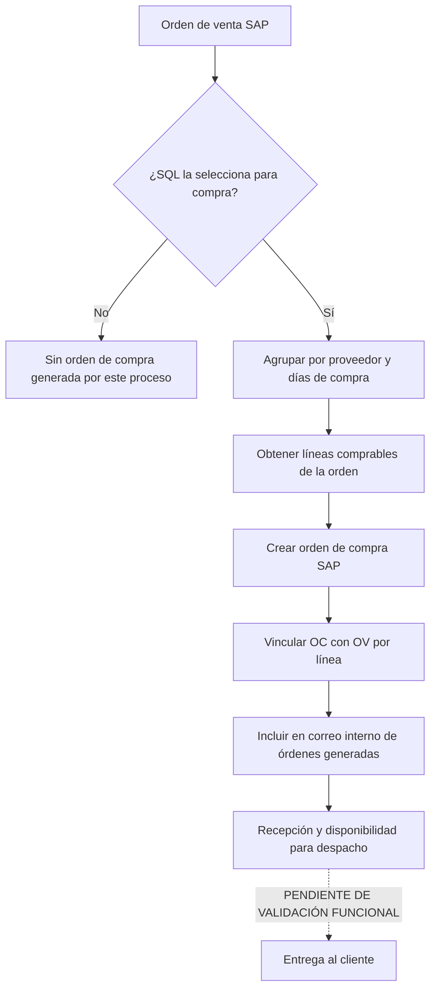

# Compras, abastecimiento y despacho — Sistema actual

## 1. Visión general

El sistema distingue entre ventas abastecidas desde existencias y ventas que conservan una condición de compra a proveedor. En bodega propia y consignación, la preparación utiliza producto y bodega con validación de inventario; el código examinado no genera una orden de compra a partir de esas modalidades. En puesto fundo y calzada proveedor, cada línea de la venta incorpora proveedor, días/plazo de compra, moneda, precio y fecha de entrega. Costo especial y liquidación también conservan datos de compra, aunque el código disponible no permite confirmar si todos sus casos son seleccionados por el proceso automático de órdenes de compra.

La compra no se crea mientras el operador prepara la venta. Primero se registra una orden de venta en SAP Business One con los antecedentes de compra guardados en campos propios de sus líneas. Posteriormente, una página destinada a ejecución automática consulta en SQL las órdenes candidatas y recibe combinaciones de orden de venta, proveedor y días de compra. Por cada combinación llama a un componente SAP que obtiene la cabecera y las líneas pertinentes, crea una orden de compra SAP y vincula las líneas creadas con la orden de venta.

La orden de compra usa al proveedor de las líneas, la moneda de compra, las cantidades, precios, bodega y fecha de entrega definidos en la venta. No copia las líneas técnicas de intereses, descuentos ni ciertos artículos auxiliares. Después de crearla, el sistema registra una relación mediante SQL para puesto fundo y calzada proveedor. Otra invocación de la misma página genera un correo interno con las órdenes de compra creadas y sus facturas de venta referenciadas.

El sistema de ventas captura tipo de despacho, dirección de despacho, fecha de entrega de la orden, fecha por producto, dato de guía y flete. Para códigos de despacho `3` o `5`, el JavaScript los trata como “despacho TAI” y exige que el flete propuesto no sea inferior al mínimo calculado. Los nombres funcionales de esos códigos provienen de SQL y no están en el repositorio.

No se encontró en `ventas/` ni `wssap/` un flujo confirmado para entrada de mercancías, recepción física, entrega SAP, traslado entre bodegas, picking o confirmación de entrega al cliente. Tampoco se encontró un estado local que confirme que la mercadería ya llegó o puede despacharse. Esos tramos quedan como `PENDIENTE DE VALIDACIÓN FUNCIONAL` y pueden ocurrir directamente en SAP Business One o fuera de este sistema.

## 2. Mapa general del proceso

## 3. Modalidades involucradas

### Bodega propia

- **Propósito:** vender producto almacenado en una bodega propia.
- **Cuándo aplica:** cuando la venta se abastece desde stock consultado por bodega.
- **Origen del producto:** inventario propio/consultado en la bodega seleccionada.
- **Quién compra:** no se genera una compra asociada por el flujo examinado.
- **Quién despacha:** PENDIENTE DE VALIDACIÓN FUNCIONAL.
- **Documento SAP:** borrador u orden de venta; factura/boleta posteriormente.
- **Resultado:** venta respaldada por stock; no se confirmó orden de compra automática.

### Puesto fundo

- **Propósito:** vender incorporando compra a proveedor y una entrega identificada como puesta en el fundo.
- **Cuándo aplica:** el operador elige la modalidad y completa proveedor y condiciones de compra por línea.
- **Origen del producto:** proveedor indicado en la línea.
- **Quién compra:** el sistema crea automáticamente la orden de compra SAP; el dueño operativo del proceso es PENDIENTE DE VALIDACIÓN FUNCIONAL.
- **Quién despacha:** PENDIENTE DE VALIDACIÓN FUNCIONAL.
- **Documento SAP:** orden de venta y orden de compra vinculada.
- **Resultado:** operación de venta con una compra separable por proveedor y días de compra.

### Calzada proveedor

- **Propósito:** registrar una venta cuyo abastecimiento se asocia directamente a un proveedor, incluyendo condición y motivo por producto.
- **Cuándo aplica:** se selecciona la modalidad y se completan proveedor, compra, condición y motivo.
- **Origen del producto:** proveedor informado por línea.
- **Quién compra:** proceso automático que crea orden de compra SAP; responsabilidad humana PENDIENTE DE VALIDACIÓN FUNCIONAL.
- **Quién despacha:** el nombre de la modalidad indica un contexto comercial, pero la responsabilidad física no puede derivarse con seguridad: PENDIENTE DE VALIDACIÓN FUNCIONAL.
- **Documento SAP:** orden de venta y orden de compra vinculada; conserva condición y motivo en líneas.
- **Resultado:** compra SAP asociada a las líneas de la venta cuando el SP la selecciona.

### Costo especial

- **Propósito:** registrar una venta con proveedor y costo de compra específico para evaluar margen/costo.
- **Cuándo aplica:** el operador selecciona la modalidad y justifica una condición comercial especial.
- **Origen del producto:** proveedor informado en la línea.
- **Quién compra:** PENDIENTE DE VALIDACIÓN FUNCIONAL.
- **Quién despacha:** PENDIENTE DE VALIDACIÓN FUNCIONAL.
- **Documento SAP:** la orden de venta conserva proveedor, precio, moneda y días de compra. La creación efectiva de una orden de compra para todos estos casos es PENDIENTE DE VALIDACIÓN FUNCIONAL.
- **Resultado:** datos de compra disponibles en SAP para evaluación y eventual abastecimiento.

### Liquidación

- **Propósito:** vender con datos de proveedor, precio, moneda, tasa y plazo de compra propios de liquidación.
- **Cuándo aplica:** modalidad seleccionada por el operador.
- **Origen del producto:** proveedor consignado en la línea.
- **Quién compra:** PENDIENTE DE VALIDACIÓN FUNCIONAL.
- **Quién despacha:** PENDIENTE DE VALIDACIÓN FUNCIONAL.
- **Documento SAP:** orden de venta con antecedentes de compra; selección para orden de compra automática PENDIENTE DE VALIDACIÓN FUNCIONAL.
- **Resultado:** operación valorizada con datos de compra preservados.

### Consignada

- **Propósito:** vender existencias identificadas como consignadas.
- **Cuándo aplica:** modalidad elegida por el operador.
- **Origen del producto:** inventario consignado consultado por bodega.
- **Quién compra:** no se confirmó generación de compra asociada.
- **Quién despacha:** PENDIENTE DE VALIDACIÓN FUNCIONAL.
- **Documento SAP:** borrador u orden de venta.
- **Resultado:** venta contra existencias consignadas, sin orden de compra confirmada en este flujo.

### Calzada propia

**Revalidación dirigida:** NO CONFIRMADA FUNCIONALMENTE. La página encontrada es un artefacto: referencia el code-behind de calzada proveedor y los scripts propios no implementan lógica. No se confirmó proveedor, stock, compra asociada, despacho, documento SAP ni facturación.

PENDIENTE DE VALIDACIÓN FUNCIONAL

Existe la pantalla, pero no se confirmó un flujo transaccional que cree orden/borrador de venta ni una compra asociada.

## 4. Funcionalidades detalladas

### FUN-005 — Registrar venta puesto fundo con compra asociable

#### Propósito

Capturar la venta y dejar en cada línea los datos que permiten generar posteriormente una orden de compra al proveedor. La compra no se materializa en esta pantalla.

#### Usuario o área

Operador comercial. Logística/Abastecimiento figura como área emisora de los correos automáticos posteriores.

#### Cómo se inicia

Pantalla `pagVentaPuestoFundo.aspx`, desde el menú o desde una cotización pendiente compatible.

#### Datos de entrada

- Cliente, productos, cantidades, precio de venta y bodega.
- Proveedor de compra.
- Plazo/días y fecha de compra.
- Precio unitario y moneda de compra.
- Tasa de interés de compra.
- Fecha de entrega por producto.
- Tipo y dirección de despacho, comentarios y referencias.

#### Flujo paso a paso

1. El operador selecciona cliente y completa la cabecera de venta.
2. Selecciona producto y bodega.
3. Selecciona un plazo de compra; el valor contiene código y días.
4. El sistema calcula la fecha de compra sumando los días a la fecha de orden.
5. El operador busca y selecciona proveedor.
6. Ingresa precio/moneda/tasa de compra y fecha de entrega.
7. El sistema calcula margen respecto del precio de compra y valida la línea.
8. La línea se guarda en la tabla del navegador con los datos de compra.
9. Al crear borrador u orden SAP, `wssap` copia esos valores a campos propios de la línea de venta.
10. Después, el proceso FUN-025 puede seleccionar la orden y generar una orden de compra por proveedor/días.

#### Reglas de negocio

- Máximo visible de diez líneas por pedido.
- Proveedor, precio, moneda, plazo/días y tasa de compra se conservan por línea.
- Margen: `100 − (precio unitario de compra × 100 / precio unitario de venta)`.
- El plazo determina una fecha de compra derivada desde la fecha de orden.
- La validación que compara plazo de venta con plazo de compra existe, pero parte de su uso está comentada; no se documenta como bloqueo confirmado.

#### Validaciones

El código exige producto, cantidad, precio de venta, fecha de entrega, plazo, tasa, precio de compra y proveedor antes de confirmar la línea. Las validaciones comunes de cliente, fechas y moneda siguen aplicando.

#### Información consultada

Proveedor, plazos de compra, producto, bodega, costos, tipo de cambio, flete y reglas de autorización.

#### Información generada o modificada

Línea de orden de venta SAP con proveedor, días, moneda, precio, total y tasa de compra.

#### Documentos involucrados

Orden/borrador de venta SAP durante la preparación; orden de compra SAP posterior.

#### Integraciones

ASMX internos para proveedor/plazo; SQL Server para maestros; `wssap` y SAP Business One para la venta. La orden de compra se crea mediante componente SAP consumido desde `ventas/`.

#### Base de datos

- `tai_vw_sp2_select_proveedor`: busca proveedores.
- `tai_vw_sp2_select_plazo_compra`: obtiene código, días y nombre del plazo.
- `tai_vw_sp2_select_orden_venta`: recupera después la cabecera y líneas de la venta.

#### Resultado esperado

Orden de venta con datos suficientes para que una ejecución posterior genere la compra.

#### Errores y excepciones

Si falla una consulta AJAX, la línea puede quedar sin el dato requerido y la validación impide agregarla. No existe persistencia intermedia fuera de la página antes de crear el documento SAP.

#### Dependencias

FUN-010, FUN-011, FUN-012, FUN-015, FUN-025 y FUN-035.

#### Evidencia técnica

- `ventas/SistemaVentasWeb/SistemaVentasWeb/Pages/pagVentaPuestoFundo.aspx`
- `ventas/SistemaVentasWeb/SistemaVentasWeb/Scripts/scrVentaPuestoFundo.js`
- `ventas/SistemaVentasWeb/SistemaVentasWeb/Scripts/scrVentaPuestoFundoProductoCarga.js`
- `wssap/WebServices/WebServices/Classes/clsOrdenVenta.vb`

#### Pendientes

PENDIENTE DE VALIDACIÓN FUNCIONAL: quién confirma las condiciones de compra y cómo se coordina la entrega física al fundo.

### FUN-006 — Registrar venta calzada proveedor con compra asociable

#### Propósito

Capturar una venta abastecida por proveedor y conservar además condición y motivo comercial por línea.

#### Usuario o área

Operador comercial; Logística/Abastecimiento participa en el proceso automático posterior.

#### Cómo se inicia

Pantalla `pagVentaCalzadaProveedor.aspx`.

#### Datos de entrada

Datos de venta y compra de FUN-005, más condición del producto y motivo seleccionado.

#### Flujo paso a paso

1. El operador completa cliente, despacho y producto.
2. Selecciona plazo y proveedor de compra.
3. Informa precio/moneda/tasa, condición y motivo.
4. El sistema calcula total de compra y margen.
5. Valida y agrega la línea.
6. Al crear la orden de venta, SAP recibe proveedor, días, precios, tasa, condición y motivo.
7. El proceso automático puede generar la orden de compra y relacionarla con la venta.

#### Reglas de negocio

- Proveedor y condición son obligatorios en la validación observada.
- Tasa de compra se inicializa en `1,80` y es conservada por línea.
- Total de compra: `cantidad × precio unitario de compra × tipo de cambio`, redondeado a entero.
- Margen: `100 − (precio de compra × 100 / precio de venta)`.
- Condición y motivo sólo se copian explícitamente a la orden de compra cuando la modalidad es calzada proveedor.

#### Validaciones

Producto, cantidad, precio de venta, fecha, plazo, tasa, precio de compra, proveedor y condición deben estar completos. La comparación de plazo de compra/venta tiene lógica visible, pero su efecto integral requiere validación.

#### Información consultada

Proveedor, plazo, motivo parametrizado, producto, bodega, costos, moneda y flete.

#### Información generada o modificada

Orden de venta con antecedentes de compra; posteriormente orden de compra vinculada.

#### Documentos involucrados

Orden/borrador de venta SAP y orden de compra SAP.

#### Integraciones

ASMX internos, SQL Server, `wssap`, SAP Business One.

#### Base de datos

`tai_vw_sp2_select_proveedor`, `tai_vw_sp2_select_plazo_compra`, `tai_vw_sp2_select_parametro`, `tai_vw_sp2_select_orden_venta` y `tai_vw_sp2_update_orden_compra`.

#### Resultado esperado

Venta SAP que puede originar una compra al proveedor con condición/motivo preservados.

#### Errores y excepciones

No existe confirmación en este código de que el proveedor acepte las condiciones ni de que despache la mercadería.

#### Dependencias

FUN-010 a FUN-012, FUN-015, FUN-025 y FUN-035.

#### Evidencia técnica

- `ventas/SistemaVentasWeb/SistemaVentasWeb/Pages/pagVentaCalzadaProveedor.aspx`
- `ventas/SistemaVentasWeb/SistemaVentasWeb/Scripts/scrVentaCalzadaProveedor.js`
- `ventas/SistemaVentasWeb/SistemaVentasWeb/Scripts/scrVentaCalzadaProveedorProductoCarga.js`
- `wssap/WebServices/WebServices/Classes/clsOrdenCompra.vb`

#### Pendientes

PENDIENTE DE VALIDACIÓN FUNCIONAL: responsabilidad de entrega y efecto operativo de condición/motivo.

### FUN-008/FUN-009 — Datos de compra en costo especial y liquidación

#### Propósito

Conservar el proveedor y las condiciones de compra usadas para valorar operaciones de costo especial o liquidación. La evidencia confirma los datos dentro de la venta, no que toda operación de estas modalidades genere automáticamente una orden de compra.

#### Usuario o área

Operador comercial; responsable posterior de compra PENDIENTE DE VALIDACIÓN FUNCIONAL.

#### Cómo se inicia

Pantallas `pagVentaCostoEspecial.aspx` y `pagVentaLiquidacion.aspx`.

#### Datos de entrada

Proveedor, plazo/días, fecha, precio y moneda de compra, tasa, cantidad, bodega y fecha de entrega; costo especial agrega condición/motivo según la línea.

#### Flujo paso a paso

1. El operador busca proveedor y selecciona plazo.
2. Ingresa el costo/precio de compra usado para evaluar la venta.
3. La línea conserva datos de compra en la tabla del navegador.
4. `wssap` los copia a campos propios de la orden/borrador de venta.
5. El SP de candidatos decide posteriormente si la operación entra al proceso de orden de compra.

#### Reglas de negocio

Las cuatro modalidades externas —puesto fundo, calzada proveedor, costo especial y liquidación— son tratadas por `clsOrdenVenta` como líneas con antecedentes de compra. Sólo puesto fundo y calzada proveedor activan explícitamente la actualización de vínculo OC–OV dentro de `clsOrdenCompra`.

#### Validaciones

Proveedor, precio y demás datos de compra exigidos por cada pantalla deben estar presentes para agregar la línea.

#### Información consultada

Proveedor, plazo, producto, moneda/tipo de cambio, costo y parámetros.

#### Información generada o modificada

Campos de compra dentro de la línea de venta SAP.

#### Documentos involucrados

Orden/borrador de venta. Orden de compra efectiva: PENDIENTE DE VALIDACIÓN FUNCIONAL para estas dos modalidades.

#### Integraciones

ASMX internos, SQL Server, `wssap` y SAP Business One.

#### Base de datos

`tai_vw_sp2_select_proveedor`, `tai_vw_sp2_select_plazo_compra` y procedimientos de orden de venta.

#### Resultado esperado

Venta SAP valorizada con antecedentes de proveedor y compra.

#### Errores y excepciones

No es seguro equiparar “tener datos de compra” con “crear una orden de compra”; la selección está encapsulada en un SP no versionado.

#### Dependencias

FUN-010, FUN-015, FUN-025 y FUN-035.

#### Evidencia técnica

- `ventas/SistemaVentasWeb/SistemaVentasWeb/Scripts/scrVentaCostoEspecial.js`
- `ventas/SistemaVentasWeb/SistemaVentasWeb/Scripts/scrVentaLiquidacion.js`
- `wssap/WebServices/WebServices/Classes/clsOrdenVenta.vb`
- `ventas/SistemaVentasWeb/SistemaVentasWeb/Classes/clsOrdenCompra.vb`

#### Pendientes

PENDIENTE DE VALIDACIÓN FUNCIONAL: qué casos de costo especial/liquidación selecciona `tai_vw_sp2_select_orden_compra_genera`.

### FUN-012 — Consultar stock para abastecimiento propio

#### Propósito

Determinar la disponibilidad por bodega en modalidades que se abastecen desde existencias, diferenciándolas de las operaciones con compra a proveedor.

#### Usuario o área

Operador comercial.

#### Cómo se inicia

Al seleccionar producto/bodega en una pantalla de venta.

#### Datos de entrada

Producto y bodega.

#### Flujo paso a paso

1. Consulta producto e inventario.
2. Muestra cantidad disponible por bodega.
3. En modalidades de stock, compara cantidad solicitada con existencia.
4. Impide agregar la línea si no hay disponibilidad suficiente.
5. En las modalidades con compra, además conserva proveedor y compra por línea.

#### Reglas de negocio

Stock cero o cantidad superior al stock impiden agregar una línea en las pantallas que aplican esa validación. La fórmula exacta de disponibilidad está en SQL.

#### Validaciones

Producto y bodega válidos; cantidad no superior a disponibilidad cuando corresponde.

#### Información consultada

Producto, bodega y existencias.

#### Información generada o modificada

No crea documento; habilita o bloquea la línea de venta.

#### Documentos involucrados

Ninguno por la consulta. Alimenta la orden de venta posterior.

#### Integraciones

ASMX `srvInventario` y SQL Server/SAP como fuente consolidada.

#### Base de datos

`tai_vw_sp2_select_inventario` y `tai_vw_sp2_select_producto`.

#### Resultado esperado

Disponibilidad visible o línea rechazada por falta de stock.

#### Errores y excepciones

No se confirmó reserva de stock ni actualización inmediata al preparar la venta.

#### Dependencias

FUN-003/FUN-004 y producto/bodega.

#### Evidencia técnica

- `ventas/SistemaVentasWeb/SistemaVentasWeb/Services/srvInventario.asmx.vb`
- `ventas/SistemaVentasWeb/SistemaVentasWeb/Classes/clsInventarioListado.vb`
- `ventas/SistemaVentasWeb/SistemaVentasWeb/Scripts/scrVentaBodegaPropia.js`

#### Pendientes

PENDIENTE DE VALIDACIÓN FUNCIONAL: definición de disponible, comprometido y momento de descuento de stock.

### FUN-025 — Generar orden de compra asociada

#### Propósito

Crear automáticamente en SAP Business One una orden de compra para líneas de una orden de venta que SQL identifica como comprables, agrupadas por proveedor y días de compra.

#### Usuario o área

Proceso automático. El correo se identifica como proveniente de Logística y Abastecimientos; responsable del scheduler PENDIENTE DE VALIDACIÓN FUNCIONAL.

#### Cómo se inicia

Invocación de `pagGenerarOrdenCompra.aspx?prmProceso=G`. El mecanismo externo que llama la página no está versionado.

#### Datos de entrada

El SP devuelve usuario, identificadores internos/número de orden de venta, proveedor y días de compra. La clase recupera después cabecera y líneas de esa orden.

#### Flujo paso a paso

1. La página ejecuta `tai_vw_sp2_select_orden_compra_genera 10`.
2. Por cada candidato obtiene usuario, orden de venta, proveedor y días de compra.
3. Llama `WebServices.clsOrdenCompra.RegistrarOrdenCompra`.
4. El componente se conecta a SAP con el usuario SAP asociado.
5. Consulta cabecera de la orden de venta.
6. Consulta sólo líneas del proveedor y días de compra indicados.
7. Crea un documento SAP `oPurchaseOrders` con serie fija observada `695`.
8. Copia fechas, despacho, propietario, vendedor, comentarios, referencias, modalidad y condición de pago.
9. Omite líneas `INTERESES`, `DESCUENTO` y códigos que comienzan con `Z6`.
10. Agrega productos con cantidad, bodega, precio/moneda de compra, fecha de entrega, proveedor, días, tasa y costos.
11. Define como proveedor de cabecera y moneda los valores obtenidos de las líneas.
12. SAP registra la orden y devuelve identificador interno/número.
13. Para puesto fundo o calzada proveedor ejecuta el SP que vincula OC, OV, artículo y línea base.
14. La página registra éxito o error en log y continúa con el siguiente candidato.

#### Reglas de negocio

- Una orden de compra se construye para una combinación de venta, proveedor y días de compra.
- El importe de línea es `precio unitario de compra × cantidad`.
- Descuento de la línea de compra se fuerza a cero.
- Serie SAP observada: `695`; su vigencia/configuración no puede asumirse fuera de este ambiente.
- La condición de pago se obtiene a partir de los días de compra.
- Sólo líneas de producto participan; las líneas técnicas indicadas se excluyen.
- La actualización explícita de vínculo se ejecuta sólo para puesto fundo y calzada proveedor.

#### Validaciones

La cabecera de orden de venta debe existir. Debe haber líneas para el proveedor/días. SAP valida proveedor, moneda, serie, artículos, bodega y datos obligatorios. Código SAP distinto de cero se considera error.

#### Información consultada

Orden de venta, líneas, proveedor, días/plazo, usuario SAP, condición de pago y número SAP resultante.

#### Información generada o modificada

Orden de compra SAP y vínculo con orden de venta para las modalidades confirmadas.

#### Documentos involucrados

- Orden de venta SAP: fuente de cabecera y líneas.
- Orden de compra SAP: documento creado.
- Factura de venta: aparece como referencia en el correo posterior, pero no crea la compra dentro de la clase.

No se encontró solicitud de compra, entrada de mercancías ni factura de proveedor en este proceso.

#### Integraciones

- Página `ventas/` → SQL Server: selección de candidatos.
- `ventas/` → componente SAP referenciado: registro de OC.
- Componente → SAP Business One DI API: creación de `oPurchaseOrders`.
- Componente → SQL Server: vínculo OC–OV.

`wssap/srvOrdenVenta.asmx` no expone la creación de órdenes de compra; aunque `wssap/` contiene una clase equivalente, la página observada usa `WebServices.clsOrdenCompra`.

#### Base de datos

- `tai_vw_sp2_select_orden_compra_genera` opción 10: selecciona candidatos.
- `tai_vw_sp2_select_orden_venta` opciones 10/20: obtiene cabecera y líneas filtradas.
- `tai_vw_sp2_update_orden_compra`: registra vínculo de OC con OV, artículo y línea.
- Función/consulta `ObtenerCodigoPlazoPagoOC`: traduce días a condición de pago SAP.

#### Resultado esperado

Orden de compra SAP creada, numerada y vinculada a la venta cuando corresponde.

#### Errores y excepciones

Fallo de conexión o alta SAP se registra en log; la página no muestra resultado interactivo ni implementa reintento. El mensaje inicial de error de la clase dice “orden de venta” aunque la operación es de compra.

#### Dependencias

Orden de venta ya creada, datos de compra por línea, SP de selección, credenciales/configuración SAP y scheduler externo.

#### Evidencia técnica

- `ventas/SistemaVentasWeb/SistemaVentasWeb/Pages/pagGenerarOrdenCompra.aspx.vb`, `LeerDatosOrdenVenta` y `GenerarOrdenCompra`
- `ventas/SistemaVentasWeb/SistemaVentasWeb/Classes/clsOrdenCompra.vb`, `RegistrarOrdenCompra`
- `ventas/SistemaVentasWeb/SistemaVentasWeb/Classes/clsTransaccionListado.vb`
- `wssap/WebServices/WebServices/Classes/clsOrdenCompra.vb`

#### Pendientes

PENDIENTE DE VALIDACIÓN FUNCIONAL: criterio completo del SP, frecuencia del scheduler, idempotencia/reintentos y vigencia de la serie 695.

### FUN-026 — Informar órdenes de compra generadas

#### Propósito

Enviar un resumen interno de las órdenes de compra generadas automáticamente. La evidencia examinada no confirma un correo al proveedor ni aceptación automática en 24 horas.

#### Usuario o área

Destinatarios internos configurados; remitente funcional “Depto. de Logística y Abastecimientos”.

#### Cómo se inicia

Invocación de `pagGenerarOrdenCompra.aspx` con un proceso distinto de `G` (comentado como `A`).

#### Datos de entrada

El SP entrega modalidad, factura de venta referenciada, folio, cliente, orden de compra y proveedor.

#### Flujo paso a paso

1. La página calcula como fecha de asunto el día anterior.
2. Ejecuta `tai_vw_sp2_select_orden_compra_genera 20`.
3. Construye una tabla HTML con factura referenciada y orden de compra creada.
4. Si no existen datos muestra “No hay información de OC generadas”.
5. Envía el correo a destinatarios internos de producción o prueba.
6. Registra errores SMTP en log.

#### Reglas de negocio

- El correo declara que las órdenes fueron generadas automáticamente.
- El asunto usa la fecha del día anterior.
- Destinatarios cambian según modalidad del ambiente.
- No se observó dirección de correo del proveedor en este flujo.

#### Validaciones

Si el SP no devuelve filas, igualmente se construye un informe sin órdenes. Un error SMTP no tiene reintento visible.

#### Información consultada

Órdenes de compra generadas, facturas de venta, clientes y proveedores.

#### Información generada o modificada

Correo HTML interno; no modifica documento SAP.

#### Documentos involucrados

Factura de venta referenciada y orden de compra creada.

#### Integraciones

SQL Server y SMTP corporativo.

#### Base de datos

`tai_vw_sp2_select_orden_compra_genera` opción 20: obtiene el resumen para correo.

#### Resultado esperado

Área interna informada de las órdenes de compra generadas.

#### Errores y excepciones

Error SMTP se registra únicamente en log. No hay confirmación de lectura o entrega.

#### Dependencias

FUN-025, configuración de destinatarios y scheduler externo.

#### Evidencia técnica

- `ventas/SistemaVentasWeb/SistemaVentasWeb/Pages/pagGenerarOrdenCompra.aspx.vb`, `EnviarCorreo` y `GenerarHTMLOrdenCompra`

#### Pendientes

PENDIENTE DE VALIDACIÓN FUNCIONAL: horario real, lista vigente de destinatarios y acción operativa posterior al informe.

### FUN-035 — Consultar proveedores, plazos y tipos de despacho

#### Propósito

Entregar los maestros necesarios para definir compra y despacho durante la venta.

#### Usuario o área

Operador comercial; el sistema consume los valores.

#### Cómo se inicia

Al cargar las pantallas y al buscar proveedor o seleccionar plazo/tipo de despacho.

#### Datos de entrada

Texto de proveedor, opción de plazo y contexto de pantalla.

#### Flujo paso a paso

1. Carga proveedores por búsqueda.
2. Carga plazos con código, días y nombre.
3. Deriva fecha de compra desde días seleccionados.
4. Carga tipos de despacho con código/nombre.
5. La selección se guarda en la venta y luego se copia a la orden de compra.

#### Reglas de negocio

La lista agrega opción `SELECCIONE`. Código y días del plazo viajan unidos en el valor de pantalla. Los códigos de despacho 3 y 5 activan tratamiento de “despacho TAI” para flete, pero sus nombres se obtienen desde SQL.

#### Validaciones

Proveedor/plazo requeridos no pueden permanecer vacíos en las modalidades que compran.

#### Información consultada

Proveedor, plazo de compra y tipo de despacho.

#### Información generada o modificada

Valores seleccionados para venta y compra; no mantiene maestros.

#### Documentos involucrados

Se copian a orden de venta y orden de compra SAP.

#### Integraciones

ASMX internos y SQL Server.

#### Base de datos

`tai_vw_sp2_select_proveedor`, `tai_vw_sp2_select_plazo_compra` y `tai_vw_sp2_select_tipo_despacho`.

#### Resultado esperado

Pantalla con proveedor, condición temporal de compra y despacho seleccionables.

#### Errores y excepciones

Nombres, vigencia y responsables de maestros dependen del ambiente.

#### Dependencias

FUN-005, FUN-006, FUN-008, FUN-009 y FUN-025.

#### Evidencia técnica

- `ventas/SistemaVentasWeb/SistemaVentasWeb/Services/srvProveedor.asmx.vb`
- `ventas/SistemaVentasWeb/SistemaVentasWeb/Services/srvPlazoCompra.asmx.vb`
- `ventas/SistemaVentasWeb/SistemaVentasWeb/Services/srvTipoDespacho.asmx.vb`
- `ventas/SistemaVentasWeb/SistemaVentasWeb/Classes/clsProveedorListado.vb`

#### Pendientes

PENDIENTE DE VALIDACIÓN FUNCIONAL: significado productivo de cada código de despacho y gobierno de maestros.

## 5. Relación venta → compra → despacho

### 1. ¿Qué evento de una venta genera una compra?

La creación de la orden de venta no llama inmediatamente a crear la compra. Una ejecución posterior consulta `tai_vw_sp2_select_orden_compra_genera 10`; si el SP devuelve la orden junto con proveedor y días de compra, la página genera la orden de compra SAP. El criterio que hace elegible a una venta es PENDIENTE DE VALIDACIÓN FUNCIONAL.

### 2. ¿Cuándo no se genera compra?

No se genera si el SP no devuelve la orden. Bodega propia y consignada no muestran una ruta confirmada de compra asociada. Para costo especial y liquidación existen datos de compra, pero su inclusión efectiva es PENDIENTE DE VALIDACIÓN FUNCIONAL.

### 3. ¿Qué documento queda vinculado con qué otro?

La orden de compra SAP se vincula con la orden de venta SAP por identificador interno, artículo y línea base mediante `tai_vw_sp2_update_orden_compra`. Esta actualización está condicionada explícitamente a puesto fundo o calzada proveedor.

### 4. ¿Cómo se conoce que la compra fue realizada?

La creación exitosa devuelve identificador interno y número de orden de compra SAP, se registra en log y aparece después en la consulta de resumen usada por el correo interno. No existe una pantalla específica de seguimiento de compras en los archivos examinados.

### 5. ¿Cómo se conoce que el producto puede despacharse?

PENDIENTE DE VALIDACIÓN FUNCIONAL

El sistema guarda tipo/dirección/fecha de despacho y fecha por línea, pero no se encontró una confirmación de recepción, disponibilidad post-compra o liberación logística.

### 6. ¿Qué parte sucede en SAP?

SAP contiene la orden de venta, los datos de compra guardados en sus líneas, la orden de compra creada y la relación documental apoyada por campos/actualizaciones SQL. La recepción física, entrada de mercancías y entrega SAP no están confirmadas en el código fuente válido.

### 7. ¿Qué parte sucede sólo en el sistema de ventas?

Captura de proveedor/plazo/precio, cálculo de condiciones, selección automática de candidatos mediante SQL, disparo de la creación, logs y correo interno de resumen.

### Despacho y flete confirmado

- La venta captura tipo de despacho, dirección, fecha de entrega de orden, fecha de entrega por producto y dato de guía.
- Los códigos de despacho `3` y `5` activan la función `EsDespachoTAI`.
- Para despacho TAI se consulta flete mínimo por línea.
- El flete propuesto total no puede ser menor a la suma mínima.
- Al modificar el total, el sistema lo redistribuye entre líneas según su proporción previa y redondea cada asignación.
- Si el tipo no es despacho TAI, el flete de las líneas se lleva a cero.
- Quién prepara, transporta, recibe y confirma la entrega es PENDIENTE DE VALIDACIÓN FUNCIONAL.

## 6. Estados del proceso

El código no implementa una máquina de estados completa de abastecimiento. Los siguientes estados son resultados observables, no una secuencia formal persistida por la aplicación.

| Estado | Significado | Cómo se alcanza | Qué permite después |
|---|---|---|---|
| Venta con datos de compra | La orden de venta contiene proveedor, días, precio, moneda y entrega por línea. | Se crea la orden desde una modalidad con compra. | Ser evaluada por el SP de generación. |
| Candidata a compra | SQL devuelve orden, proveedor y días de compra. | Ejecución del SP opción 10. | Intentar crear orden de compra SAP. |
| Orden de compra creada | SAP devuelve código de éxito e identificadores OC. | Alta exitosa de `oPurchaseOrders`. | Vincular con la OV e informar internamente. |
| Orden de compra no creada | SAP devuelve error o se produce excepción. | Falla conexión/validación/alta. | Sólo queda registro en log; reintento PENDIENTE DE VALIDACIÓN FUNCIONAL. |
| Compra vinculada | Se ejecutó actualización con OC, OV, artículo y línea. | OC exitosa en puesto fundo o calzada proveedor. | Consulta/reporte posterior. |
| Informada | La OC aparece en correo interno. | Ejecución del proceso de aviso opción 20. | Acción posterior PENDIENTE DE VALIDACIÓN FUNCIONAL. |
| Recibida/disponible | PENDIENTE DE VALIDACIÓN FUNCIONAL | No existe evidencia en `ventas/`/`wssap/`. | Despacho físico. |
| Despachada/entregada | PENDIENTE DE VALIDACIÓN FUNCIONAL | No existe confirmación en el código examinado. | Cierre logístico. |

## 7. Stored procedures relevantes

| Stored procedure | Propósito funcional | Proceso relacionado |
|---|---|---|
| `tai_vw_sp2_select_proveedor` | Buscar código/nombre de proveedor y resolver datos auxiliares. | Preparación de compra. |
| `tai_vw_sp2_select_proveedor_orden_compra` | Obtener proveedores y días de compra relacionados con una orden. | Identificación de compras por venta. |
| `tai_vw_sp2_select_plazo_compra` | Listar condiciones de compra con código y días. | Preparación y fecha de compra. |
| `tai_vw_sp2_select_tipo_despacho` | Listar códigos y nombres de despacho. | Cabecera logística. |
| `tai_vw_sp2_select_flete_producto` | Calcular/obtener flete mínimo por bodega, producto, cantidad y monto. | Despacho TAI y valorización. |
| `tai_vw_sp2_select_orden_compra_genera` opción 10 | Seleccionar ventas/proveedores/días candidatos a crear OC. | Generación automática. |
| `tai_vw_sp2_select_orden_compra_genera` opción 20 | Obtener OC generadas y factura de venta referenciada para correo. | Informe automático. |
| `tai_vw_sp2_select_orden_venta` opción 10 | Recuperar cabecera de la orden de venta. | Construcción de OC. |
| `tai_vw_sp2_select_orden_venta` opción 20 | Recuperar líneas filtradas por proveedor y días de compra. | Construcción de OC. |
| `tai_vw_sp2_select_orden_compra` opciones 10/20 | Consultar cabecera/detalle de una orden de compra. | Consulta transaccional auxiliar. |
| `tai_vw_sp2_update_orden_compra` | Vincular OC con OV, artículo y línea base. | Trazabilidad documental. |
| `tai_vw_sp2_select_parametro` | Obtener motivos/valores configurables usados por modalidades. | Condición de compra. |

No se documentan tablas físicas: las definiciones de los SP no están versionadas y no existe evidencia suficiente para atribuir cada dato a una tabla concreta.

## 8. Integraciones técnicas involucradas

| Integración | Para qué se usa en este proceso | Dirección |
|---|---|---|
| Servicios ASMX internos | Proveedores, plazos, despachos, productos y flete. | Navegador → `ventas/` |
| SQL Server | Maestros, candidatos, cabecera/detalle de OV, vínculo OC–OV y resumen. | `ventas/` → SQL Server |
| Componente `WebServices.clsOrdenCompra` | Encapsular creación de la OC SAP. | `ventas/` → componente SAP |
| SAP Business One DI API | Crear `oPurchaseOrders` y obtener identificadores. | Componente SAP → SAP Business One |
| SMTP corporativo | Enviar resumen interno de OC generadas. | `ventas/` → SMTP → destinatarios internos |
| NLog/archivos | Registrar candidatos, éxitos y errores de SQL/SAP/correo. | `ventas/` → archivos de log |
| `wssap/` | Contiene una implementación equivalente de `clsOrdenCompra`, pero su ASMX público no expone esta operación. | Componente disponible → SAP Business One |

## 9. Procesos automáticos

| Proceso | Disparador | Información revisada | Acción | Resultado |
|---|---|---|---|---|
| Generar OC | Invocación externa con `prmProceso=G`. | Candidatos de SP opción 10. | Crea OC por venta/proveedor/días y vincula líneas. | OC SAP o error en log. |
| Informar OC | Invocación externa con otro modo (`A` en comentario). | SP opción 20; OC y factura de venta referenciada. | Construye y envía correo HTML interno. | Resumen recibido o error SMTP en log. |
| Cálculo de flete | Cambio de líneas/tipo/flete en navegador. | Líneas y flete mínimo. | Recalcula y distribuye flete. | Total no inferior al mínimo para despacho TAI. |

No se encontró en el repositorio el scheduler, frecuencia, monitoreo, bloqueo concurrente, idempotencia ni reintento. No se encontraron procesos automáticos confirmados para recepción, entrada de mercancías o despacho físico.

## 10. Resumen ejecutivo

- Bodega propia y consignación se abastecen desde existencias consultadas; no se confirmó compra automática.
- Puesto fundo y calzada proveedor conservan proveedor y condiciones de compra por línea y pueden originar OC SAP vinculadas.
- Costo especial y liquidación también guardan datos de compra, pero su selección automática debe validarse.
- La compra se genera después de la orden de venta, mediante una página invocada externamente y un SP de candidatos.
- SAP Business One crea la orden de compra con productos, cantidades, bodega, precio, moneda y entrega tomados de la venta.
- Las líneas técnicas de interés/descuento y códigos `Z6*` no se incluyen en la OC.
- El vínculo OC–OV se registra explícitamente para puesto fundo y calzada proveedor.
- El sistema envía un resumen interno; no se confirmó notificación directa ni aceptación del proveedor.
- Despacho se limita a datos, fechas, guía y cálculo de flete; no hay seguimiento físico confirmado.
- Recepción, disponibilidad post-compra, entrega y recuperación de fallos dependen de información fuera del código disponible.

## 11. Dependencias de conocimiento especializado

| Prioridad | Área | Dependencia real de conocimiento |
|---|---|---|
| ALTO | Selección automática | El criterio de `tai_vw_sp2_select_orden_compra_genera` define qué venta compra, cuándo y si evita duplicados; su definición no está en el repositorio. |
| ALTO | Relación SAP/SQL | Mantener la correlación OC–OV por artículo/línea requiere conocer UDF, líneas base y consultas SAP usadas por los SP. |
| ALTO | Operación logística | Recepción, disponibilidad y entrega no están implementadas aquí; una persona nueva necesita identificar el sistema/proceso externo responsable. |
| ALTO | Scheduler | Disparador, frecuencia, credenciales, concurrencia, monitoreo y reintentos no están versionados. |
| MEDIO | Modalidades | La diferencia contractual/física entre puesto fundo y calzada proveedor requiere conocimiento de Ventas y Abastecimiento. |
| MEDIO | Maestros | Proveedores, plazos, motivos, despachos y serie 695 dependen de configuración productiva y responsables no identificados en código. |
| MEDIO | Componente SAP duplicado | Existen clases equivalentes en `ventas/` y `wssap/`, pero el ASMX no publica compras; se debe conocer qué ensamblado está desplegado. |
| MEDIO | Errores operativos | El proceso registra fallos, pero no ofrece una bandeja o reintento explícito; la recuperación depende del procedimiento operacional. |
| BAJO | Correo interno | Destinatarios y horario están configurados/codificados y requieren conocimiento del área que consume el informe. |
