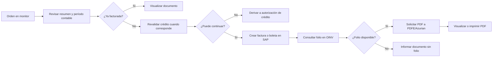

# Facturación, DTE e impresión — Sistema actual

## 1. Visión general

Una orden de venta que aparece en el monitor puede abrirse para revisión y facturación. La pantalla vuelve a consultar el resumen de la operación, el tipo de emisión (factura o boleta), el período contable y si ya existe un documento emitido. Si la orden no está facturada y el período de la orden está abierto, se habilita la creación del documento.

Al confirmar, `ventas/` solicita a SAP Business One la creación de una factura basada en la orden. La misma operación se usa para boleta cambiando serie, indicador y subtipo documental. SAP devuelve los identificadores del documento; el folio tributario se consulta posteriormente en `OINV`, porque puede estar disponible después de la creación. Para boletas se ejecuta además una actualización específica en SQL Server.

El usuario puede abrir el documento desde la pantalla. `ventas/` llama al servicio SOAP de visualización PDF de PDFE/Azurian con empresa, tipo de documento, resolución, folio y credencial configurada, y redirige al navegador a la URL devuelta. La impresión se solicita al momento de crear el documento mediante un campo de usuario SAP; la impresión física posterior depende del PDF obtenido. La cuarta copia se gestiona en una pantalla separada que consulta documentos y registra su ingreso en SQL Server.

## 2. Diagrama general

## 3. Tipos de documentos

| Documento | Cuándo se usa | Quién lo genera | Sistema involucrado | Resultado |
|---|---|---|---|---|
| Factura electrónica | Cuando la orden tiene emisión distinta de `B` y el usuario confirma crear factura | `ventas/` solicita; SAP Business One crea el documento | SAP Business One DI API, SQL Server, PDFE/Azurian | Factura SAP con folio consultable y PDF visualizable |
| Boleta electrónica | Cuando la orden tiene emisión `B` y el usuario confirma crear boleta | `ventas/` solicita; SAP Business One crea el documento | SAP Business One DI API, SQL Server, PDFE/Azurian | Boleta SAP con folio consultable y PDF visualizable |
| Cuarta copia (registro) | Después de emitido el documento, para registrar su recepción | Usuario mediante pantalla de cuarta copia | SQL Server | Fecha/marca de ingreso actualizada; no se crea un nuevo DTE |

No se encontró en el alcance revisado una rutina de emisión de nota de crédito, guía de despacho ni otro DTE tributario. **PENDIENTE DE VALIDACIÓN FUNCIONAL** para confirmar si existen en módulos no recorridos.

## 4. Funcionalidades detalladas

### FUN-023 — Crear factura o boleta desde orden

#### Propósito

Convertir una orden de venta SAP en el documento de venta electrónico correspondiente. La operación conserva la relación entre las líneas de la orden y las líneas de la factura y permite solicitar impresión desde el mismo acto.

#### Usuario o área

Operador comercial autorizado para trabajar el monitor de documentos. La comprobación de autorización se ejecuta antes de procesar borradores en el monitor.

#### Cómo se inicia

Desde `pagVisualizarOrdenVenta.aspx`, al presionar **Crear Factura** o **Crear Boleta**. La etiqueta y el selector **Imprimir Factura/Boleta** se ajustan según el campo de emisión de la orden.

#### Precondiciones

* La orden debe existir y no estar marcada como facturada.
* El período contable de la fecha de la orden debe estar abierto; si no, la pantalla bloquea el botón e informa que debe realizarse un pedido para el período correspondiente.
* Para el camino de monitor que procesa un borrador autorizado, las autorizaciones deben estar obtenidas y validadas.
* SAP debe aceptar la conexión y la incorporación del documento.

#### Datos de entrada

* Usuario y sus credenciales SAP configuradas.
* `DocEntry` de la orden de venta.
* Tipo de emisión (`B` para boleta o cualquier otro valor tratado como factura).
* Opción de imprimir.
* Cabecera y líneas de la orden almacenadas en SAP.

#### Flujo paso a paso

1. La pantalla carga el resumen de la orden, cliente, fechas, moneda, tipo de despacho, condición de pago y detalle.
2. Se obtiene el período contable y se compara con el período de la orden.
3. Si la orden no está facturada, el operador selecciona crear el documento y, opcionalmente, imprimirlo.
4. `ventas/Classes/clsOrdenVenta.vb` abre una conexión DI API a SAP y obtiene la orden por `DocEntry`.
5. Se crea un objeto de factura (`oInvoices`) con cliente, fechas, indicador electrónico, serie según oficina/usuario y propietario del documento.
6. Para boleta se usa la serie de boleta, indicador `BE`, subtipo `bod_Bill` y se marca el campo asociado a cuarta copia. Para factura se usa la serie de factura, indicador `FE` y subtipo normal.
7. Las líneas de la factura se basan en las líneas de la orden (`BaseType`, `BaseEntry`, `BaseLine`) y conservan sus totales.
8. La opción de impresión se guarda en el campo de usuario SAP `U_TAI_Imprimir`; no se imprime directamente desde este método.
9. SAP agrega la factura. Si falla, se recupera el código y texto de error SAP y se informa que no se pudo crear el documento.
10. Si la creación es exitosa, se obtiene el nuevo `DocEntry` y `DocNum` de `OINV`.
11. La pantalla espera ciclos configurados y consulta `OINV.FolioNum` hasta encontrar el folio o agotar el límite.
12. Si existe folio, habilita **Ver Factura/Boleta**. Si no existe, informa que el documento fue creado sin folio.
13. Para boleta se ejecuta `dbo.tai_vw_sp2_update_boleta_venta` con `DocEntry` y `DocNum`.
14. En ventas de puesto fundo o calzada proveedor, después de crear el documento se invoca el registro de proveedores para generar las órdenes de compra asociadas.

#### Reglas de negocio

* La emisión `B` determina boleta; las demás emisiones visibles en la pantalla determinan factura.
* Una orden ya facturada no vuelve a habilitar la creación.
* Un período contable cerrado impide crear el documento desde la pantalla.
* La factura se crea como factura de reserva (`ReserveInvoice = tYES`).
* La creación de factura mantiene trazabilidad por línea hacia la orden SAP.
* La opción de impresión se transmite a SAP mediante `U_TAI_Imprimir` con valores `1` o `0`.
* Para boleta se marca `U_TAI_DocExitoso = Y` y `U_TAI_cuartacopia` con la fecha de la orden.

#### Validaciones

| Condición | Efecto o mensaje observado |
|---|---|
| Período contable cerrado | “Periodo contable cerrado, realice nuevamente el pedido de cliente por el periodo que corresponda.” |
| Orden inexistente en SAP | Retorno de error “orden de venta no existe.” |
| Error de conexión o alta SAP | Se registra el error y se informa que no se pudo crear factura/boleta, junto con el estado devuelto |
| Documento creado sin folio dentro del ciclo de espera | Se informa que fue creado sin folio y no se habilita visualizar |

#### Revalidación de crédito

La revalidación está antes de abrir la facturación en el monitor, no dentro del alta de `oInvoices`. `scrMonitorDocumento.js` consulta la línea de crédito y compara el monto; si no alcanza y se cumplen las condiciones visibles (días adicionales distintos de cero y estado no autorizado), abre `pagVisualizarAutorizacion.aspx`. Esa pantalla convierte la orden nuevamente en borrador SAP, cancela la orden y envía la solicitud de autorización de crédito. **PENDIENTE DE VALIDACIÓN FUNCIONAL** el detalle de las políticas de crédito que residen en procedimientos o configuración externa.

#### Integración SAP

SAP Business One crea la factura/boleta y entrega la clave del nuevo documento. `ventas/` usa DI API directa mediante `SAPbobsCOM`; `wssap/` contiene la misma rutina reutilizable, pero el alta de factura se invoca desde la aplicación de ventas. La documentación de esta implementación no define un contrato futuro distinto.

#### Información generada o modificada

* Documento `OINV` con `DocEntry`, `DocNum` y `FolioNum`.
* Campos de usuario de documento y líneas para emisión electrónica, impresión, bloqueo de guía y moneda de costo.
* Para boletas, actualización SQL de la relación de venta mediante `tai_vw_sp2_update_boleta_venta`.
* Para modalidades con proveedor, órdenes de compra posteriores al alta del documento.

#### Dependencias

Orden SAP, usuario SAP, series por oficina/usuario, período contable, crédito/autorizaciones, SQL Server y servicio PDFE para visualizar.

#### Evidencia técnica

* `ventas/SistemaVentasWeb/SistemaVentasWeb/Pages/pagVisualizarOrdenVenta.aspx.vb` — `GenerarHTMLOrdenVenta`, `btnCrearFactura_Click`, `btnVerFactura_Click`, `ActualizarBoletaVenta`.
* `ventas/SistemaVentasWeb/SistemaVentasWeb/Classes/clsOrdenVenta.vb` — `RegistrarOrdenVentaEnFacturaVenta`.
* `wssap/WebServices/WebServices/Classes/clsOrdenVenta.vb` — implementación DI API equivalente.
* `ventas/SistemaVentasWeb/SistemaVentasWeb/Services/srvMonitorDocumento.asmx.vb` — `ProcesarBorradorVentaEnFacturaVenta`.

#### Pendientes

PENDIENTE DE VALIDACIÓN FUNCIONAL: significado operativo de todos los estados tributarios que devuelve el proveedor externo y política para recuperar un folio que no aparece dentro del ciclo de espera.

### FUN-024 — Visualizar documento tributario

#### Propósito

Permitir que el operador abra el PDF de la factura o boleta ya emitida.

#### Usuario o área

Usuario que consulta una orden facturada.

#### Cómo se inicia

Desde **Ver Factura** o **Ver Boleta** en `pagVisualizarOrdenVenta.aspx`, habilitado sólo cuando se obtuvo un folio positivo.

#### Datos de entrada

Folio, tipo de documento (33 para factura, 39 para boleta), RUT de empresa, resolución configurada y API key del ambiente.

#### Flujo paso a paso

1. La pantalla construye `PDFE.VisualizacionRequest`.
2. Selecciona API key, resolución y URL del servicio según modalidad de prueba o producción.
3. Envía folio, tipo de documento y RUT empresa al método SOAP `visualizacionPDF`.
4. El servicio devuelve una respuesta que incluye `urlDocumento`.
5. La aplicación redirige el navegador a esa URL.

#### Reglas y validaciones

* No se intenta visualizar si la creación no produjo folio.
* Se usa TLS 1.2 para la llamada.
* Las excepciones del cliente SOAP se registran y no exponen el stack trace al usuario.

#### Integraciones

PDFE/Azurian es un servicio SOAP externo de visualización. No crea el documento SAP; recupera su representación PDF a partir de los datos tributarios.

#### Evidencia técnica

* `ventas/SistemaVentasWeb/SistemaVentasWeb/Pages/pagVisualizarOrdenVenta.aspx.vb` — `btnVerFactura_Click`.
* `ventas/SistemaVentasWeb/SistemaVentasWeb/Web References/PDFE/Reference.vb` — `VisualizacionService.visualizacionPDF` y `VisualizacionRequest`.
* `ventas/SistemaVentasWeb/SistemaVentasWeb/Web References/PDFE/VisualizacionService.wsdl`.

#### Pendientes

PENDIENTE DE VALIDACIÓN FUNCIONAL: contenido exacto de `codigoRespuesta` y `respuesta` del proveedor, y si el PDF queda almacenado o se genera bajo demanda.

### FUN-032 — Registrar recepción de cuarta copia

#### Propósito

Consultar documentos emitidos por operador y período y marcar cuáles tienen ingreso de cuarta copia.

#### Usuario o área

Operador o administración responsable de registrar la recepción documental.

#### Cómo se inicia

Desde `pagIngresoCuartaCopia.aspx`, seleccionando operador, año y mes y presionando **Registrar**.

#### Datos de entrada

Operador, año, mes; para cada fila: cliente, tipo de documento, número interno, folio y marca de ingreso (1/0).

#### Flujo paso a paso

1. El navegador llama `ObtenerCuartaCopia`.
2. SQL devuelve cliente, fecha, tipo, número, folio, total neto y fecha de cuarta copia.
3. Una fecha con año 1900 se muestra como “----------”; cualquier otra fecha aparece como registrada.
4. El usuario marca o desmarca cada documento.
5. El navegador llama `ActualizarCuartaCopia` para cada fila.
6. SQL actualiza la marca y la pantalla vuelve a cargar la consulta.

#### Regla identificada

La cuarta copia se administra como una recepción posterior asociada a un documento y folio; esta función no emite ni reemite el DTE.

#### Base de datos

`tai_vw_sp2_select_cuarta_copia` consulta las filas; `dbo.tai_vw_sp2_update_cuarta_copia` actualiza operador, cliente, tipo, documento, folio e indicador de ingreso.

#### Evidencia técnica

* `ventas/SistemaVentasWeb/SistemaVentasWeb/Pages/pagIngresoCuartaCopia.aspx`.
* `ventas/SistemaVentasWeb/SistemaVentasWeb/Scripts/scrIngresoCuartaCopia.js`.
* `ventas/SistemaVentasWeb/SistemaVentasWeb/Services/srvCuartaCopia.asmx.vb`.
* `ventas/SistemaVentasWeb/SistemaVentasWeb/Classes/clsCuartaCopiaListado.vb`.

#### Pendientes

PENDIENTE DE VALIDACIÓN FUNCIONAL: significado documental exacto de “cuarta copia”, quién debe custodiarla y si corresponde a factura, guía u ambos tipos mostrados por el procedimiento.

### FUN-036 — Revalidar crédito antes de facturar

#### Propósito

Evitar que una orden avance directamente a facturación cuando el crédito disponible ya no permite continuar.

#### Usuario o área

Operador comercial y área/autorizador de crédito.

#### Cómo se inicia

Al seleccionar una orden desde el monitor mediante `VisualizarOrdenVenta`.

#### Flujo paso a paso

1. El monitor obtiene la línea de crédito del cliente mediante `srvCliente.asmx/ObtenerClienteLineaCredito`.
2. Calcula si el crédito disponible cubre el monto de la operación.
3. Si alcanza, o si no hay días adicionales, o si el estado visible es autorizado, abre la pantalla de la orden.
4. En caso contrario abre la pantalla de autorización de crédito.
5. La autorización convierte la orden SAP en borrador mediante `wssap_test.../RegistrarOrdenVentaEnBorradorVenta`, cancela la orden y envía correo de autorización.

#### Evidencia técnica

* `ventas/SistemaVentasWeb/SistemaVentasWeb/Scripts/scrMonitorDocumento.js` — `VisualizarOrdenVenta`, `ObtenerLineaCredito`, `HaySuficienteCreditoDisponible`.
* `ventas/SistemaVentasWeb/SistemaVentasWeb/Scripts/scrVisualizarAutorizacion.js` — conversión a borrador, cancelación y correo.
* `ventas/SistemaVentasWeb/SistemaVentasWeb/Services/srvMonitorDocumento.asmx.vb`.

#### Pendientes

PENDIENTE DE VALIDACIÓN FUNCIONAL: fórmulas completas, excepciones por cliente y significado de cada estado utilizado por el monitor.

### FUN-022 — Monitorear y accionar documentos comerciales

#### Propósito

Proporcionar la bandeja desde la que se localizan documentos y se accede a facturación, visualización o cancelación.

#### Evidencia y datos

`tai_vw_sp2_select_monitor_documento_resumen` obtiene filas por cliente, producto, estado, fechas, operador y página. Para el estado `Facturados`, el sistema transforma el número interno en `FolioNum` consultando `OINV`. `tai_vw_sp2_select_monitor_documento_detalle` obtiene líneas y fecha de entrega.

#### Resultado

El usuario ve estado, fecha, tipo y código/folio; según el estado puede abrir una orden, procesar un borrador autorizado o cancelar una orden pendiente.

#### Evidencia técnica

* `ventas/SistemaVentasWeb/SistemaVentasWeb/Classes/clsMonitorDocumentoListado.vb`.
* `ventas/SistemaVentasWeb/SistemaVentasWeb/Services/srvMonitorDocumento.asmx.vb`.
* `ventas/SistemaVentasWeb/SistemaVentasWeb/Scripts/scrMonitorDocumento.js`.

## 5. PDFE / Azurian / DTE

El proyecto contiene una referencia SOAP generada para `VisualizacionService` del namespace de visualización DTE de Azurian. Sólo se utiliza el método `visualizacionPDF`. La aplicación envía API key, folio, tipo de documento, resolución SII y RUT de empresa; recibe un `VisualizacionResponse` y utiliza `urlDocumento` para abrir el PDF.

El proveedor externo no participa en la creación del documento SAP dentro del código revisado. La relación entre DTE, folio y documento SAP se establece por el folio consultado desde `OINV` y los parámetros enviados al servicio. **PENDIENTE DE VALIDACIÓN FUNCIONAL** si Azurian realiza además validación tributaria, almacenamiento, envío por correo o recuperación de XML, porque esas operaciones no aparecen en esta llamada.

## 6. Visualización de documentos

La visualización es iniciada por el usuario en la misma pantalla que muestra la orden. El archivo no se construye localmente en `btnVerFactura_Click`: se solicita al servicio PDFE y se redirige a la URL recibida. La URL, API keys y resolución provienen de configuración por ambiente y no deben considerarse datos funcionales introducidos por el usuario.

## 7. Impresión

La pantalla ofrece un selector de impresión antes de crear factura o boleta. La selección se guarda en `OINV.U_TAI_Imprimir`; el código de emisión no contiene una llamada directa a una impresora. Por tanto, la impresión física queda a cargo del procesamiento asociado al documento SAP o de la apertura posterior del PDF. **PENDIENTE DE VALIDACIÓN FUNCIONAL** qué componente consume exactamente `U_TAI_Imprimir`, qué impresora usa y cuántas copias produce.

Existe además un voucher PDF de la operación en `FUN-013`, pero no se ha encontrado evidencia suficiente para afirmar que sea la impresión del DTE.

## 8. Cuarta copia

En la emisión de boleta se escribe `U_TAI_cuartacopia` con la fecha de la orden. La pantalla de ingreso de cuarta copia lista documentos y permite registrar o quitar la marca de recepción mediante SQL. La interfaz muestra tipo, número, folio, total neto y fecha de ingreso.

No se encontró una rutina de impresión específica de cuarta copia ni una llamada PDFE exclusiva para ella. **PENDIENTE DE VALIDACIÓN FUNCIONAL** si la cuarta copia se imprime desde otro proceso o si su registro sólo acredita recepción administrativa.

## 9. Reimpresión y recuperación

El código observado permite volver a consultar el documento y solicitar nuevamente su PDF mediante **Ver Factura/Ver Boleta**, siempre que se disponga de folio. Eso es recuperación/visualización del documento, no una nueva emisión.

No se encontró un botón o método explícito denominado reimpresión ni una operación de alta duplicada controlada para reemitir. **PENDIENTE DE VALIDACIÓN FUNCIONAL** si la reimpresión se realiza desde SAP, PDFE o una pantalla no incluida en este alcance.

## 10. Errores y excepciones

| Situación | Comportamiento del sistema | Puede continuar |
|---|---|---|
| Período cerrado | Deshabilita creación y muestra mensaje de período | No, debe generarse otra operación para período válido |
| Orden no encontrada en SAP | Retorna error de orden inexistente | No |
| Error de conexión/alta SAP | Registra código y texto de SAP; pantalla informa fallo | No en ese intento |
| Folio aún no disponible | Documento puede quedar creado sin folio; no habilita visualización | Requiere recuperación posterior; política exacta pendiente |
| Error PDFE/Azurian | Registra excepción de llamada/visualización | No se abre el PDF en ese intento |
| Falla SQL de boleta | Registra excepción de `ActualizarBoletaVenta`; el documento SAP ya pudo crearse | **PENDIENTE DE VALIDACIÓN FUNCIONAL** impacto operativo |
| Error al actualizar cuarta copia | Servicio devuelve mensaje de error y la fila puede no quedar actualizada | Sí, puede reintentarse según resultado visible |

## 11. Base de datos

| Stored procedure / consulta | Propósito funcional | Momento del flujo |
|---|---|---|
| `dbo.tai_vw_sp2_update_boleta_venta` | Actualiza la relación de boleta después del alta SAP | Inmediatamente después de crear boleta |
| `tai_vw_sp2_select_monitor_documento_resumen` | Lista documentos del monitor; filtra por estado, período, cliente, producto y operador | Antes de abrir o accionar una operación |
| `tai_vw_sp2_select_monitor_documento_detalle` | Recupera líneas y fechas de entrega del documento | Consulta de detalle |
| `tai_vw_sp2_select_cuarta_copia` | Lista documentos y marca/fecha de cuarta copia | Consulta administrativa |
| `dbo.tai_vw_sp2_update_cuarta_copia` | Registra o quita ingreso de cuarta copia | Al guardar selección |
| `select FolioNum from OINV where DocEntry=...` | Recupera el folio tributario generado por SAP | Después de crear factura/boleta |

## 12. Integraciones

| Integración | Propósito | Dirección | Resultado |
|---|---|---|---|
| SAP Business One DI API | Crear factura/boleta desde orden y obtener identificadores | `ventas/` → SAP | Documento `OINV`, `DocEntry`, `DocNum` |
| SQL Server | Monitor, folio, actualización de boleta y cuarta copia | `ventas/` → SQL | Estados, folios y marcas administrativas |
| PDFE/Azurian SOAP | Obtener URL de PDF del DTE | `ventas/` → PDFE | URL de documento visualizable |
| Servicios ASMX internos | Monitor, crédito, autorizaciones y cuarta copia | Navegador → `ventas/Services` | Datos y acciones del flujo |
| SMTP/correo | Solicitud de autorización de crédito | `ventas/` → servidor de correo | Notificación; no es emisión DTE |
| Impresión SAP/PDF | Procesar la marca de impresión o imprimir PDF | Documento SAP/PDF → impresora | **PENDIENTE DE VALIDACIÓN FUNCIONAL** |

## 13. Estados del proceso

| Estado/condición confirmada | Significado | Origen | Acción posterior |
|---|---|---|---|
| `blnFacturado = False` | La orden aún no tiene factura/boleta registrada para la pantalla | Resumen de transacción | Puede mostrarse crear documento si el período está abierto |
| `blnFacturado = True` | La operación ya fue facturada | Resumen de transacción | No se habilita nueva creación; puede visualizarse |
| `Facturados` | Filtro del monitor para documentos facturados | Parámetro de consulta | Se muestra folio desde `OINV` |
| Folio positivo | SAP ya expone folio tributario | `OINV.FolioNum` | Se habilita visualización PDF |
| Sin folio tras espera | Documento creado pero sin folio observado | Consulta repetida a `OINV` | Se informa sin folio |

No se encontró una máquina de estados tributaria completa ni un catálogo de respuestas PDFE. **PENDIENTE DE VALIDACIÓN FUNCIONAL**.

## 14. Procesos automáticos

En el alcance revisado no se identificó scheduler o timer que emita DTE o genere PDF automáticamente. El monitor y la consulta de folio se disparan por acciones del usuario; el registro de cuarta copia también es manual. Las cancelaciones automáticas de órdenes sin facturar pertenecen al proceso de cancelación documentado en el flujo general y no generan DTE.

## 15. Resumen ejecutivo

* La facturación nace desde una orden visible en el monitor.
* El período contable y la marca de facturado controlan si se habilita crear.
* Crédito/riesgo se revalida antes de abrir la facturación cuando el caso lo exige.
* SAP Business One crea la factura o boleta y devuelve los identificadores.
* El folio se obtiene después consultando `OINV`; puede existir una ventana sin folio.
* Factura y boleta usan series, indicadores y subtipos distintos.
* PDFE/Azurian sólo se invoca para obtener la URL del PDF visualizable.
* La impresión se solicita mediante `U_TAI_Imprimir`; la impresora y copias no están determinadas por este código.
* La cuarta copia se registra administrativamente mediante una pantalla y dos procedimientos SQL.
* No hay evidencia suficiente en este alcance para afirmar reemisión, XML, notas de crédito o un scheduler de facturación.

## 16. Dependencias de conocimiento especializado

| Nivel | Dependencia | Motivo |
|---|---|---|
| ALTO | Series, indicadores, subtipos y campos de usuario SAP | Determinan el tipo tributario y la creación correcta del documento |
| ALTO | PDFE/Azurian, API key y resolución por ambiente | Sin esta configuración no se recupera el PDF |
| ALTO | Reglas de crédito y autorización | Definen si una orden llega a facturación o vuelve a borrador |
| MEDIO | Espera y recuperación de folio | El folio puede aparecer después del alta y la política de reintento no está explicitada |
| MEDIO | Cuarta copia | La interfaz registra una marca, pero su significado operativo y custodia requieren conocimiento del negocio |
| MEDIO | Impresión SAP asociada a `U_TAI_Imprimir` | El consumidor de la marca no está dentro del flujo de emisión |
| BAJO | Mensajes de error y logging | Existen registros, pero su correlación operativa requiere revisar bitácoras |

