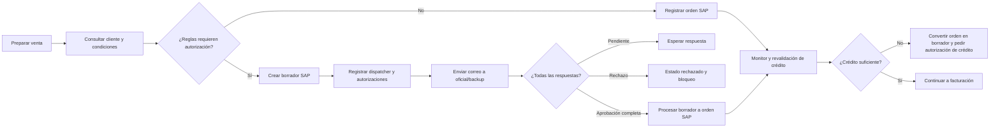

# Crédito, riesgo y autorizaciones — Sistema actual

## 1. Visión general

Antes de registrar una venta, el sistema consulta antecedentes del cliente y las condiciones económicas de la operación. Entre los datos visibles están el acuerdo de plazo, la línea autorizada, el crédito utilizado y disponible, facturas impagas y cheques protestados. También se evalúan precio, margen, costo, tasa/interés, modalidad, moneda y fecha de vencimiento.

Cuando las condiciones cumplen las reglas configuradas, la venta puede convertirse directamente en orden SAP. Si una o más reglas requieren excepción, el sistema muestra los aprobadores, crea un borrador SAP y registra solicitudes de autorización. Cada solicitud se almacena en un dispatcher con un responsable oficial, un respaldo opcional, concepto, estado y comentarios. Los autorizadores responden mediante enlaces enviados por correo; una aprobación completa permite procesar el borrador, mientras un rechazo deja la operación rechazada.

La autorización no es un permiso abstracto: queda asociada al `DocEntry` del borrador y se valida comparando la cantidad requerida de cada concepto con la cantidad aprobada. Antes de facturar una orden, el monitor vuelve a consultar la línea de crédito. El detalle de las fórmulas y matrices que viven en procedimientos SQL no está completamente visible en el código de presentación y se marca como pendiente cuando corresponde.

## 2. Diagrama general

## 3. Evaluación de cliente y riesgo

### Datos consultados

| Dato consultado | Evidencia | Uso visible |
|---|---|---|
| Acuerdo de plazo (`CliAcuerdo`) | `tai_vw_sp2_select_cliente` opción 20 | Limita plazos superiores a 30 días cuando el acuerdo comienza con `NO` |
| Línea autorizada, utilizada y disponible | `tai_vw_sp2_select_cliente` opción 20 | Se muestra al operador y se compara con el monto en la revalidación |
| Facturas impagas | `tai_vw_sp2_select_cliente` opción 60 | Se muestran como deuda vencida y pueden generar autorización |
| Cheques protestados | `tai_vw_sp2_select_cliente` opción 70 | Se muestran como protestos y pueden generar autorización |
| Cliente, RUT, categoría, giro, correo, vendedor y direcciones | consultas generales de cliente | Identificación, contexto de aprobación y contenido del correo |
| Condición de pago, plazo, fecha de vencimiento y moneda | resumen de transacción y formularios de venta | Cálculo de días extras, interés y validaciones de plazo |

### Regla confirmada y datos no equivalentes

La pantalla comprueba explícitamente que un cliente sin acuerdo no use más de 30 días de plazo. La existencia de deuda o protestos se convierte en autorización cuando los indicadores entregados por la pantalla son verdaderos; el procedimiento que decide esos indicadores no está en el código cliente. **PENDIENTE DE VALIDACIÓN FUNCIONAL** la fórmula completa para determinar deuda vencida, protesto y exposición.

## 4. Crédito y cupo

La consulta de línea devuelve tres magnitudes: autorizado, utilizado y disponible. El monitor obtiene estos valores y compara el monto de la operación con el disponible. Si no alcanza, abre la autorización específica de crédito bajo las condiciones implementadas en `scrMonitorDocumento.js`.

La fecha de vencimiento se compara con la fecha actual y con rangos calculados en cada modalidad. El código muestra mensajes para fechas inferiores al mínimo o superiores al máximo; cuando el cliente paga en moneda extranjera exige al menos 30 días. No se encontró en `ventas/` la fórmula SQL que define el límite autorizado ni el cálculo de deuda; **PENDIENTE DE VALIDACIÓN FUNCIONAL**.

## 5. Reglas que generan autorización

| Regla | Condición observable | Qué ocurre | Tipo de autorización |
|---|---|---|---|
| Plazo sin acuerdo | Acuerdo comienza con `NO` y diferencia de vencimiento mayor a 30 días | Se bloquea la carga y se informa al usuario | No se crea dispatcher en este punto; corrección del plazo o decisión de negocio pendiente |
| Margen mínimo | Línea tiene `auxTipoAutorizacion = 1` | Se marca `porMargen` y se consultan aprobadores por producto | BM1/BM2/BM3 |
| Costo | Línea tiene `auxTipoAutorizacion = 2` | Se marca `porCosto` y se consultan aprobadores | BC1/BC2/BC3 |
| Tasa/interés | Indicador `porTasa` | Se incorpora concepto TASA cuando el flujo lo entrega | TASA |
| Crédito/cupo | Crédito disponible no cubre el monto en la revalidación, o indicador `porCredito` no está vacío | Se deriva a autorización de crédito | CREDITOS |
| Deuda vencida | Indicador `porDeuda` es verdadero | Se incorpora aprobador especial | DEUDA VENCIDA |
| Protestos | Indicador `porProtesto` es verdadero | Se incorpora aprobador especial | PROTESTOS |
| Condición de pago extranjera | Vencimiento inferior al mínimo configurado para moneda extranjera | Se impide continuar | **PENDIENTE DE VALIDACIÓN FUNCIONAL** si genera autorización o sólo corrección |

El código de algunas modalidades deja `VerificarAutorizacionPorTasa`, crédito, deuda o protesto en falso y obtiene otros indicadores desde campos ocultos o estructuras del pedido. Por ello no se generaliza que todas las modalidades activen las mismas reglas.

## 6. Tipos de autorización

### Crédito (`CREDITOS`)

Se origina por cupo insuficiente o por el indicador de crédito del pedido. El aprobador se obtiene mediante autorización especial asociada al operador. El correo muestra datos de cliente, línea autorizada/utilizada/disponible y operación. Una aprobación incrementa el contador de crédito; un rechazo actualiza el concepto y exige comentario.

### Deuda vencida (`DEUDA VENCIDA`)

Se origina cuando existen documentos impagos que el flujo marca para autorización. El aprobador especial se busca por código configurado. La pantalla de aprobación puede marcar bloqueo de guía de despacho para conceptos financieros.

### Protestos (`PROTESTOS`)

Se origina cuando existen cheques protestados marcados por el pedido. Se muestra al aprobador el número, fecha y monto de los documentos recuperados del cliente.

### Bajo margen (`BM1`, `BM2`, `BM3`)

Se origina por el nivel de margen de una línea. La asignación de oficial, backup y nivel proviene de `tai_vw_sp2_select_autorizacion`, considerando operador, bodega, producto, fecha, precio y tipo de venta.

### Bajo costo (`BC1`, `BC2`, `BC3`)

Se origina por el costo de una línea y usa la misma consulta de matriz de aprobadores. En la interfaz los niveles BM/BC se presentan como tipo **VENTAS**, pero el dispatcher conserva el concepto específico.

### Tasa (`TASA`)

El modelo de autorización contempla este concepto y lo persiste con contador propio. En parte del JavaScript revisado la verificación está deshabilitada; **PENDIENTE DE VALIDACIÓN FUNCIONAL** en qué modalidades se activa productivamente.

### Factura (`FACTURA`)

El modelo SQL contiene `AutorizacionFactura` y su contador. El código de creación y envío revisado puede recibir este indicador, pero no permite determinar qué regla lo establece. **PENDIENTE DE VALIDACIÓN FUNCIONAL**.

## 7. Determinación de aprobadores

* `tai_vw_sp2_select_autorizacion` devuelve oficial, tipo y backup según operador, bodega, producto, fecha, precio y tipo de venta.
* `tai_vw_sp2_select_autorizacion_especial` devuelve responsables para crédito, deuda y protesto según el operador.
* `tai_vw_sp2_select_autorizador` entrega nombre, cargo y correo de un responsable.
* El flujo mantiene oficial y backup; el oficial recibe la solicitud principal y el backup recibe copia cuando existe.
* Las autorizaciones de margen/costo se ordenan por niveles BM1→BM3 y BC1→BC3; crédito, deuda y protesto preceden a esos niveles en el orden interno del pedido.

No se observó una regla por monto, sucursal o jerarquía adicional fuera de los parámetros entregados por SQL. **PENDIENTE DE VALIDACIÓN FUNCIONAL**.

## 8. Ciclo de vida de una autorización

| Estado | Significado | Cómo se alcanza | Qué permite |
|---|---|---|---|
| PENDIENTE | Solicitud creada sin respuesta | Dispatcher se inserta con estado inicial 0 | Esperar respuesta |
| APROBADO | Responsable respondió afirmativamente | `Estado_Autorizacion = 1` | Incrementar contador y continuar si todas están aprobadas |
| RECHAZADO | Responsable rechazó | `Estado_Autorizacion = 2` | Bloquea el avance y notifica rechazo |
| Aprobación completa | Todos los contadores igualan requisitos | `ValidarAutorizaciones()` devuelve verdadero | Procesar borrador a orden SAP |
| Vencida/caducada | No se encontró estado ni rutina explícita | — | PENDIENTE DE VALIDACIÓN FUNCIONAL |
| Anulada | No se encontró estado específico de autorización | — | PENDIENTE DE VALIDACIÓN FUNCIONAL |

Cada dispatcher conserva fecha de creación, fecha de actualización y comentario. La respuesta se actualiza también en el registro agregado de autorizaciones.

## 9. Revalidación antes de facturación

FUN-036 ocurre al seleccionar una orden desde el monitor, antes de abrir la pantalla de facturación. `scrMonitorDocumento.js` llama a `ObtenerClienteLineaCredito`, calcula si el monto cabe en el disponible y considera los días adicionales y el estado de la operación.

Cuando la condición no permite continuar, `pagVisualizarAutorizacion.aspx` muestra al responsable de crédito. El proceso crea un nuevo borrador SAP desde la orden, cancela la orden original y llama a `EnviarAutorizacionCorreoCredito`. Cuando la condición permite avanzar, se abre la pantalla de orden y queda disponible la facturación descrita en el documento DTE.

La revalidación usa el estado actual del cliente y no sólo la autorización histórica. **PENDIENTE DE VALIDACIÓN FUNCIONAL** si también vuelve a evaluar deuda, protestos, margen o cambios de precio en ese punto.

## 10. Cambios posteriores a autorización

Las autorizaciones se vinculan al `DocEntry` y a conceptos/contadores; el código no muestra una comparación de versión o huella de cantidades, precio, cliente, producto o condición de pago al responder. La conversión a orden copia datos del borrador SAP. Por tanto:

* No se puede confirmar que cambiar cantidades, precio, descuento, cliente, producto, fecha o condición invalide automáticamente una autorización.
* La revalidación de crédito sí puede volver a bloquear una orden posteriormente.
* **PENDIENTE DE VALIDACIÓN FUNCIONAL** la política para modificaciones después de una aprobación.

## 11. Notificaciones

* Al generar autorizaciones, `EnviarAutorizacionCorreo` crea correos HTML con resumen de cliente, operación, detalle, concepto, oficial y backup.
* El mensaje incluye enlaces separados para aprobar y rechazar.
* La solicitud se registra en dispatcher antes del envío.
* Al completarse todas las respuestas, `GenerarHTMLCorreoDispatcher` prepara un resumen de aprobación o rechazo para el operador comercial.
* El rechazo exige comentario en la pantalla.
* La autorización de crédito posterior a facturación envía correo mediante `EnviarAutorizacionCorreoCredito`.

No se exponen direcciones concretas ni credenciales de configuración en esta documentación. El comportamiento exacto ante fallo SMTP se limita a registrar la excepción; **PENDIENTE DE VALIDACIÓN FUNCIONAL** si existe reintento.

## 12. Funcionalidades detalladas

### FUN-011 — Consultar cliente y riesgo comercial

#### Propósito

Mostrar antecedentes comerciales necesarios para evaluar una venta y para que el aprobador entienda el riesgo.

#### Usuario o área

Operador comercial y autorizador.

#### Cómo se inicia

Desde formularios de venta, monitor y pantalla de autorización.

#### Datos de entrada

Código de cliente y contexto de la operación.

#### Flujo paso a paso

1. Se consulta la ficha del cliente.
2. Se consulta línea de crédito, facturas impagas y protestos mediante opciones de `tai_vw_sp2_select_cliente`.
3. Se muestran antecedentes y se guardan indicadores en la estructura del pedido cuando el flujo los determina.
4. El formulario usa esos indicadores al construir la lista de autorizaciones.

#### Reglas de negocio

Un cliente sin acuerdo no puede usar plazo superior a 30 días sin corregir la fecha/condición. La existencia de deuda o protestos puede crear autorización especial.

#### Información generada/modificada

Indicadores `porCredito`, `porDeuda` y `porProtesto` en el pedido; no se modifica el maestro durante esta consulta.

#### Integraciones y base de datos

SQL Server, servicio `srvCliente.asmx` y SAP como fuente indirecta de datos maestros. Procedimiento `tai_vw_sp2_select_cliente` con opciones 20, 60 y 70.

#### Evidencia técnica

* `ventas/SistemaVentasWeb/SistemaVentasWeb/Classes/clsClienteListado.vb`.
* `ventas/SistemaVentasWeb/SistemaVentasWeb/Services/srvCliente.asmx.vb`.
* `ventas/SistemaVentasWeb/SistemaVentasWeb/Scripts/scrVentaBodegaPropia.js`.

#### Pendientes

PENDIENTE DE VALIDACIÓN FUNCIONAL: definición SQL exacta de disponible, deuda vencida y protestos.

### FUN-016 — Determinar autorizaciones requeridas

#### Propósito

Convertir las excepciones comerciales y financieras de una venta en una lista ordenada de responsables y conceptos.

#### Usuario o área

Sistema, operador y autorizadores comerciales/financieros.

#### Cómo se inicia

Al cargar el cuadro de autorizaciones antes de crear orden o borrador.

#### Flujo paso a paso

1. Se validan fechas y plazo.
2. Se evalúan indicadores de margen/costo por línea, tasa, crédito, deuda y protestos.
3. Para cada excepción se consulta la matriz de responsables.
4. Se eliminan duplicados y se ordenan solicitudes.
5. Se muestra oficial, cargo, concepto y backup.

#### Reglas de negocio

Los niveles BM/BC se asocian a conceptos específicos y se ordenan; crédito, deuda y protesto usan responsables especiales por operador.

#### Base de datos

`tai_vw_sp2_select_autorizacion`, `tai_vw_sp2_select_autorizacion_especial`, `tai_vw_sp2_select_autorizador`.

#### Evidencia técnica

* `ventas/SistemaVentasWeb/SistemaVentasWeb/Classes/clsAutorizacionListado.vb`.
* `ventas/SistemaVentasWeb/SistemaVentasWeb/Scripts/scrVentaBodegaPropia.js` y scripts equivalentes de modalidades.

#### Pendientes

PENDIENTE DE VALIDACIÓN FUNCIONAL: contenido completo de las matrices SQL y regla de autorización de factura.

### FUN-017 — Notificar solicitud de autorización

#### Propósito

Crear el registro de trabajo de cada aprobador y enviarle una solicitud accionable.

#### Usuario o área

Sistema; destinatarios son aprobadores oficiales y backups.

#### Flujo paso a paso

1. Se genera un código único asociado al borrador.
2. Se inserta dispatcher con borrador, oficial, backup y concepto.
3. Se construye correo HTML con resumen y enlaces aprobar/rechazar.
4. Se envía al oficial y, si existe, al backup.
5. Se inserta el resumen de autorizaciones con contadores iniciales en cero.

#### Evidencia técnica

* `ventas/SistemaVentasWeb/SistemaVentasWeb/Classes/clsAutorizacionListado.vb`.
* `ventas/SistemaVentasWeb/SistemaVentasWeb/Classes/clsDispatcherListado.vb`.
* `ventas/SistemaVentasWeb/SistemaVentasWeb/Services/srvAutorizacion.asmx.vb`.

### FUN-018 — Aprobar borrador

#### Propósito

Registrar la aprobación de un concepto y permitir que el flujo avance cuando todos los requisitos estén aprobados.

#### Usuario o área

Autorizador oficial o backup identificado en el enlace.

#### Flujo paso a paso

1. El usuario abre el enlace de aprobación.
2. Se verifica que el dispatcher seleccionado siga pendiente.
3. Puede marcar bloqueo de guía para crédito, deuda o protestos.
4. Se actualiza dispatcher y autorización con estado 1 y comentario.
5. Se recalcula el estado agregado del borrador.

#### Resultado

Si todos los contadores coinciden con los requisitos, el borrador queda autorizado y puede procesarse desde el monitor a orden SAP.

#### Evidencia técnica

* `ventas/SistemaVentasWeb/SistemaVentasWeb/Pages/pagAprobarBorrador.aspx.vb`.
* `ventas/SistemaVentasWeb/SistemaVentasWeb/Classes/clsDispatcherListado.vb`.
* `ventas/SistemaVentasWeb/SistemaVentasWeb/Classes/clsAutorizacionesListado.vb`.

### FUN-019 — Rechazar borrador

#### Propósito

Detener una operación que no fue aprobada y dejar constancia del motivo.

#### Flujo paso a paso

1. El autorizador abre el enlace de rechazo.
2. Debe ingresar comentario.
3. Se actualizan dispatcher y autorización con estado 2.
4. El estado agregado se recalcula como rechazado y se notifica al operador.

#### Validación

Sin comentario el rechazo no se ejecuta y la pantalla informa que se requiere explicar el motivo.

#### Evidencia técnica

* `ventas/SistemaVentasWeb/SistemaVentasWeb/Pages/pagRechazarBorrador.aspx.vb`.
* `ventas/SistemaVentasWeb/SistemaVentasWeb/Classes/clsDispatcherListado.vb`.

### FUN-020 — Consolidar y procesar decisión de autorización

#### Propósito

Determinar si la autorización está completa y permitir la conversión del borrador autorizado a orden SAP.

#### Flujo paso a paso

1. Se cargan los requisitos y contadores desde `tai_vw_sp2_select_autorizaciones`.
2. `ValidarAutorizaciones` compara cada par requisito/contador.
3. Si no coinciden, el monitor informa que el documento aún no está autorizado.
4. Si coinciden, `ProcesarBorradorVentaEnOrdenVenta` llama a SAP para convertir el borrador.
5. Se actualizan estado del borrador y estado de la orden.

#### Evidencia técnica

* `ventas/SistemaVentasWeb/SistemaVentasWeb/Classes/clsAutorizacionesListado.vb`.
* `ventas/SistemaVentasWeb/SistemaVentasWeb/Services/srvMonitorDocumento.asmx.vb`.
* `wssap/WebServices/WebServices/Classes/clsOrdenVenta.vb`.

### FUN-036 — Revalidar crédito antes de facturar

#### Propósito

Volver a comprobar el cupo antes de permitir la apertura de facturación.

#### Evidencia técnica

* `ventas/SistemaVentasWeb/SistemaVentasWeb/Scripts/scrMonitorDocumento.js`.
* `ventas/SistemaVentasWeb/SistemaVentasWeb/Scripts/scrVisualizarAutorizacion.js`.
* `ventas/SistemaVentasWeb/SistemaVentasWeb/Services/srvCliente.asmx.vb`.

#### Pendientes

PENDIENTE DE VALIDACIÓN FUNCIONAL: alcance exacto de la revalidación más allá de cupo y días de plazo.

## 13. Stored procedures relevantes

| Stored procedure | Propósito funcional | Regla/proceso |
|---|---|---|
| `tai_vw_sp2_select_cliente` (20, 60, 70) | Línea de crédito; facturas impagas; cheques protestados | Riesgo y cupo |
| `tai_vw_sp2_select_autorizacion` | Matriz de oficial, backup y tipo por operación/producto | Margen, costo y niveles BM/BC |
| `tai_vw_sp2_select_autorizacion_especial` | Responsables especiales por operador | Crédito, deuda y protesto |
| `tai_vw_sp2_select_autorizador` | Nombre, cargo y correo del responsable | Presentación y notificación |
| `dbo.tai_vw_sp2_insert_autorizaciones` | Requisitos y contadores iniciales | Inicio del circuito |
| `dbo.tai_vw_sp2_update_autorizaciones` | Estado, comentario y autorizador que responde | Aprobación/rechazo |
| `tai_vw_sp2_select_autorizaciones` | Recupera requisitos, contadores y mensajes | Validación de completitud |
| `dbo.tai_vw_sp2_insert_dispatcher` | Crea solicitud individual para oficial/backup | Notificación |
| `dbo.tai_vw_sp2_update_dispatcher` | Actualiza estado y comentario de una solicitud | Respuesta |
| `tai_vw_sp2_select_dispatcher` | Lista solicitudes, estados, fechas y comentarios | Monitor y consolidación |
| `dbo.tai_vw_sp2_update_estado_borrador` | Guarda estado final y bloqueo de guía | Aprobación/rechazo |
| `dbo.tai_vw_sp2_update_estado_orden` | Relaciona borrador procesado con orden | Conversión posterior |
| `tai_vw_sp2_select_interes_producto` | Calcula/consulta interés por cliente, producto, plazo y fechas | Condición comercial; posible autorización TASA |

## 14. Integraciones

| Integración | Participación confirmada |
|---|---|
| SQL Server | Concentra datos de cliente, matrices, requisitos, contadores, dispatcher y estados |
| SAP Business One DI API | Crea borradores/órdenes y convierte borrador aprobado; conserva campos de estado y bloqueo |
| `wssap` / ASMX | Expone operaciones SAP usadas al procesar borradores y órdenes |
| Servicios ASMX de `ventas` | Sirven cliente, autorización, monitor y dispatcher al navegador |
| SMTP | Envía solicitudes y resultado de autorización por correo |

## 15. Resumen ejecutivo

* El sistema evalúa cupo, deuda, protestos, plazo, margen, costo, tasa y condiciones de venta.
* La línea muestra autorizado, utilizado y disponible; el monitor revalida el disponible antes de facturar.
* Las excepciones crean requisitos de autorización, no una aprobación genérica.
* Existen autorizaciones de crédito, deuda vencida, protestos, BM1–BM3, BC1–BC3, tasa y un indicador de factura pendiente de confirmar.
* Los aprobadores oficiales y backups provienen de matrices SQL y configuraciones especiales por operador.
* Cada solicitud queda en dispatcher con estado pendiente, aprobado o rechazado.
* La aprobación exige que todos los contadores coincidan con los requisitos.
* El rechazo exige comentario y deja el borrador bloqueado/rechazado.
* Los correos contienen enlaces para responder y un resumen final al operador.
* No se confirmó caducidad automática ni invalidación por cambios posteriores.

## 16. Dependencias de conocimiento especializado

| Nivel | Dependencia | Motivo |
|---|---|---|
| ALTO | Procedimientos SQL de riesgo y matrices de aprobación | Las fórmulas y responsables principales no están en el código de presentación |
| ALTO | Relación de conceptos BM/BC, crédito, deuda y protesto | Define qué operación puede avanzar y qué área debe aprobar |
| ALTO | Conversión borrador/orden SAP | Un error de estado o bloqueo puede impedir el flujo comercial |
| MEDIO | Revalidación de crédito | Combina cupo actual, días de plazo y estado del documento |
| MEDIO | Notificaciones y enlaces | Códigos, oficiales/backups y respuestas dependen de dispatcher y SMTP |
| MEDIO | Indicador de factura y tasa | Están modelados, pero su origen completo no aparece en el alcance cliente |
| BAJO | Mensajes y logging de errores | Sirven para operación, pero no documentan la regla que originó el rechazo |

