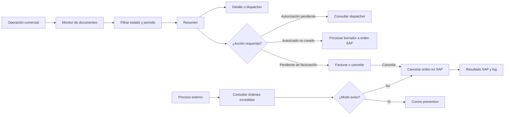

# Monitoreo, cancelaciones y recuperación operativa — Sistema actual

## 1. Visión general

El sistema dispone de dos monitores operativos. El monitor de documentos permite buscar pedidos, órdenes y facturas por cliente, estado y período; muestra un resumen y permite expandir el detalle. Según el estado, el usuario puede revisar autorizaciones, procesar un borrador autorizado, abrir una orden para facturar o cancelar manualmente una orden pendiente.

El monitor de autorizaciones se concentra en solicitudes de aprobación y muestra responsable, concepto, estado, fechas y monto. Las cancelaciones manuales se ejecutan sobre órdenes de venta aún pendientes de facturación y llaman a SAP Business One para cancelar el documento. Los borradores tienen además una página que ejecuta un procedimiento SQL de cancelación.

Existe un proceso separado para órdenes sin facturar. Recibe un modo de aviso o cancelación, consulta SQL las órdenes que superaron el tiempo permitido y, en modo aviso, envía un correo indicando que serán canceladas al día siguiente; en el otro modo intenta cancelarlas en SAP. El código contiene estas páginas, pero no demuestra qué scheduler externo las invoca en producción.

## 2. Mapa operativo general

## 3. Monitor de operaciones

### Monitor de documentos

* **Pantalla:** `pagMonitorDocumento.aspx` con `scrMonitorDocumento.js`.
* **Usuario:** operador o supervisor con acceso al módulo.
* **Filtros:** código de cliente, estado, fecha desde y fecha hasta; el producto se envía como filtro vacío desde la pantalla revisada.
* **Límite:** el período consultado no puede exceder 30 días. La consulta exige cliente y estado.
* **Paginación:** el procedimiento devuelve cantidad de páginas; la interfaz presenta hasta diez filas por página.
* **Resumen:** número/código de documento, cliente, fecha de documento, fecha de vencimiento, tipo y estado.
* **Detalle:** código y nombre de producto, cantidad, moneda, precio unitario, total, descuento, interés y fecha de entrega.
* **Acciones:** ver dispatcher, procesar borrador autorizado, abrir facturación/revalidación y cancelar orden pendiente.

### Monitor de autorizaciones

`pagMonitorAutorizacion.aspx` consulta por cliente, estado, fechas y operador. Muestra `DocEntry`, cliente, fecha, vencimiento, total, tipo de autorización, código/concepto de dispatcher, modalidad de venta y oficina. La paginación utiliza el mismo procedimiento con una opción distinta.

## 4. Estados observados

Los nombres de estado del monitor se obtienen desde el parámetro `documento`; el código de presentación implementa acciones para los siguientes valores:

| Estado | Significado funcional | Origen | Acciones disponibles |
|---|---|---|---|
| Pendientes de Autorización | Borrador con solicitudes aún en proceso | SQL/monitor | Ver dispatcher |
| Autorizados No Creados | Borrador cuyas autorizaciones están completas pero aún no se convirtió en orden | SQL/monitor | Procesar borrador |
| Autorización Rechazada | Solicitud con al menos un rechazo | SQL/dispatcher | Ver dispatcher |
| Pedidos Cancelados | Operación cancelada | SQL/SAP | Sin acción en monitor |
| Pendientes de Facturación | Orden SAP todavía no facturada | SQL/monitor | Revalidar, facturar o cancelar |
| Facturados | Documento con factura/boleta; el código muestra `FolioNum` de `OINV` | SQL y SAP | Sólo consulta |

Los estados internos del dispatcher son `PENDIENTE` (0), `APROBADO` (1) y `RECHAZADO` (2). El estado SAP de una orden cancelada no se traduce en una máquina de estados local visible en el código. **PENDIENTE DE VALIDACIÓN FUNCIONAL** el catálogo completo entregado por la tabla de parámetros y la correspondencia exacta con estados SAP.

## 5. Consulta detallada de operación

Al expandir una fila, el monitor llama a `ObtenerMonitorDocumentoDetalle` con tipo y código del documento. El usuario puede revisar productos, cantidades, moneda, precios, descuento, interés y fecha de entrega antes de decidir procesar, facturar o cancelar.

Para operaciones con autorizaciones, `CargarCuadroDispatcher` consulta `ObtenerDispatcher` y muestra oficial, cargo, tipo, estado, backup, fecha de creación, fecha de respuesta y comentario. No se observa en esta consulta una relectura directa de todos los datos SAP ni un diagnóstico técnico de inconsistencias.

## 6. Cancelación manual — FUN-037

### Propósito

Permitir que un operador cancele desde el monitor una orden de venta que aún está pendiente de facturación.

### Usuario o área

Usuario que visualiza el estado **Pendientes de Facturación** y dispone de la acción mostrada por el monitor. El código no contiene una comprobación explícita de rol dentro del método; **PENDIENTE DE VALIDACIÓN FUNCIONAL** la restricción de perfil aplicada por menú o seguridad externa.

### Precondiciones y flujo

1. El usuario consulta cliente, estado y período.
2. En una fila pendiente selecciona el ícono de cancelar.
3. Confirma el mensaje “¿Desea cancelar orden de venta ...?”.
4. El navegador llama `srvMonitorDocumento.asmx/CancelarOrdenVenta` con número de documento y usuario.
5. La capa de ventas obtiene credenciales SAP y busca el `DocEntry` en `ORDR` a partir del número.
6. SAP Business One ejecuta `oOrders.Cancel()`.
7. El servicio devuelve número, código de estado y mensaje; la pantalla recarga la consulta y muestra éxito o error.

### Reglas y diferencias

Cancelar no elimina el registro ni borra la orden: invoca la operación de cancelación de SAP. El código no ejecuta un procedimiento SQL de actualización local después de una cancelación exitosa. **PENDIENTE DE VALIDACIÓN FUNCIONAL** cómo el monitor refleja posteriormente el estado cancelado si la fuente SQL no se actualiza en este método.

### Errores y recuperación

* Si SAP no conecta, devuelve el código/texto de SAP y registra log.
* Si SAP rechaza la cancelación, se informa el error y la orden permanece sin confirmación de cancelación.
* Si la orden no se encuentra por `DocNum`, no hay resultado exitoso; el texto final exacto queda sujeto al retorno de la capa.
* No existe reintento automático en el JavaScript; el usuario puede volver a consultar y repetir manualmente.

### Evidencia técnica

* `ventas/SistemaVentasWeb/SistemaVentasWeb/Scripts/scrMonitorDocumento.js` — `CancelarPedido`.
* `ventas/SistemaVentasWeb/SistemaVentasWeb/Services/srvMonitorDocumento.asmx.vb` — `CancelarOrdenVenta`.
* `ventas/SistemaVentasWeb/SistemaVentasWeb/Classes/clsMonitorDocumentoListado.vb` — cancelación DI API.
* `wssap/WebServices/WebServices/Classes/clsOrdenVenta.vb` — `CancelarOrdenVenta` equivalente.

## 7. Cancelación de borradores — FUN-033

`pagCancelarBorradorVenta.aspx` ejecuta `dbo.tai_vw_sp2_select_cancela_borrador_venta` al cargar la página, sin parámetros de usuario visibles y sin recorrer filas en la aplicación. El procedimiento es quien determina qué borradores cancela y cómo actualiza sus estados. No se encontró en esta página una llamada DI API para cada borrador.

* **Disparador confirmado:** carga de la página.
* **Criterio temporal/estado:** encapsulado en el procedimiento; **PENDIENTE DE VALIDACIÓN FUNCIONAL**.
* **Impacto SAP:** no comprobable desde esta página; **PENDIENTE DE VALIDACIÓN FUNCIONAL**.
* **Notificación:** no se observa envío de correo en esta página.

La acción es cancelación/actualización, no eliminación física demostrada.

## 8. Órdenes sin facturar — FUN-034

### Detección y aviso

`pagCancelarOrdenVenta.aspx` recibe `prmProceso`. En modo `A`, consulta `tai_vw_sp2_select_cancela_orden_venta 'A'` y envía al correo del operador un aviso: la orden supera el tiempo máximo permitido pendiente de facturación y será cancelada automáticamente al día siguiente. El mensaje incluye número de orden, cliente, modalidad y monto.

### Cancelación posterior

En un modo distinto de `A`, la misma página consulta `tai_vw_sp2_select_cancela_orden_venta` y, por cada fila, llama a `WebServices.clsOrdenVenta.CancelarOrdenVenta`. El procedimiento SQL decide qué órdenes están excedidas; SAP ejecuta la cancelación individual.

### Condiciones y límites

El texto del correo confirma un tiempo máximo de espera, pero el número de días no aparece en el código. La condición que excluye órdenes ya facturadas/cerradas está encapsulada en SQL. **PENDIENTE DE VALIDACIÓN FUNCIONAL** frecuencia, valor temporal exacto, exclusiones y quién invoca cada modo.

## 9. Recuperación ante errores

| Situación | Detección | Acción de recuperación | Manual/Automática |
|---|---|---|---|
| Error de conexión SAP al cancelar | Código de retorno y `GetLastError` | Revisar log y reintentar la acción desde monitor/proceso | Manual |
| SAP rechaza cancelación | Código SAP distinto de cero | No se compensa en SQL; requiere revisión y nuevo intento | Manual |
| Documento no encontrado en SAP | `GetByKey` no obtiene orden | **PENDIENTE DE VALIDACIÓN FUNCIONAL**; revisar relación DocNum/DocEntry | Manual |
| Fallo SQL en monitor | Excepción registrada por `ToLog` | La consulta puede quedar sin datos; no hay reparación automática visible | Manual |
| Error al cancelar borrador | Excepción de procedimiento/página | Revisar procedimiento y volver a ejecutar página | Manual |
| Error SMTP de aviso | `SmtpException` registrada | No se observa reintento; verificar operador por otro medio | Manual |
| Orden creada en SAP pero estado SQL desactualizado | No existe comprobación conjunta en cancelación manual | **PENDIENTE DE VALIDACIÓN FUNCIONAL** |
| Timeout de servicio | No hay captura específica distinta de excepción general | **PENDIENTE DE VALIDACIÓN FUNCIONAL** |

No se encontró una compensación transaccional entre SAP y SQL ni una rutina que reconcilie ambos sistemas.

## 10. Reintentos

No se identificó un contador, intervalo o política de reintento para cancelar órdenes, ejecutar procedimientos o enviar avisos. El usuario puede repetir manualmente la consulta/acción. **PENDIENTE DE VALIDACIÓN FUNCIONAL** si el scheduler externo reintenta la página o el proceso SQL.

## 11. Dispatcher, scheduler y timers

| Componente | Disparador | Qué revisa | Qué ejecuta | Resultado |
|---|---|---|---|---|
| `srvMonitorDocumento.asmx` | Acción del usuario | Resumen, detalle, autorizaciones y orden pendiente | Consulta, procesa borrador o cancela orden | Respuesta al navegador |
| `srvDispatcher.asmx` | Expansión manual del monitor | Solicitudes del documento | Devuelve dispatcher | Estados y comentarios visibles |
| `pagCancelarBorradorVenta.aspx` | Carga de página | Criterios encapsulados en SQL | `tai_vw_sp2_select_cancela_borrador_venta` | Borradores actualizados según SP |
| `pagCancelarOrdenVenta.aspx` modo A | Invocación externa no identificada | Órdenes excedidas según SQL | Correo preventivo | Aviso de futura cancelación |
| `pagCancelarOrdenVenta.aspx` modo distinto de A | Invocación externa no identificada | Órdenes excedidas según SQL | Cancelación SAP por fila | Órdenes canceladas o errores en log |

No se encontraron timers, Windows Services, ejecutables auxiliares ni configuración que pruebe la programación productiva. **PENDIENTE DE VALIDACIÓN FUNCIONAL** el scheduler responsable de invocar las páginas de cancelación.

## 12. Notificaciones

* El aviso de órdenes sin facturar se envía al correo del operador obtenido por SQL.
* El asunto identifica el número de orden y el cuerpo informa cliente, modalidad, monto y cancelación prevista.
* Las autorizaciones usan dispatcher y correo, pero se documentan en el documento de crédito/autorizaciones.
* Las cancelaciones manuales muestran `alert` de éxito o error en pantalla.
* Los errores de SMTP se registran; no se observa reintento.

## 13. Funcionalidades detalladas

### FUN-021 — Monitorear autorizaciones

#### Propósito

Consultar solicitudes de aprobación por cliente, estado, período y operador.

#### Usuario o área

Operador, supervisor o área que sigue aprobaciones.

#### Cómo se inicia

Desde `pagMonitorAutorizacion.aspx` mediante servicios ASMX.

#### Datos consultados

Cliente, fechas, operador, `DocEntry`, total, tipo de autorización, concepto, responsable, estado y oficina.

#### Acciones SQL

`tai_vw_sp2_select_monitor_autorizacion_resumen` se usa para resumen y paginación.

#### Resultado esperado

Listado de autorizaciones consultable por página. No se observa una acción de cancelación desde este monitor.

#### Evidencia técnica

* `ventas/SistemaVentasWeb/SistemaVentasWeb/Classes/clsMonitorAutorizacionListado.vb`.
* `ventas/SistemaVentasWeb/SistemaVentasWeb/Services/srvMonitorAutorizacion.asmx.vb`.
* `ventas/SistemaVentasWeb/SistemaVentasWeb/Pages/pagMonitorAutorizacion.aspx`.

### FUN-022 — Monitorear y accionar documentos comerciales

#### Propósito

Centralizar consulta y acciones según estado de pedidos, órdenes y documentos facturados.

#### Flujo

1. Se validan cliente, estado y rango máximo de 30 días.
2. Se consulta resumen paginado.
3. El usuario expande detalle o dispatcher.
4. Según estado, procesa, factura, cancela o sólo consulta.

#### Acciones SQL

`tai_vw_sp2_select_monitor_documento_resumen`, `tai_vw_sp2_select_monitor_documento_detalle` y `tai_vw_sp2_select_monitor_documento_resumen` opción de páginas.

#### Evidencia técnica

* `ventas/SistemaVentasWeb/SistemaVentasWeb/Scripts/scrMonitorDocumento.js`.
* `ventas/SistemaVentasWeb/SistemaVentasWeb/Classes/clsMonitorDocumentoListado.vb`.
* `ventas/SistemaVentasWeb/SistemaVentasWeb/Services/srvMonitorDocumento.asmx.vb`.

### FUN-033 — Cancelar borradores pendientes

#### Propósito

Ejecutar la cancelación de borradores definida por un procedimiento SQL.

#### Cómo se inicia

Carga de `pagCancelarBorradorVenta.aspx`; el disparador productivo externo no está identificado.

#### Acciones SQL/SAP

Sólo se observa llamada a `dbo.tai_vw_sp2_select_cancela_borrador_venta`. **PENDIENTE DE VALIDACIÓN FUNCIONAL** impacto SAP y criterio exacto.

#### Evidencia técnica

* `ventas/SistemaVentasWeb/SistemaVentasWeb/Pages/pagCancelarBorradorVenta.aspx.vb`.

### FUN-034 — Avisar/cancelar órdenes sin facturar

#### Propósito

Detectar órdenes atrasadas, avisar al operador y cancelarlas en una ejecución posterior.

#### Flujo

Consulta `tai_vw_sp2_select_cancela_orden_venta` con modo; modo `A` envía aviso y otro modo cancela cada orden mediante SAP.

#### Evidencia técnica

* `ventas/SistemaVentasWeb/SistemaVentasWeb/Pages/pagCancelarOrdenVenta.aspx.vb`.
* `ventas/SistemaVentasWeb/SistemaVentasWeb/Classes/clsOrdenVenta.vb`.
* `wssap/WebServices/WebServices/Classes/clsOrdenVenta.vb`.

#### Pendientes

PENDIENTE DE VALIDACIÓN FUNCIONAL: scheduler, frecuencia y días máximos.

### FUN-037 — Cancelar manualmente orden pendiente

#### Propósito

Cancelar una orden pendiente de facturación mediante confirmación del usuario.

#### Acciones SAP

Busca `ORDR` por número y ejecuta `oOrders.Cancel()`.

#### Evidencia técnica

* `ventas/SistemaVentasWeb/SistemaVentasWeb/Scripts/scrMonitorDocumento.js`.
* `ventas/SistemaVentasWeb/SistemaVentasWeb/Classes/clsMonitorDocumentoListado.vb`.
* `wssap/WebServices/WebServices/Services/srvOrdenVenta.asmx.vb`.

## 14. Stored procedures relevantes

| Stored procedure | Propósito funcional | Proceso |
|---|---|---|
| `tai_vw_sp2_select_monitor_documento_resumen` | Lista documentos por cliente, producto, estado, fechas, operador y página | Monitor de documentos |
| `tai_vw_sp2_select_monitor_documento_detalle` | Recupera líneas y fechas de entrega | Detalle |
| `tai_vw_sp2_select_monitor_autorizacion_resumen` | Lista solicitudes de autorización y paginación | Monitor de autorizaciones |
| `tai_vw_sp2_select_cancela_borrador_venta` | Determina/actualiza cancelación de borradores según reglas internas | Cancelación de borradores |
| `tai_vw_sp2_select_cancela_orden_venta` | Devuelve órdenes que deben avisarse o cancelarse según modo | Órdenes sin facturar |
| `tai_vw_sp2_select_dispatcher` | Recupera responsables, estados, fechas y comentarios | Dispatcher |
| `dbo.tai_vw_sp2_update_estado_borrador` | Actualiza estado agregado de autorización y bloqueo de guía | Cierre de autorización |
| `dbo.tai_vw_sp2_update_estado_orden` | Actualiza relación/estado luego de procesar borrador | Conversión a orden |

No se identificó un procedimiento específico llamado desde la cancelación manual para actualizar SQL después de `oOrders.Cancel()`.

## 15. Integraciones

| Integración | Uso dentro del proceso | Dirección |
|---|---|---|
| SQL Server | Monitores, estados, pendientes, dispatcher y cancelaciones automáticas | `ventas/` → SQL |
| SAP Business One DI API | Procesar borradores, cancelar órdenes y obtener estado documental | `ventas/`/`wssap/` → SAP |
| `wssap` | Servicios de orden y cancelación SAP | `ventas/` → ASMX `wssap` |
| ASMX de ventas | Monitor, dispatcher, cliente y acciones del navegador | Navegador → `ventas/Services` |
| SMTP | Avisos de órdenes que serán canceladas y resultados de autorización | `ventas/` → SMTP |
| Scheduler externo | Invocación de páginas de cancelación | PENDIENTE DE VALIDACIÓN FUNCIONAL |

## 16. Riesgo de inconsistencias

| Riesgo operativo | Cómo se detecta actualmente | Recuperación conocida |
|---|---|---|
| SAP cancelado pero SQL no sincronizado | Estado posterior en monitor o consulta manual | PENDIENTE DE VALIDACIÓN FUNCIONAL |
| SQL selecciona pendiente y SAP ya no encuentra orden | Error de `GetByKey`/retorno SAP | Revisar log y relación `DocNum`/`DocEntry` |
| Aviso SMTP no entregado | Excepción SMTP en log | Revisión manual; no hay reintento confirmado |
| Borrador cancelado por SP sin detalle visible | Revisión posterior en monitor/SAP | PENDIENTE DE VALIDACIÓN FUNCIONAL |
| Proceso externo no ejecutado | Órdenes permanecen en estado pendiente | Ejecución manual si se conoce la página; scheduler pendiente |
| Error parcial durante procesamiento | Mensaje de servicio o estado no actualizado | PENDIENTE DE VALIDACIÓN FUNCIONAL |

## 17. Resumen ejecutivo

* El monitor de documentos controla pedidos, órdenes, autorizaciones y facturados.
* Permite filtrar por cliente, estado y período máximo de 30 días.
* El resumen muestra estado y fechas; el detalle muestra líneas y valores comerciales.
* El dispatcher permite revisar responsables, respuestas y comentarios.
* El usuario puede cancelar manualmente órdenes pendientes de facturación.
* La cancelación manual ejecuta `oOrders.Cancel()` en SAP y no elimina el documento.
* Los borradores tienen una cancelación basada en procedimiento SQL.
* Las órdenes atrasadas tienen un flujo de aviso previo y cancelación posterior.
* No se confirmó el scheduler externo ni una reconciliación automática SQL/SAP.
* Los principales riesgos son errores parciales, folios/estados desalineados y avisos no entregados.

## 18. Dependencias de conocimiento especializado

| Nivel | Dependencia | Motivo |
|---|---|---|
| ALTO | Criterios SQL de cancelación | El código no contiene días, estados ni exclusiones completas |
| ALTO | Scheduler externo de páginas de cancelación | Sin conocer el disparador no se puede asegurar el ciclo automático |
| ALTO | Relación SQL/SAP en cancelación | La cancelación manual no actualiza explícitamente ambos sistemas |
| MEDIO | Estados del parámetro `documento` | Acciones de pantalla dependen de nombres configurados |
| MEDIO | Dispatcher y procesamiento de autorizaciones | Determina cuándo un borrador puede transformarse en orden |
| MEDIO | Recuperación de errores parciales | No existe compensación visible en el alcance |
| BAJO | Paginación y filtros | Su funcionamiento está explícito en servicios y JavaScript |

