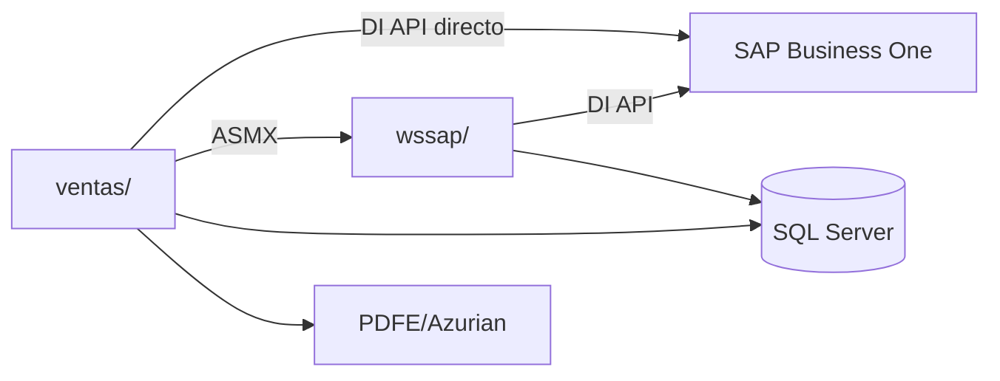

# Integración SAP Business One y wssap — Sistema actual

## 1. Resumen ejecutivo

El sistema de ventas utiliza SAP Business One como registro operativo de borradores, órdenes de venta, órdenes de compra y facturas/boletas. SQL Server mantiene consultas, parámetros, estados de autorización, relaciones de seguimiento y algunos identificadores; SAP mantiene los documentos comerciales y sus números/folios.

Hay dos caminos de integración. `ventas/` accede directamente a SAP mediante la DI API para las operaciones que ejecuta desde sus páginas y clases locales. Además, `ventas/` consume el servicio ASMX de `wssap/` para crear o convertir documentos de venta en algunos flujos. `wssap/` encapsula la misma familia de operaciones SAP y devuelve resultados compactos con códigos e identificadores.

La integración depende de CompanyDB, servidor, License Server, series, UDF, códigos de usuario SAP, bodegas y procedimientos SQL. Un nuevo mantenedor debe conocer tanto el documento SAP como la consulta SQL que lo relaciona; no existe una transacción coordinada visible entre ambos sistemas.

## 2. Arquitectura actual de integración

El camino directo se usa para creación de documentos desde clases de `ventas`, facturación, órdenes de compra y cancelación. El camino indirecto usa `wssap` para operaciones de orden de venta invocadas por servicios ASMX.

## 3. Responsabilidades por componente

| Componente | Responsabilidad | Tecnología | Sistemas relacionados |
|---|---|---|---|
| `ventas/` | Pantallas, validaciones, monitor, autorización y llamadas DI API/ASMX | ASP.NET WebForms, VB.NET, SAPbobsCOM, ASMX | SQL Server, SAP, wssap, PDFE |
| `wssap/` | Encapsular operaciones de orden de venta y conversión/cancelación SAP | ASMX, VB.NET, SAP DI API | SAP Business One, SQL Server |
| SQL Server | Parámetros, clientes, estados, dispatcher, relaciones y folios consultados | Stored procedures y consultas | `ventas/`, `wssap`, SAP |
| SAP Business One | Documentos comerciales, maestros utilizados por DI API y folios | DI API sobre SQL Server | `ventas/`, `wssap` |
| Servicios ASMX de `ventas` | Exponer monitor, cliente, dispatcher, autorización y acciones al navegador | Web Services JSON/XML | Navegador y clases locales |
| PDFE/Azurian | Visualizar PDF DTE a partir de folio | SOAP | `ventas/` |

## 4. Conexión a SAP

### Punto de inicialización

Cada operación crea un objeto `SAPbobsCOM.Company`, asigna parámetros de ambiente y ejecuta `Connect`. Los puntos principales son:

* `ventas/.../Classes/clsOrdenVenta.vb` — creación de borrador, orden, factura, cancelación y conversión.
* `ventas/.../Classes/clsOrdenCompra.vb` — orden de compra.
* `wssap/.../Classes/clsOrdenVenta.vb` y `clsOrdenCompra.vb` — operaciones equivalentes expuestas por servicios.

### Parámetros usados

El código asigna servidor SAP, usuario técnico de base de datos, contraseña de base de datos, License Server, `CompanyDB`, usuario SAP y contraseña SAP. Los valores se seleccionan desde recursos según `zModalidad` (`P` para producción y otro valor para prueba). Las credenciales se obtienen para el operador mediante `ObtenerUsuarioSap` y desde recursos/configuración para la conexión de compañía.

La base de datos se declara como `SAPbobsCOM.BoDataServerTypes.dst_MSSQL2016`, `UseTrusted = False`, y se invoca `Connect`. No se documentan valores concretos de servidor, CompanyDB ni credenciales.

### Familia SAP

La evidencia identifica SAP Business One y su DI API (`SAPbobsCOM`). No se identifica desde estos proyectos una versión exacta del cliente/servidor SAP; **PENDIENTE DE VALIDACIÓN FUNCIONAL**.

## 5. Mapa de operaciones SAP

| Operación funcional | Componente origen | Objeto/servicio SAP | Acción | Resultado |
|---|---|---|---|---|
| Crear borrador de venta | `ventas` o `wssap` | `oDrafts`, `DocObjectCode=oOrders` | Agrega cabecera, líneas, UDF y llama `Add` | `DocEntry`, `DocNum`, estado |
| Crear orden de venta | `ventas` o `wssap` | `oOrders` | Completa cabecera/líneas y llama `Add` | Orden SAP y claves |
| Convertir borrador autorizado | `wssap`/`ventas` | `oDrafts.SaveDraftToDocument()` | Convierte borrador a orden | Código de retorno y orden |
| Convertir orden a borrador | `wssap`/`ventas` | `oOrders` + `oDrafts` | Copia cabecera, líneas y UDF; agrega draft | Nuevo borrador |
| Crear orden de compra | `ventas`/`wssap` | `oPurchaseOrders` | Carga proveedor, líneas y condiciones; llama `Add` | Orden de compra SAP |
| Crear factura/boleta | `ventas`/`wssap` | `oInvoices` | Base de líneas en `oOrders`; llama `Add` | `OINV`, `DocEntry`, `DocNum` |
| Consultar documento | `ventas`/`wssap` + SQL SAP | `ORDR`, `OINV`, `ODRF` mediante DI API/consultas | Obtiene por clave o cruza DocNum/DocEntry | Datos/documento |
| Cancelar orden | `ventas` o `wssap` | `oOrders.Cancel()` | Busca `ORDR` por `DocNum` y cancela | Código SAP y mensaje |
| Obtener folio | `ventas`/SQL | `OINV.FolioNum` | Consulta por `DocEntry` después del alta | Folio tributario |

## 6. Documentos SAP confirmados

### Borrador de venta

Se crea cuando la venta requiere autorización o cuando una orden debe volver a evaluación. Se usa `oDrafts` con `DocObjectCode=oOrders`. Incluye cliente, fechas, vendedor, propietario, plazo, direcciones, modalidad, emisión, comentarios, UDF y líneas. El `Add` devuelve la nueva clave; el código obtiene DocNum mediante consultas auxiliares.

El borrador lleva `U_Estado_Aut = "P"` al crearse. Tras respuestas de autorización, SQL calcula el estado agregado y el monitor puede llamar `SaveDraftToDocument` para transformarlo en orden. Un rechazo deja el estado de autorización rechazado; el detalle de eliminación física no está demostrado.

### Orden de venta

Se crea con `oOrders`, cliente (`CardCode`), serie, fechas, vencimiento, condición de pago, vendedor, propietario, direcciones, referencia de compra, modalidad y líneas con producto/bodega/precio/moneda. Puede cancelarse con `oOrders.Cancel()`. Sus líneas son la base de la factura y de algunas órdenes de compra.

### Orden de compra

Las modalidades con compra asociada generan `oPurchaseOrders` por proveedor. Se asignan serie SAP 695 en la implementación observada, proveedor, fechas, condición de pago, moneda, bodega, cantidades, precio de compra y UDF de abastecimiento. El código devuelve la nueva clave y actualiza la relación con la venta mediante `dbo.tai_vw_sp2_update_orden_compra`.

### Factura/boleta

Se crea `oInvoices` a partir de una orden (`BaseType=oOrders`, `BaseEntry=DocEntry`, `BaseLine`). Usa `ReserveInvoice=tYES`. Boleta usa subtipo `bod_Bill`, indicador `BE`, serie de boleta y marca de cuarta copia; factura usa subtipo normal, indicador `FE` y serie de factura. El folio se obtiene posteriormente desde `OINV.FolioNum`.

No se encontró creación DI API de nota de crédito o guía en los componentes revisados; **PENDIENTE DE VALIDACIÓN FUNCIONAL** fuera de este alcance.

## 7. Borradores SAP y autorización

El borrador SAP del legado no es un borrador local del nuevo POS. Es un documento SAP real, creado para conservar la venta mientras se resuelven autorizaciones. `ventas/` prepara el contenido y `wssap/` puede crear/copiar el documento; SQL registra conceptos y contadores en tablas de autorización/dispatcher.

Al aprobarse todos los conceptos, el monitor llama al servicio que valida contadores y convierte el borrador a orden. Al rechazar, se actualizan dispatcher, comentario y estado del borrador. Cuando una orden ya creada necesita revalidación de crédito, se copia nuevamente a borrador, se cancela la orden y se inicia una nueva autorización.

## 8. Órdenes de venta

La creación directa en `clsOrdenVenta.RegistrarOrdenVenta` asigna `CardCode`, `Series`, `TaxDate`, `DocDate`, `DocDueDate`, `PaymentGroupCode`, `PayToCode`, `ShipToCode`, `NumAtCard`, vendedor y propietario. Las líneas asignan `ItemCode`, `Quantity`, `WarehouseCode`, `UnitPrice`, `Currency`, `LineTotal` y UDF comerciales.

La creación de borrador copia el mismo conjunto de datos a `oDrafts`. La conversión de borrador a orden utiliza `SaveDraftToDocument`. La cancelación busca `ORDR` por DocNum y ejecuta `Cancel`; no hay actualización SQL coordinada en el mismo método.

## 9. Órdenes de compra

`clsOrdenCompra.RegistrarOrdenCompra` recibe usuario, DocEntry/DocNum de venta, proveedor y días de compra. Consulta el resumen y detalle de la venta, crea `oPurchaseOrders`, usa el proveedor del detalle, carga líneas de compra y campos como fecha de entrega, costo, moneda, condición y tasa. Después de `Add`, `ActualizarOrdenCompra` registra la referencia entre orden de compra y venta en SQL.

## 10. Facturación SAP

La operación recibe usuario, DocEntry de la orden y bandera de impresión. Obtiene credenciales del usuario, conecta a SAP, obtiene `oOrders` y crea `oInvoices`. Copia líneas por referencia base, asigna series mediante `tai_vw_sp2_select_serie`, UDF electrónicos y de impresión, agrega el documento y obtiene `GetNewObjectKey()`.

`DocEntry`/`DocNum` se recuperan desde SAP y `FolioNum` se consulta luego en `OINV`. PDFE/Azurian no crea ni modifica el documento: recibe folio/tipo/resolución y devuelve URL de visualización.

## 11. Cancelaciones SAP

El objeto cancelable confirmado es la orden de venta `oOrders`. La aplicación traduce DocNum a DocEntry mediante `ObtenerDocEntryConDocNum(...,"ORDR")`, ejecuta `GetByKey` y llama `Cancel()`. El código obtiene `GetLastError` cuando el retorno es distinto de cero.

No se encontró una transacción SAP explícita ni actualización SQL coordinada con el `Cancel`. Por ello, una falla posterior o parcial puede dejar discrepancias entre SQL y SAP; la recuperación operativa no está automatizada en el código revisado.

## 12. wssap

### Operaciones ASMX confirmadas

| Operación wssap | Entrada funcional | Acción | SAP involucrado | Salida | Consumidor |
|---|---|---|---|---|---|
| `RegistrarBorradorVenta` | Usuario, cliente, modalidad, fechas, condiciones, direcciones, comentarios y JSON de líneas | Llama `clsOrdenVenta.RegistrarBorradorVenta` | `oDrafts` | `status|DocEntry|DocNum|mensaje` | `ventas`/navegador |
| `RegistrarOrdenVenta` | Mismos datos de venta | Llama `clsOrdenVenta.RegistrarOrdenVenta` | `oOrders` | `status|DocEntry|DocNum|mensaje` | `ventas`/navegador |
| `CancelarOrdenVenta` | DocNum y usuario | Llama `clsOrdenVenta.CancelarOrdenVenta` | `ORDR`/`oOrders.Cancel` | `DocNum|status|mensaje` | Monitor |
| `RegistrarOrdenVentaEnBorradorVenta` | Usuario y DocEntry de orden | Copia orden a borrador SAP | `oOrders` + `oDrafts` | `status|DocEntry|DocNum|mensaje` | Revalidación de crédito |

No se identificó un servicio ASMX público de `wssap` para facturar, crear orden de compra u obtener folio. Esas operaciones aparecen como clases DI API directas o consultas auxiliares en `ventas`.

### Contrato y errores

Los métodos reciben tipos simples y devuelven un `String` delimitado por `|`. `status=0` representa éxito en los flujos observados; valores negativos se acompañan de mensaje. Los errores SAP se incorporan como código/texto recuperado por `GetLastError`; excepciones generales se registran y dejan el estado inicial de error.

## 13. Relación SQL ↔ SAP

| Proceso | Dato SQL | Identificador SAP | Cómo se relacionan |
|---|---|---|---|
| Monitor de documentos | Código de documento y estado | `DocNum`/`DocEntry` de órdenes o facturas | SQL entrega código; `ObtenerDocEntryConDocNum` y `ObtenerFolioFactura` consultan SAP/OINV |
| Autorización | `DocEntry`, conceptos, contadores, dispatcher | `DocEntry` de borrador SAP | SQL usa la clave SAP como vínculo del circuito |
| Conversión borrador→orden | Estado de borrador/orden | DraftKey y DocNum | `update_estado_borrador` y `update_estado_orden` se ejecutan tras operación SAP |
| Facturación | Relación de venta y DocEntry/DocNum | `OINV.DocEntry`, `OINV.DocNum`, `FolioNum` | La pantalla consulta folio después del `Add` |
| Orden de compra | Relación venta/proveedor | DocEntry de compra y venta | `update_orden_compra` registra la asociación posterior al alta SAP |
| Cuarta copia | Cliente, tipo, documento y folio | Folio DTE | SQL registra recepción usando folio; no crea documento SAP |

No se observa una transacción que confirme simultáneamente cambios SQL y SAP.

## 14. UDF y campos SAP relevantes

| Campo SAP/UDF | Objeto | Propósito funcional |
|---|---|---|
| `U_Estado_Aut` | Borrador/orden | Estado del circuito de autorización |
| `U_VK_CertOrigen` | Borrador/orden/compra | Marca origen WEB |
| `U_TAI_TipoVenta` | Venta/compra | Modalidad comercial |
| `U_TAI_Emision` | Venta/compra/factura | Factura o boleta |
| `U_TAI_Despacho` | Cabecera | Tipo de despacho |
| `U_TAI_NotaPedidoC` | Cabecera | Referencia de pedido |
| `U_TAI_GuiaDespacho` | Cabecera | Indicador/referencia de guía |
| `U_TAI_MonedaProducto` | Cabecera | Moneda comercial |
| `U_TAI_CondicionPagOC` | Cabecera | Condición de pago de compra |
| `U_TAI_ComentarioOC` | Cabecera | Comentario de abastecimiento |
| `U_TAI_GlosaEspecial` | Cabecera | Texto especial de operación |
| `U_TAI_Motivo` | Cabecera/línea | Motivo de operación especial |
| `U_TAI_Interes` | Línea | Interés aplicado |
| `U_TAI_Descuento` | Línea | Descuento aplicado |
| `U_TAI_PrcDsctoMax` | Línea | Descuento máximo consultado |
| `U_TAI_PUFinal` | Línea | Precio unitario final |
| `U_TAI_Flete` | Línea | Flete |
| `U_TAI_TasaInteres` | Línea | Tasa de interés |
| `U_TAI_CostoComercial` / `U_TAI_MonedaCosto` | Línea | Costo y moneda comercial |
| `U_TAI_CardCode` | Línea de compra | Proveedor de la línea |
| `U_TAI_FechaEntrega` / `U_TAI_DiasCompra` | Línea de compra | Entrega y plazo de abastecimiento |
| `U_TAI_FactElec` | Factura | Marca de factura electrónica |
| `U_TAI_Imprimir` | Factura | Solicitud de impresión |
| `U_TAI_DocExitoso` | Boleta | Marca de emisión exitosa |
| `U_TAI_cuartacopia` | Boleta | Fecha/marca de cuarta copia |
| `U_TAI_BloqueaGD` | Venta/factura | Bloqueo de guía asociado a autorización |

## 15. Series, subtipos y numeración

* Factura usa serie obtenida por `tai_vw_sp2_select_serie` con objeto `13` y subobjeto `--`.
* Boleta usa objeto `13`, subobjeto `IB`, indicador `BE` y `bod_Bill`.
* Factura usa indicador `FE` y `bod_None`.
* Orden de compra usa serie 695 en `clsOrdenCompra`.
* `DocEntry` es la clave interna SAP; `DocNum` es el número documental; `FolioNum` es el folio tributario consultado en `OINV`.
* La numeración y el código de serie por usuario/oficina provienen de SQL/configuración.

## 16. Empresa y configuración SAP

Para ejecutar la integración se requiere, por ambiente:

* modalidad producción/prueba (`zModalidad`);
* servidor SAP y License Server;
* CompanyDB y tipo de servidor MSSQL;
* usuario/contraseña de compañía y credenciales SAP por operador;
* series y permisos SAP;
* maestros de clientes, productos, bodegas, vendedores y proveedores;
* procedimientos SQL de conexión, series, códigos de empleado y correlación documental;
* endpoints ASMX de `wssap` consumidos por `ventas`;
* PDFE/Azurian para visualización y SMTP para notificaciones relacionadas.

No se incluyen valores concretos ni secretos.

## 17. Manejo de errores

| Operación | Error detectado | Cómo se obtiene | Qué hace el sistema |
|---|---|---|---|
| Conexión SAP | Código de `Connect` | `GetLastError` | Registra código/mensaje y retorna estado de error |
| `Add` de documento | Código distinto de cero | `GetLastError` | No continúa con identificador exitoso |
| Documento inexistente | `GetByKey=False` | Retorno textual de método | Informa documento inexistente o deja error |
| Consulta SQL auxiliar | Excepción ADO.NET | `Catch` + `ToLog` | Retorna valor por defecto o estado de error |
| Servicio ASMX | Código negativo/mensaje delimitado | Respuesta `String` | Consumidor muestra error |
| Cancelación | Retorno distinto de cero de `Cancel` | `GetLastError` | Registra y devuelve mensaje |

No se encontró rollback SAP, `StartTransaction`, `EndTransaction` ni transacción coordinada SQL/SAP.

## 18. Gestión de objetos DI API

Las clases crean objetos `Company`, `Documents` y otros objetos de negocio. Después de operar, liberan explícitamente con `Marshal.ReleaseComObject`, asignan `Nothing` y ejecutan `GC.Collect`/`WaitForPendingFinalizers` en varios métodos. Los `Catch` escriben en `ToLog`; algunos bloques tienen `Finally` vacío.

Para mantener esta integración, un desarrollador debe liberar cada objeto COM creado incluso ante error, cerrar conexiones SQL auxiliares y no conservar objetos SAP entre solicitudes. **PENDIENTE DE VALIDACIÓN FUNCIONAL** si existen fugas en rutas excepcionales no cubiertas por los bloques actuales.

## 19. Transacciones

No se encontraron llamadas a `StartTransaction`, `EndTransaction` o `RollbackTransaction`. Tampoco se observó una transacción SQL que abarque simultáneamente el `Add/Cancel` SAP y la actualización SQL. Las operaciones son secuenciales, por lo que una falla intermedia puede dejar referencias incompletas.

## 20. Reintentos y reconexión

Cada operación crea y conecta una nueva instancia `Company`; no se identificó un bucle de reconexión ni política de reintentos DI API. La facturación sí espera ciclos para consultar el folio después de crear el documento, pero eso no reintenta la creación SAP. **PENDIENTE DE VALIDACIÓN FUNCIONAL** cualquier reintento implementado fuera de estos proyectos.

## 21. Evidencia técnica principal

* `ventas/SistemaVentasWeb/SistemaVentasWeb/Classes/clsOrdenVenta.vb` — borrador, orden, factura, cancelación y conversión.
* `ventas/SistemaVentasWeb/SistemaVentasWeb/Classes/clsOrdenCompra.vb` — orden de compra y relación SQL.
* `ventas/SistemaVentasWeb/SistemaVentasWeb/Classes/clsFuncion.vb` — conexión, usuarios SAP, series, folios y correlaciones.
* `ventas/SistemaVentasWeb/SistemaVentasWeb/Services/srvMonitorDocumento.asmx.vb` — consumidores de operaciones de monitor.
* `wssap/WebServices/WebServices/Services/srvOrdenVenta.asmx.vb` — contrato público ASMX.
* `wssap/WebServices/WebServices/Classes/clsOrdenVenta.vb` — implementación DI API de ventas.
* `wssap/WebServices/WebServices/Classes/clsOrdenCompra.vb` — implementación DI API de compras.
* `ventas/SistemaVentasWeb/SistemaVentasWeb/Web References/cl.agroinsumos.wssap_test/Reference.vb` — cliente generado de `wssap`.

## 22. Dependencias de conocimiento especializado

| Nivel | Dependencia | Motivo |
|---|---|---|
| ALTO | SAP DI API y objetos `oDrafts`, `oOrders`, `oPurchaseOrders`, `oInvoices` | Determinan creación, conversión y cancelación |
| ALTO | UDF y series SAP | Una asignación incorrecta altera modalidad, emisión o trazabilidad |
| ALTO | Correlación SQL/SAP | Requiere conocer DocEntry, DocNum, folio y procedimientos auxiliares |
| ALTO | CompanyDB y configuración por ambiente | Define dónde se escriben documentos |
| MEDIO | Contratos ASMX de `wssap` | Devuelven cadenas delimitadas y errores compactos |
| MEDIO | Gestión COM | Objetos no liberados pueden afectar estabilidad del proceso IIS |
| MEDIO | Monedas, bodegas, proveedores y clientes SAP | Los códigos deben existir y ser compatibles con cada documento |
| BAJO | PDFE y SMTP | Son dependencias posteriores o de notificación, no creación SAP |

## 23. Pendientes de validación

* Versión exacta de SAP Business One/DI API.
* CompanyDB y topología real de producción/prueba.
* Existencia de otros servicios `wssap` fuera de `srvOrdenVenta`.
* Uso productivo de la serie 695 y series configuradas por ambiente.
* Catálogo completo de UDF y reglas de negocio asociadas.
* Política externa de reintentos, transacciones o reconciliación.
* Documentos SAP adicionales no encontrados en los puntos revisados.

## 24. Guía rápida para un nuevo mantenedor

* **Crear borrador de venta:** revisar `ventas/.../Classes/clsOrdenVenta.vb` y `wssap/.../Classes/clsOrdenVenta.vb`, método `RegistrarBorradorVenta`.
* **Crear orden de venta:** revisar `RegistrarOrdenVenta` en las mismas clases y el contrato `wssap/.../Services/srvOrdenVenta.asmx.vb`.
* **Convertir borrador autorizado:** revisar `srvMonitorDocumento.asmx.vb` y `RegistrarBorradorVentaEnOrdenVenta`/`SaveDraftToDocument`.
* **Crear orden de compra:** revisar `ventas/.../Classes/clsOrdenCompra.vb`, `wssap/.../Classes/clsOrdenCompra.vb` y `tai_vw_sp2_update_orden_compra`.
* **Facturar:** revisar `ventas/.../Classes/clsOrdenVenta.vb`, método `RegistrarOrdenVentaEnFacturaVenta`, y consulta de folio en `clsFuncion.vb`.
* **Cancelar orden:** revisar `srvMonitorDocumento.asmx.vb`, `clsMonitorDocumentoListado.vb` y `wssap/.../clsOrdenVenta.vb`, método `CancelarOrdenVenta`.
* **Cambiar series/empleados:** revisar `clsFuncion.vb` y `tai_vw_sp2_select_serie`.
* **Cambiar configuración:** revisar recursos de `ventas`/`wssap` por modalidad, sin copiar secretos.

