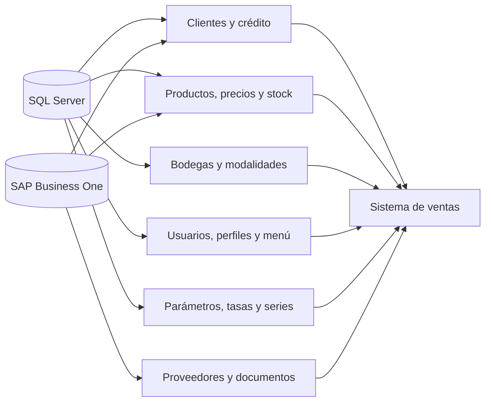

# Maestros, parámetros, acceso y configuración operativa — Sistema actual

## 1. Visión general

El sistema de ventas consulta una combinación de datos locales de SQL Server y datos de SAP Business One. SQL Server concentra lectores y procedimientos para clientes, productos, proveedores, bodegas, usuarios, perfiles, menú, series y parámetros comerciales. SAP se utiliza directamente para consultar o actualizar información de socios de negocio y para ejecutar documentos de venta y compra.

Los maestros condicionan la preparación de la venta: el cliente aporta direcciones, vendedor y antecedentes de crédito; el producto aporta unidad, moneda, precio, costo, stock y proveedor; la bodega determina la modalidad de venta; y los plazos, tasas, descuentos, series y parámetros determinan qué opciones puede utilizar el operador. La evidencia de esta fase no muestra un módulo genérico de administración de todos los maestros; parte importante de ellos se mantiene fuera de las pantallas de ventas.

El acceso es propio del sistema: la pantalla de login valida usuario y contraseña contra SQL Server, verifica que el usuario esté activo y recupera empresa, operador, oficina, rol, nivel y perfil. El perfil obtenido se utiliza para construir el menú visible. No se encontró evidencia de autenticación Windows, dominio o Microsoft Identity.

## 2. Mapa de dependencias de datos

El código confirma qué consultas realiza el sistema, pero no permite determinar en todos los casos qué proceso de carga o sincronización alimenta SQL. Cuando el origen de mantenimiento no está visible se marca como PENDIENTE DE VALIDACIÓN FUNCIONAL.

## 3. Inventario de maestros

| Maestro | Fuente | Uso funcional | Cómo se consulta | Mantenimiento |
|---|---|---|---|---|
| Clientes | SQL para búsqueda/antecedentes; SAP DI API para alta o actualización de socio de negocio | Identificar comprador, direcciones, vendedor, crédito y documentos pendientes | `tai_vw_sp2_select_cliente` y `oBusinessPartners` | Alta/actualización visible en `clsClienteListado`; sincronización completa PENDIENTE DE VALIDACIÓN FUNCIONAL |
| Productos | SQL Server, con atributos provenientes del catálogo operativo | Seleccionar artículos y obtener unidad, moneda, precio, costo, stock, proveedor y días de pago | `tai_vw_sp2_select_producto` | PENDIENTE DE VALIDACIÓN FUNCIONAL |
| Proveedores | SQL Server y documentos SAP de compra | Seleccionar proveedor y relacionarlo con órdenes de compra | `tai_vw_sp2_select_proveedor` | PENDIENTE DE VALIDACIÓN FUNCIONAL |
| Bodegas | SQL Server | Determinar disponibilidad y modalidad de venta | `tai_vw_sp2_select_bodega` por operador | PENDIENTE DE VALIDACIÓN FUNCIONAL |
| Plazos de venta/compra | SQL Server; para compras también UDF SAP | Aplicar condiciones y vencimientos | servicios `srvPlazoVenta`/`srvPlazoCompra` y clases de listado | PENDIENTE DE VALIDACIÓN FUNCIONAL |
| Tasas de interés | SQL Server | Calcular interés asociado a producto o condición | `tai_vw_sp2_select_tasa_interes_producto` y `tai_vw_sp2_select_interes_producto` | PENDIENTE DE VALIDACIÓN FUNCIONAL |
| Descuentos y fletes | SQL Server | Obtener límites o parámetros de cálculo | `tai_vw_sp2_select_descuento_maximo_producto`; clases de descuento/flete | PENDIENTE DE VALIDACIÓN FUNCIONAL |
| Series | SQL Server/SAP | Elegir numeración según objeto, subtipo y usuario | `tai_vw_sp2_select_serie` mediante `srvSerie` | Configuración SAP/SQL; responsables de mantenimiento PENDIENTE DE VALIDACIÓN FUNCIONAL |
| Usuarios y perfiles | SQL Server | Autenticar, asociar empresa/oficina/rol/nivel y construir menú | `tai_vw_sp2_select_usuario_sistema` | Pantallas de usuario no confirmadas |
| Menú | SQL Server | Mostrar módulos y opciones autorizadas | `tai_vw_sp2_select_menu_sistema` | PENDIENTE DE VALIDACIÓN FUNCIONAL |

## 4. Clientes

El identificador funcional del cliente se utiliza para consultar la línea de crédito (`CliAcuerdo`, `CliAutorizado`, `CliUtilizado`, `CliDisponible`), el vendedor asociado, direcciones de facturación/despacho, facturas impagas y cheques protestados. Estas consultas se realizan mediante distintas opciones de `tai_vw_sp2_select_cliente` en `clsClienteListado`.

La clase también puede registrar o actualizar un socio de negocio en SAP mediante `oBusinessPartners`, incluyendo direcciones de facturación y despacho. El código selecciona servidor, usuario de base de datos, contraseña y `CompanyDB` desde recursos separados para productivo y testing; los valores no se reproducen aquí.

El sistema usa, por tanto, tanto el dato maestro SQL para la evaluación operativa como el socio de negocio SAP para altas/actualizaciones. El proceso que sincroniza cambios entre ambas fuentes no está completamente documentado en el código: PENDIENTE DE VALIDACIÓN FUNCIONAL.

## 5. Productos

`tai_vw_sp2_select_producto` devuelve, entre otros, código y nombre del artículo, envase, grupo, proveedor, moneda, precio unitario, costo comercial, stock físico, stock disponible, indicador de inventariable, porcentaje de flete, costo de reposición, días de pago, precio de compra y moneda de compra. La consulta recibe opción, código o texto de producto y bodega; también existe búsqueda por ingrediente.

La bodega es una entrada funcional porque el stock y la modalidad pueden variar por ubicación. La evidencia confirma consumo de estos datos, no una pantalla de mantenimiento del catálogo de artículos. El origen último de cada atributo (SAP, carga SQL o proceso externo) queda PENDIENTE DE VALIDACIÓN FUNCIONAL.

## 6. Proveedores

El lector `clsProveedorListado` busca proveedores por identificador o texto mediante `tai_vw_sp2_select_proveedor`. También consulta el proveedor asociado a una orden de compra mediante `tai_vw_sp2_select_proveedor_orden_compra`, recibiendo `DocEntry` y `DocNum`.

El proveedor participa principalmente en modalidades que requieren compra o abastecimiento. La selección, agrupación y actualización del maestro no se administran en las pantallas revisadas: PENDIENTE DE VALIDACIÓN FUNCIONAL.

## 7. Bodegas y ubicaciones

`tai_vw_sp2_select_bodega` obtiene código, nombre y marca de bodega por defecto para el operador. `clsBodegaListado` traduce atributos de la bodega a una modalidad operativa: bodega consignada, calzada proveedor, puesto fundo, liquidación o bodega propia. También existen excepciones explícitas para determinados operadores y códigos de bodega.

Esta relación bodega→modalidad afecta la disponibilidad, el origen del producto y los pasos posteriores de compra/despacho. No se encontró evidencia suficiente para describir quién mantiene las banderas `BodConsignado`, `BodVtaCalzada` o el catálogo de códigos: PENDIENTE DE VALIDACIÓN FUNCIONAL.

## 8. Precios, monedas y condiciones de pago

El producto expone moneda de venta (`ArtMoneda`) y moneda de compra (`ArtMonedaCompra`), además de precio unitario, costo y días de pago. Las transacciones reciben moneda de pago, plazo de venta, plazo de compra y fecha de vencimiento. Los plazos de venta y compra tienen servicios ASMX y clases de consulta dedicadas.

Para órdenes de compra, `clsFuncion.ObtenerCodigoPlazoPagoOC` consulta el UDF de `OPOR` (`TableID='OPOR'`, `FieldID=59`) para convertir el plazo a un código SAP. La evidencia de una tabla completa de tipos de cambio, monedas permitidas o tasas financieras generales no está disponible: PENDIENTE DE VALIDACIÓN FUNCIONAL.

## 9. Parámetros comerciales

| Parámetro | Propósito | Fuente | Quién lo utiliza |
|---|---|---|---|
| Tasa de interés por tipo | Obtener tasa aplicable a un tipo de producto/operación | SQL: `tai_vw_sp2_select_tasa_interes_producto` | Cálculo comercial |
| Interés del producto | Consultar configuración específica de interés | SQL: `tai_vw_sp2_select_interes_producto` | Pantallas y cálculo de venta |
| Descuento máximo | Comparar o limitar descuento por bodega, producto y fecha | SQL: `tai_vw_sp2_select_descuento_maximo_producto` | Venta y autorización |
| Flete del producto | Aplicar porcentaje/condición de flete | Atributo consultado por `tai_vw_sp2_select_producto` y lector de flete | Cálculo comercial |
| Cuenta contable por bodega | Resolver cuenta para la operación | SQL: `tai_vw_sp2_select_cuenta_contable` | Generación de documentos |
| Aprobador/autorizador | Resolver usuario o circuito de autorización | SQL: `tai_vw_sp2_select_autorizador` y variantes | Autorizaciones |
| Parámetro general | Resolver valores configurables por código | SQL: `tai_vw_sp2_select_parametro` | Distintas pantallas/procesos |

Los umbrales exactos, vigencias y responsables de modificación no se encuentran consolidados en el código cliente: PENDIENTE DE VALIDACIÓN FUNCIONAL.

## 10. Parámetros SAP

El ambiente selecciona recursos de productivo o testing mediante `zModalidad` (`P` o `T`). Para DI API se requieren servidor SAP, `CompanyDB`, usuario y contraseña de base de datos, usuario SAP y licencia; las claves se leen desde recursos de aplicación y no se exponen en este documento.

Las series se obtienen por objeto, subtipo y usuario con `tai_vw_sp2_select_serie`. El código de facturación utiliza objetos SAP y subtipos como `13/IB` o `13/--`; el detalle de significado de cada combinación depende de la parametrización SAP. También se observan UDF de órdenes de compra para plazo de pago.

El servicio wssap y la referencia de servicio de orden de venta tienen endpoints separados de testing/productivo. La correspondencia exacta entre empresa comercial, bodega y `CompanyDB` debe validarse operativamente.

## 11. Parámetros de facturación e impresión

La facturación resuelve serie y subtipo mediante el lector de series y los documentos SAP. La visualización DTE usa la referencia PDFE/Azurian y recursos de ambiente como API key, resolución SII y URL de facturación; estos nombres de configuración existen en el código, pero sus valores son sensibles y no se copian.

El sistema genera además comprobantes PDF locales con `mdlVoucherVenta.GenerarPDFVenta` y los muestra desde las páginas de modalidades de venta. La impresora concreta, número de copias y configuración de cuarta copia no quedan completamente determinados por esta inspección: PENDIENTE DE VALIDACIÓN FUNCIONAL.

## 12. Acceso al sistema

El usuario inicia sesión en `pagLoginSistema`. La validación se realiza contra SQL Server mediante `tai_vw_sp2_select_usuario_sistema`, comparando usuario y contraseña. Si no existe registro, se muestra “Credenciales de acceso no validas”; si existe pero está inactivo, se muestra “Usuario no se encuentra activo en el sistema”.

Tras validar, el sistema recupera empresa, usuario, operador, oficina, rol, nivel, indicador de activo y perfil/cotizador. La página muestra el ambiente seleccionado (productivo, testing o sin clasificar). No se observan tokens, autenticación Windows ni un proveedor externo de identidad.

## 13. Usuarios, perfiles y permisos

| Concepto | Cómo funciona | Fuente | Impacto |
|---|---|---|---|
| Usuario | Credencial validada junto con estado activo | `tai_vw_sp2_select_usuario_sistema` | Permite o impide iniciar sesión |
| Empresa/oficina/operador | Identificadores recuperados después del login | Mismo SP | Determinan contexto operativo y bodegas |
| Rol/nivel | Datos asociados a la cuenta | Mismo SP | Participan en restricciones y autorizaciones |
| Perfil | Código de perfil y marca de cotizador | Mismo SP | Se usa para construir menú |
| Menú/opción | Módulo, nombre y página devueltos según perfil | `tai_vw_sp2_select_menu_sistema` | Define opciones visibles |
| Autorizador | Usuario o circuito para aprobaciones | `tai_vw_sp2_select_autorizador` | Define quién revisa excepciones |

La existencia de restricciones por empresa, oficina o bodega está reflejada en los datos recuperados, pero su matriz completa no puede reconstruirse sólo con estas clases: PENDIENTE DE VALIDACIÓN FUNCIONAL.

## 14. Menú por perfil

`clsMenuSistemaListado.ObtenerMenuSistema` ejecuta `tai_vw_sp2_select_menu_sistema` con opción y perfil. Cada fila devuelve `ModNombre`, `OpcNombre` y `OpcPagina`; `pagMenuSistema` recibe el perfil y construye la navegación. La ausencia de una opción en la respuesta significa que no se muestra en el menú.

La evidencia disponible describe visibilidad de menú, no una autorización centralizada para cada llamada a servicio. Las restricciones efectivas de cada pantalla y los permisos de mantenimiento requieren validación funcional.

## 15. Mantenimiento de maestros/parámetros

| Función | Quién la usa | Qué modifica | Impacto |
|---|---|---|---|
| Registrar/actualizar cliente | Usuario autorizado de ventas | Socio de negocio y direcciones en SAP | Habilita uso del cliente en operaciones futuras |
| Consultar producto/proveedor/bodega | Operador | No modifica; sólo selecciona datos | Determina disponibilidad y modalidad |
| Resolver series | Sistema/administrador de parámetros | No modifica desde la pantalla observada | Controla numeración SAP |
| Mantener usuarios/perfiles/menú | PENDIENTE DE VALIDACIÓN FUNCIONAL | No se identificó pantalla confirmada | Controla acceso y navegación |
| Mantener tasas, descuentos, fletes y parámetros | PENDIENTE DE VALIDACIÓN FUNCIONAL | No se identificó CRUD completo | Cambia cálculos y autorizaciones |

## 16. Configuración por ambiente

La aplicación usa recursos `rscSistemaVentasWeb` para seleccionar valores de productivo (`PRD`) o testing (`TST`). Las claves funcionales identificadas son:

- `zModalidad`;
- servidor, base de datos, usuario y contraseña SQL por ambiente;
- servidor, `CompanyDB`, usuario y contraseña SAP por ambiente;
- usuario/licencia SAP;
- `ServerWebPRD`/`ServerWebTST` para enlaces web;
- URL y credenciales lógicas de PDFE/Azurian (API key, resolución SII y URL de facturación);
- URL del servicio wssap;
- parámetros SMTP usados por notificaciones.

`web.config` no contiene la configuración funcional completa; buena parte está en recursos compilados. No se exponen valores sensibles. Un valor incorrecto puede dirigir la operación al ambiente equivocado, impedir la conexión SQL/SAP, impedir la visualización DTE o impedir el envío de notificaciones.

## 17. Stored procedures relevantes

| Stored procedure | Propósito funcional | Maestro/parámetro |
|---|---|---|
| `tai_vw_sp2_select_usuario_sistema` | Validar credenciales y devolver contexto, perfil y estado | Usuarios/perfiles |
| `tai_vw_sp2_select_menu_sistema` | Obtener módulos y opciones para un perfil | Menú/permisos |
| `tai_vw_sp2_select_cliente` | Buscar cliente, direcciones, vendedor, crédito, impagos y protestos | Clientes |
| `tai_vw_sp2_select_producto` | Buscar artículos y sus atributos comerciales/stock | Productos |
| `tai_vw_sp2_select_proveedor` | Buscar proveedor y proveedor de una orden de compra | Proveedores |
| `tai_vw_sp2_select_bodega` | Obtener bodegas disponibles y atributos de modalidad | Bodegas |
| `tai_vw_sp2_select_parametro` | Resolver parámetros por código | Parámetros generales |
| `tai_vw_sp2_select_tasa_interes_producto` | Obtener tasas de interés por tipo | Comercial |
| `tai_vw_sp2_select_interes_producto` | Obtener interés configurado para producto | Comercial |
| `tai_vw_sp2_select_descuento_maximo_producto` | Obtener máximo de descuento por bodega/producto/fecha | Comercial |
| `tai_vw_sp2_select_cuenta_contable` | Obtener cuenta contable por bodega | SAP/contabilidad |
| `tai_vw_sp2_select_serie` | Resolver serie por objeto, subtipo y usuario | SAP/numeración |
| `tai_vw_sp2_select_usuario_sap` | Obtener credencial lógica de usuario SAP asociada | SAP/acceso |

## 18. Dependencias entre maestros

- Cliente → direcciones, vendedor, crédito, facturas impagas y cheques protestados.
- Producto → proveedor, moneda, precio, costo, flete, stock y días de pago.
- Bodega → stock, modalidad de venta y cuenta contable.
- Proveedor → orden de compra y abastecimiento.
- Usuario → empresa, operador, oficina, rol, nivel y perfil.
- Perfil → módulos, opciones y páginas del menú.
- Objeto/subtipo/usuario → serie SAP.
- Ambiente → servidor SQL, `CompanyDB`, endpoints y credenciales lógicas.

## 19. Qué ocurre cuando falta configuración

| Configuración faltante/incorrecta | Efecto observable |
|---|---|
| Usuario inexistente o contraseña incorrecta | Se rechaza el acceso |
| Usuario inactivo | Se rechaza el acceso con mensaje de usuario inactivo |
| Perfil sin opciones | El menú no presenta módulos/opciones |
| Conexión SQL o procedimiento no disponible | Las listas de maestros quedan vacías o se registra error en `ToLog` |
| Servidor/`CompanyDB` SAP incorrectos | Fallan consultas o documentos DI API |
| Serie no resuelta | El documento SAP no puede asignar la numeración esperada |
| Endpoint wssap/PDFE incorrecto | Fallan operaciones de servicio o visualización DTE |
| Parámetro comercial ausente | El cálculo o autorización puede quedar sin valor; tratamiento exacto PENDIENTE DE VALIDACIÓN FUNCIONAL |

## 20. Funcionalidades detalladas

### FUN-001 — Acceso y validación de usuario

#### Propósito

Permite que un operador ingrese al sistema y establece su contexto de empresa, oficina, operador y perfil.

#### Usuario o área

Operadores del sistema de ventas.

#### Cómo se inicia

Desde la pantalla `pagLoginSistema`.

#### Datos consultados/modificados

Usuario, contraseña, estado activo, empresa, operador, oficina, rol, nivel, perfil y marca de cotizador.

#### Flujo

1. El usuario ingresa sus credenciales.
2. Se ejecuta `tai_vw_sp2_select_usuario_sistema`.
3. Si no hay coincidencia, se informa que las credenciales no son válidas.
4. Si la cuenta está inactiva, se informa que no se encuentra activa.
5. Si es válida, se recupera el contexto y el perfil para continuar al menú.

#### Reglas

- La cuenta debe existir y estar activa.
- El perfil se obtiene desde el contexto devuelto por SQL.

#### Integraciones

SQL Server; no se confirmó un proveedor de identidad externo.

#### Base de datos

`tai_vw_sp2_select_usuario_sistema`.

#### Resultado

Acceso concedido con un contexto operativo o acceso bloqueado.

#### Dependencias

Conexión SQL y datos de usuario/perfil.

#### Evidencia técnica

- `ventas/SistemaVentasWeb/SistemaVentasWeb/Pages/pagLoginSistema.aspx.vb`
- `ventas/SistemaVentasWeb/SistemaVentasWeb/Classes/clsUsuarioSistemaListado.vb`

#### Pendientes

PENDIENTE DE VALIDACIÓN FUNCIONAL sobre políticas de expiración, bloqueo por intentos y cierre de sesión.

### FUN-002 — Menú según perfil

#### Propósito

Mostrar sólo módulos y páginas asociadas al perfil recuperado para el usuario.

#### Usuario o área

Todo usuario autenticado.

#### Cómo se inicia

Automáticamente al completar el login, en `pagMenuSistema`.

#### Datos consultados/modificados

Código de perfil, módulo, nombre de opción y página.

#### Flujo

1. La página recibe el perfil.
2. Se ejecuta `tai_vw_sp2_select_menu_sistema`.
3. Cada fila se transforma en una opción de menú.
4. El usuario navega sólo por las opciones devueltas.

#### Reglas y validaciones

La visibilidad depende del perfil; no se confirmó en esta fase una matriz separada de permisos por botón.

#### Base de datos

`tai_vw_sp2_select_menu_sistema`.

#### Resultado

Menú contextual por perfil.

#### Evidencia técnica

- `ventas/SistemaVentasWeb/SistemaVentasWeb/Classes/clsMenuSistemaListado.vb`
- `ventas/SistemaVentasWeb/SistemaVentasWeb/Pages/pagMenuSistema.aspx.vb`

#### Pendientes

PENDIENTE DE VALIDACIÓN FUNCIONAL sobre permisos directos al invocar una URL sin pasar por el menú.

### FUN-011 — Consulta de cliente y antecedentes

#### Propósito

Proveer los datos maestros y antecedentes necesarios para operar con un cliente.

#### Flujo y datos

El identificador del cliente se utiliza para consultar dirección, vendedor, línea de crédito, facturas impagas y cheques protestados mediante opciones especializadas del procedimiento de clientes.

#### Integraciones y evidencia

También existe alta/actualización del socio de negocio en SAP mediante `oBusinessPartners`.

- `ventas/SistemaVentasWeb/SistemaVentasWeb/Classes/clsClienteListado.vb`

#### Pendientes

PENDIENTE DE VALIDACIÓN FUNCIONAL sobre sincronización automática y fuente maestra oficial.

### FUN-012 — Consulta de productos, stock y bodegas

#### Propósito

Permitir seleccionar un producto en una bodega con sus atributos comerciales y disponibilidad.

#### Flujo y datos

Se consulta el artículo y bodega; se devuelven código, descripción, envase, grupo, proveedor, moneda, precio, costos, stock físico/disponible, inventariable, flete y días de pago. La bodega se clasifica además por modalidad.

#### Integraciones y evidencia

- `ventas/SistemaVentasWeb/SistemaVentasWeb/Classes/clsProductoListado.vb`
- `ventas/SistemaVentasWeb/SistemaVentasWeb/Classes/clsBodegaListado.vb`
- servicios `srvProducto.asmx`, `srvBodega.asmx`

#### Pendientes

PENDIENTE DE VALIDACIÓN FUNCIONAL sobre proceso de actualización del stock SQL.

### FUN-035 — Parámetros comerciales y configuración operativa

#### Propósito

Resolver tasas, descuentos máximos, fletes, cuentas, plazos, series y parámetros que condicionan las operaciones.

#### Flujo

Las pantallas llaman lectores SQL o servicios ASMX; el código utiliza el resultado para cálculo comercial, autorización, cuenta contable, plazo de compra o numeración SAP.

#### Evidencia técnica

- `ventas/SistemaVentasWeb/SistemaVentasWeb/Classes/clsFuncion.vb`
- `ventas/SistemaVentasWeb/SistemaVentasWeb/Classes/clsParametroListado.vb`
- `ventas/SistemaVentasWeb/SistemaVentasWeb/Classes/clsSerieListado.vb`
- `ventas/SistemaVentasWeb/SistemaVentasWeb/Services/srvParametro.asmx.vb`
- `ventas/SistemaVentasWeb/SistemaVentasWeb/Services/srvSerie.asmx.vb`

#### Pendientes

PENDIENTE DE VALIDACIÓN FUNCIONAL sobre responsables y pantallas de mantenimiento.

## 21. Guía rápida para un nuevo mantenedor

Si necesitas cambiar:

- usuarios/perfiles: revisar `clsUsuarioSistemaListado.vb`, `clsMenuSistemaListado.vb` y los SP `tai_vw_sp2_select_usuario_sistema`/`tai_vw_sp2_select_menu_sistema`;
- menú: revisar `pagMenuSistema.aspx.vb` y `srvMenuSistema.asmx.vb`;
- clientes: revisar `clsClienteListado.vb` y sus operaciones DI API;
- productos/bodegas: revisar `clsProductoListado.vb`, `clsBodegaListado.vb`, `srvProducto.asmx.vb` y `srvBodega.asmx.vb`;
- proveedores: revisar `clsProveedorListado.vb` y `srvProveedor.asmx.vb`;
- parámetros comerciales: revisar `clsFuncion.vb`, `clsParametroListado.vb`, `clsInteresProductoListado.vb`, `clsDescuentoProductoListado.vb` y `clsFleteProductoListado.vb`;
- series SAP: revisar `clsSerieListado.vb`, `clsFuncion.ObtenerCodigoSerie` y la configuración SAP documentada en `06-sap-wssap-integracion.md`;
- configuración de ambiente: revisar `Resources/rscSistemaVentasWeb.resx`, `My Project/Settings.settings` y `clsFuncion.ObtenerConeccion` sin copiar secretos.

## 22. Resumen ejecutivo

- Los maestros esenciales son clientes, productos, proveedores, bodegas, plazos, series, usuarios y perfiles.
- SQL Server concentra la mayoría de consultas operativas y parámetros; SAP participa en socios de negocio y documentos.
- El producto combina precio, costo, moneda, stock, proveedor, flete y días de pago.
- La bodega no sólo ubica stock: también determina la modalidad operativa.
- Los descuentos, tasas, fletes, cuentas, plazos y series se resuelven mediante procedimientos y servicios parametrizados.
- El acceso usa usuario/contraseña propios contra SQL y exige cuenta activa.
- El perfil determina el menú visible mediante un procedimiento específico.
- Productivo y testing se seleccionan con `zModalidad` y recursos separados.
- Una configuración SAP, SQL, serie o endpoint incorrecta puede detener la operación.
- La administración completa y sincronización de maestros requiere validación con los responsables funcionales.

## 23. Dependencias de conocimiento especializado

### ALTO

- Interpretación de los procedimientos `tai_vw_sp2_select_*` y sus opciones numéricas.
- Relación entre bodega, modalidad, serie SAP y `CompanyDB`.
- Mantenimiento de recursos de ambiente con credenciales y endpoints.
- Matriz real de perfiles, menú y autorizadores.

### MEDIO

- UDF SAP para plazos de compra y reglas de series/subtipos.
- Sincronización entre datos SQL y socios de negocio SAP.
- Parámetros de descuento, interés, flete y cuentas contables.

### BAJO

- Lectura de listas de productos, proveedores y bodegas mediante los servicios ASMX.
- Presentación del ambiente en la pantalla de login.

## 24. Pendientes de validación

- PENDIENTE DE VALIDACIÓN FUNCIONAL: fuente maestra y frecuencia de sincronización de clientes, productos, proveedores y stock.
- PENDIENTE DE VALIDACIÓN FUNCIONAL: pantallas y responsables para mantener usuarios, perfiles, menú y parámetros comerciales.
- PENDIENTE DE VALIDACIÓN FUNCIONAL: política de expiración, bloqueo por intentos y cierre de sesión.
- PENDIENTE DE VALIDACIÓN FUNCIONAL: matriz completa de restricciones por empresa, oficina, bodega y rol.
- PENDIENTE DE VALIDACIÓN FUNCIONAL: monedas permitidas, tipo de cambio y reglas de plazo/tasa.
- PENDIENTE DE VALIDACIÓN FUNCIONAL: significado operativo de todas las series, subtipos y UDF SAP.
- PENDIENTE DE VALIDACIÓN FUNCIONAL: impresoras, copias y cuarta copia.
- PENDIENTE DE VALIDACIÓN FUNCIONAL: comportamiento exacto cuando un parámetro comercial no existe.
