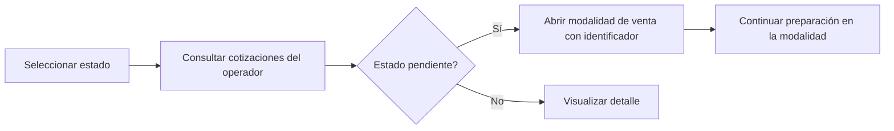

# Cotizaciones, informes y comisiones — Sistema actual

## 1. Visión general

Los módulos revisados permiten consultar cotizaciones, revisar la cuenta corriente de un cliente, consultar ventas de un mes y revisar liquidaciones de comisión. Son principalmente funciones de consulta: leen información desde SQL Server mediante servicios ASMX y presentan resúmenes y detalles en pantallas WebForms/JavaScript.

La pantalla de cotizaciones no muestra un alta completa. Consulta cotizaciones por operador y estado; cuando una cotización está pendiente permite abrir la página de la modalidad de venta correspondiente, pasando el identificador de cotización. Para estados distintos de pendiente, la interfaz indica que se debe visualizar el detalle. La conversión efectiva a una venta no queda confirmada únicamente por estos archivos.

Los informes usan filtros explícitos (cliente, año, mes, operador) y muestran datos tributarios, saldos, vencimientos, documentos, productos, márgenes y comisiones según el informe. La liquidación de comisión distingue resúmenes, detalle por línea, detalle por documento y variantes especiales/provisorias. Las fórmulas y reglas de elegibilidad están encapsuladas en procedimientos SQL.

## 2. Cotizaciones

La pantalla `pagCotizacion.aspx` carga estados desde el parámetro `cotizacion` y consulta `srvCotizacion.ObtenerCotizacionResumen`. El resumen muestra origen CRM y SAP, cliente, tipo de venta, documento/emisor, fecha, despacho, plazo de venta, moneda de pago y total en CLP. El usuario filtra por estado y el operador autenticado.

Al seleccionar una cotización pendiente (`strEstado = 'P'`), JavaScript construye la página `pagVenta<tipo>.aspx?prmCotizacion=<id>`, reutilizando la modalidad de venta y el identificador. Para un estado no pendiente no se abre preparación: se informa que corresponde visualizar el detalle.

El detalle se obtiene con `srvCotizacion.ObtenerCotizacionDetalle` y contiene bodega, artículo, cantidad, precio, moneda, tipo de cambio y fecha de entrega. En los archivos examinados no hay método de creación o actualización de cotización; esos actos pueden pertenecer a otro sistema o a páginas no incluidas en este módulo: PENDIENTE DE VALIDACIÓN FUNCIONAL.

### Flujo confirmado

### Reglas de cotización confirmadas

- La consulta recibe operador y estado.
- Una cotización pendiente puede abrirse en la página de su modalidad.
- Una cotización no pendiente no se trata como una nueva preparación desde esta pantalla.
- El detalle presenta precios, moneda, tipo de cambio y fecha de entrega.
- La vigencia, descuentos autorizados, estados completos y conversión definitiva a venta: PENDIENTE DE VALIDACIÓN FUNCIONAL.

## 3. Informes y reportes

| Informe/Reporte | Propósito | Usuario/Área | Filtros principales | Fuente |
|---|---|---|---|---|
| Cuenta corriente | Revisar documentos, débitos, créditos, saldos, vencimientos y cheques de un cliente | Ventas/crédito | Cliente | `tai_vw_sp2_select_cuenta_corriente` |
| Venta mensual | Consultar documentos vendidos en un cliente y período | Ventas/administración | Usuario, cliente, año, mes | `tai_vw_sp2_select_venta_mensual` |
| Liquidación de comisión | Revisar pagos/liquidaciones y totales de comisión | Vendedores/administración | Empleado, operador, año, mes, oficina, línea, sublínea, documento | `tai_vw_sp2_select_liquidacion_comision` |
| Detalle de comisión | Desglosar una liquidación por línea o documento | Vendedores/administración | Identificador de liquidación y filtros anteriores | Mismo SP, opciones 20/21/30/31/50/51 |
| Cotizaciones | Consultar cotizaciones y su detalle | Ventas | Estado, operador, cotización | `tai_vw_sp2_select_cotizacion` |

No se confirmó un catálogo adicional de reportes corporativos, exportación Excel/CSV ni un motor de reportes externo en los archivos revisados.

## 4. Detalle de reportes relevantes

### Cuenta corriente de cliente

- **Acceso:** `pagInformeCuentaCorriente.aspx`.
- **Parámetro:** código de cliente, con búsqueda asistida mediante `srvCliente`.
- **Resumen:** tipo de documento, abreviatura, fecha, vencimiento, débito, crédito, saldo y estado.
- **Detalle:** para facturas se consultan líneas con `srvMonitorDocumento`; se muestran producto, cantidad, moneda, precio, descuento e interés.
- **Totalizaciones:** facturas vencidas, facturas por vencer y cheques en cartera, con cantidad y monto.
- **Evidencia:** `clsInformeListado.ObtenerInformeCuentaCorriente`, `scrInformeCuentaCorriente.js`.

### Venta mensual

- **Acceso:** `pagInformeVentaMensual.aspx`.
- **Parámetros:** usuario, cliente opcional, año y mes.
- **Resultado:** tipo de documento/folio, fechas, cuarta copia, cliente y neto.
- **Agrupación visible:** total neto de facturas y boletas menos notas de crédito; el script reconoce prefijos de folio para factura, boleta y nota de crédito.
- **Detalle:** se recuperan líneas del documento y se muestran artículo, cantidad, moneda, precios, descuento e interés.
- **Evidencia:** `clsInformeListado.ObtenerInformeVentaMensual`, `scrInformeVentaMensual.js`.

### Liquidación de comisión

- **Acceso:** `pagInformeLiquidacionComision.aspx` y `pagInformeComisionProvisorio.aspx`.
- **Resumen:** tipo de liquidación, fecha, período, neto, costo, margen, porcentaje de margen, comisión individual, grupal, final, provisión de vacaciones, semana corrida y total.
- **Detalle:** por línea o documento muestra línea/subLínea, tipo documental, oficina, fecha, folio, cuarta copia, cliente, bodega, artículo, cantidad, venta neta, margen, porcentaje/base de comisión y nivel.
- **Variantes:** el origen de liquidación decide entre detalle normal/especial; existen consultas provisorias y una validación de usuario especial.
- **Evidencia:** `clsLiquidacionComisionListado`, `srvLiquidacionComision.asmx.vb`, `scrInformeLiquidacionComision.js`.

## 5. Comisiones

La comisión se consulta para un empleado/operador y un período (año y mes). La respuesta SQL ya contiene los totales calculados: neto, costo, margen, porcentaje de margen, comisión individual, grupal, final, provisión de vacaciones, semana corrida y total.

El detalle permite observar la base de comisión, porcentaje, nivel, margen, documento, línea/subLínea, vendedor, oficina, cliente, bodega y artículo. Esto demuestra que el cálculo considera al menos venta neta, costo, margen, estructura de líneas y tipo de documento; la fórmula exacta, exclusiones y ajustes están en `tai_vw_sp2_select_liquidacion_comision` y no son deducibles completamente del cliente.

La interfaz consulta liquidaciones normales, especiales y provisorias mediante opciones 10, 20, 21, 30, 31, 50 y 51. También invoca `ValidarUsuarioComisionProvisorio`, que devuelve si el usuario tiene tratamiento especial. La periodicidad observable es mensual porque los filtros son año/mes; no se confirma quién ejecuta el cierre o cuándo se genera físicamente la liquidación.

## 6. Estados y procesos administrativos

- Las cotizaciones se consultan por un estado parametrizado. Sólo el estado pendiente tiene navegación de preparación confirmada.
- Las liquidaciones tienen origen y tipo; el origen determina el detalle normal o especial.
- La cuenta corriente presenta estados funcionales como `VENCIDO` y `POR VENCER` para facturas, además de cheques en cartera.
- La venta mensual clasifica documentos por prefijo de folio y netea notas de crédito en el total mostrado.
- No se confirmó un proceso de edición, aprobación o cierre administrativo de cotizaciones desde estas pantallas.

## 7. Exportación e impresión

Las pantallas generan tablas HTML en el navegador y permiten expandir detalles. No se encontró una rutina explícita de exportación a Excel, CSV o archivo tabular en los scripts revisados.

La generación PDF identificada pertenece a comprobantes de venta (`mdlVoucherVenta`) y a visualización DTE, documentadas en los módulos de facturación. Para cotizaciones e informes de esta fase, la impresión/exportación específica: PENDIENTE DE VALIDACIÓN FUNCIONAL.

No se confirmó envío de informes por correo. El SMTP observado en otras áreas no aparece invocado por estos informes.

## 8. Stored procedures relevantes

| Stored procedure | Propósito funcional | Función relacionada |
|---|---|---|
| `tai_vw_sp2_select_cotizacion` | Obtener resumen o detalle según opción, operador, estado e identificador | Cotizaciones |
| `tai_vw_sp2_select_cuenta_corriente` | Recuperar documentos, saldos y estados de un cliente | Cuenta corriente |
| `tai_vw_sp2_select_venta_mensual` | Recuperar documentos vendidos por período y cliente | Venta mensual |
| `tai_vw_sp2_select_liquidacion_comision` | Recuperar resumen y distintos niveles de detalle de comisión | Liquidaciones normales, especiales y provisorias |
| `tai_vw_sp2_select_parametro` | Cargar estados de cotización y otros parámetros de pantalla | Selector de cotización |

## 9. Integraciones

| Integración | Uso | Dirección |
|---|---|---|
| SQL Server | Ejecuta los procedimientos y entrega datos de consulta | Ventas → SQL Server |
| Servicios ASMX | Exponen cotizaciones, informes y liquidaciones al navegador | Navegador → ventas/ASMX |
| Servicio de monitor documental | Entrega detalle de documentos desde la cuenta corriente/venta mensual | Ventas → SQL/monitor |
| SAP Business One | Los informes muestran identificadores SAP como `DocEntry`, `DocNum`, folios y documentos; la consulta directa SAP en estas pantallas no está confirmada | PENDIENTE DE VALIDACIÓN FUNCIONAL |
| PDF/impresión | No confirmado específicamente para estos módulos | PENDIENTE DE VALIDACIÓN FUNCIONAL |

## 10. Funcionalidades detalladas

### FUN-014 — Consulta de cotizaciones

#### Propósito

Consultar cotizaciones por estado y operador, revisar su resumen/detalle y abrir una cotización pendiente en la modalidad de venta correspondiente.

#### Usuario o área

Ventas; perfil exacto: PENDIENTE DE VALIDACIÓN FUNCIONAL.

#### Cómo se inicia

Menú que conduce a `pagCotizacion.aspx`.

#### Datos de entrada

Estado, operador, identificador de cotización, cliente, tipo de venta, moneda, plazo, productos, precios y fecha de entrega.

#### Flujo

1. Se cargan los estados desde el parámetro `cotizacion`.
2. Se consulta el resumen para el operador autenticado.
3. El usuario visualiza cliente, modalidad, fecha, despacho, plazo, moneda y total.
4. Puede solicitar el detalle de artículos.
5. Si el estado es pendiente, se redirige a la página de modalidad con `prmCotizacion`.
6. En otro estado, la interfaz indica que corresponde visualizar detalle.

#### Información consultada

`tai_vw_sp2_select_cotizacion`, con opciones de resumen y detalle.

#### Resultado

Consulta de cotización o apertura de preparación para una cotización pendiente.

#### Evidencia técnica

- `ventas/SistemaVentasWeb/SistemaVentasWeb/Pages/pagCotizacion.aspx`
- `ventas/SistemaVentasWeb/SistemaVentasWeb/Scripts/scrCotizacion.js`
- `ventas/SistemaVentasWeb/SistemaVentasWeb/Classes/clsCotizacionListado.vb`
- `ventas/SistemaVentasWeb/SistemaVentasWeb/Services/srvCotizacion.asmx.vb`

#### Pendientes

PENDIENTE DE VALIDACIÓN FUNCIONAL sobre creación, vigencia, conversión definitiva y estados completos.

### FUN-018 — Consulta de cuenta corriente

#### Propósito

Mostrar documentos y saldos de un cliente, destacando deuda vencida, deuda por vencer y cheques en cartera.

#### Datos de entrada

Código de cliente.

#### Flujo y resultado

El usuario selecciona el cliente; se consulta el resumen; puede expandir facturas para ver sus líneas; se calculan totalizaciones visibles. Los estados `VENCIDO` y `POR VENCER` se contabilizan para facturas.

#### Evidencia técnica

- `ventas/SistemaVentasWeb/SistemaVentasWeb/Pages/pagInformeCuentaCorriente.aspx`
- `ventas/SistemaVentasWeb/SistemaVentasWeb/Scripts/scrInformeCuentaCorriente.js`
- `ventas/SistemaVentasWeb/SistemaVentasWeb/Classes/clsInformeListado.vb`

### FUN-019 — Informe de venta mensual

#### Propósito

Consultar documentos emitidos en un mes y opcionalmente para un cliente.

#### Datos de entrada

Usuario, cliente, año y mes.

#### Resultado

Resumen por documento con folio, fechas, cuarta copia, cliente y neto; detalle de productos y total neto ajustado por notas de crédito.

#### Evidencia técnica

- `ventas/SistemaVentasWeb/SistemaVentasWeb/Pages/pagInformeVentaMensual.aspx`
- `ventas/SistemaVentasWeb/SistemaVentasWeb/Scripts/scrInformeVentaMensual.js`
- `ventas/SistemaVentasWeb/SistemaVentasWeb/Classes/clsInformeListado.vb`

### FUN-020 — Liquidación y comisión

#### Propósito

Consultar pagos/liquidaciones de comisión y sus desgloses.

#### Datos de entrada

Empleado, operador, año, mes, identificador, oficina, línea, sublínea y tipo de documento.

#### Resultado

Resumen y detalle normal, especial o provisorio, con totales de venta, costo, margen y comisión.

#### Evidencia técnica

- `ventas/SistemaVentasWeb/SistemaVentasWeb/Pages/pagInformeLiquidacionComision.aspx.vb`
- `ventas/SistemaVentasWeb/SistemaVentasWeb/Pages/pagInformeComisionProvisorio.aspx.vb`
- `ventas/SistemaVentasWeb/SistemaVentasWeb/Scripts/scrInformeLiquidacionComision.js`
- `ventas/SistemaVentasWeb/SistemaVentasWeb/Classes/clsLiquidacionComisionListado.vb`
- `ventas/SistemaVentasWeb/SistemaVentasWeb/Services/srvLiquidacionComision.asmx.vb`

## 11. Resumen ejecutivo

- Cotizaciones se consultan por estado y operador; las pendientes pueden abrirse en la modalidad de venta.
- El sistema muestra resumen y detalle de artículos, precios, moneda y fecha de entrega.
- La creación y conversión completa de cotizaciones no está confirmada en este módulo.
- Cuenta corriente permite revisar deuda, vencimientos y cheques en cartera por cliente.
- Venta mensual entrega documentos, folios, fechas, netos y detalle de productos.
- Notas de crédito se restan del total visible del informe mensual.
- Las comisiones se consultan por período y empleado/operador, con detalle por línea y documento.
- El cálculo final está encapsulado en SQL y expone margen, bases, porcentajes y componentes de comisión.
- Los módulos son consultas WebForms/ASMX; no se confirmó exportación Excel/CSV.
- Impresión, correo y mantenimiento de liquidaciones requieren validación adicional.

## 12. Dependencias de conocimiento especializado

### ALTO

- Procedimiento `tai_vw_sp2_select_liquidacion_comision` y sus opciones numéricas.
- Significado de orígenes, tipos, niveles y componentes de comisión.
- Estados de cotización y proceso que convierte una cotización en venta.

### MEDIO

- Relación entre folios, cuarta copia, documentos SAP y notas de crédito.
- Procedimientos de cuenta corriente y venta mensual.
- Filtros de línea, sublínea, oficina y documento.

### BAJO

- Servicios ASMX y scripts de presentación.
- Navegación y expansión de detalles HTML.

## 13. Pendientes de validación

- PENDIENTE DE VALIDACIÓN FUNCIONAL: dónde se crean y modifican cotizaciones.
- PENDIENTE DE VALIDACIÓN FUNCIONAL: vigencia, descuentos y conversión definitiva a venta.
- PENDIENTE DE VALIDACIÓN FUNCIONAL: catálogo completo de informes y usuarios autorizados.
- PENDIENTE DE VALIDACIÓN FUNCIONAL: fórmula, exclusiones y cierre de comisiones.
- PENDIENTE DE VALIDACIÓN FUNCIONAL: exportación a Excel/CSV/PDF e impresión de informes.
- PENDIENTE DE VALIDACIÓN FUNCIONAL: envío de informes por correo.
- PENDIENTE DE VALIDACIÓN FUNCIONAL: periodicidad y responsable de generación de liquidaciones.
